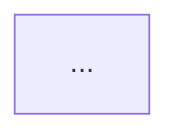

# write-devnote

Référence de rédaction du [devnotes-garden](https://garden.leplomb.work) — un digital garden technique sur l'architecture logicielle et l'ingénierie des agents IA. Les notes sont rendues par une app Angular séparée hébergée sur Azure Static Web Apps.

**Ce fichier est la source de vérité des conventions du garden.** `CLAUDE.md` et `README.md` n'en sont que des routeurs : s'ils divergent, c'est ce fichier qui gagne.

## Quick checklist

- [ ] Dossier = catégorie ouverte (voir *Taxonomie*)
- [ ] Slug unique **dans tout le garden**, identique au nom de fichier
- [ ] Frontmatter complet, `draft: true`
- [ ] `pillar` renseigné ; `level` renseigné ; `verified` si forme *recette*
- [ ] 5 tags maximum, dont exactement 1 tag de domaine, jamais `architecture`
- [ ] H1 identique au `title`
- [ ] Corps conforme à l'une des 3 formes (concept / arbitrage / recette)
- [ ] Section `## Pour un agent` en fin de corps
- [ ] Footer *Note liée* + champ `related` cohérents entre eux
- [ ] `node .claude/scripts/audit-garden.mjs` sort en code 0
- [ ] Passer `draft: false` seulement après une passe `critique-devnote`

---

## Les deux piliers

| Pilier | Sujet | Question à laquelle il répond |
|--------|-------|-------------------------------|
| **craft** | Architecture, backend, modélisation, infra | Comment construire un système qui tient |
| **ai** | Agents, orchestration, méthode AIDD | Comment faire construire ce système par des agents |

Le garden n'est pas deux gardens. Sa valeur est le **pont** entre les deux : une équipe d'agents est un système distribué, avec les mêmes problèmes que ceux déjà documentés côté craft — idempotence, livraison at-least-once, frontières de contexte, observabilité. Chaque fois qu'une note IA peut s'appuyer sur une note craft existante, elle doit le faire.

---

## Taxonomie

### Dossiers ouverts

```
notes/
  # pilier craft
  ddd/             → agrégats, value objects, bounded contexts, langage ubiquitaire
  cqrs/            → séparation lecture/écriture, read models, projections
  hexagonal/       → ports & adapters, règle de dépendance, Clean Architecture
  bff/             → Backend For Frontend, composition, gateway, temps réel
  event-storming/  → ateliers, niveaux Big Picture / Process / Design, code couleur
  messaging/       → outbox, inbox, idempotence, fiabilité de la livraison
  # pilier ai
  agents/          → fondamentaux ET fabrication : boucle agentique, contexte, mémoire,
                     outils, garde-fous, skill vs agent vs commande, évaluation
  orchestration/   → équipes d'agents : rôles spécialisés, fan-out / pipeline / coordinateur,
                     handoff, boucles, auto-correction
  aidd/            → la méthode : SDLC piloté par IA, TDD multi-agents, artefacts de
                     contexte (rules, skills, memory), gates de vérification
```

### Dossiers prévus, pas encore ouverts

`dotnet/` (EF Core, Result pattern, validation, minimal APIs) · `testing/` (TDD, tests d'architecture, contract testing, testcontainers) · `infrastructure/` (déploiement, observabilité, résilience, Azure).

### Règle d'ouverture d'un dossier

> **Aucun nouveau dossier tant que 3 notes ne le remplissent pas.**

En attendant les 3 notes, la note va dans le dossier ouvert le plus proche. Un dossier à une seule note est une catégorie morte : elle fragmente la navigation sans rien classer. La taxonomie du garden dérive déjà (29 tags pour 12 notes) — le plafond se tient, il ne se négocie pas.

### ⚠️ Les slugs sont uniques dans TOUT le garden

La route de l'app est **plate** : `/notes/:slug`. Le dossier n'est qu'une facette d'affichage (`theme`), pas un namespace.

En cas de collision, `deduplicateSlugs` garde **la note dont `updated` est la plus récente** et écrase l'autre avec un simple `console.warn` que personne ne lit. Une note peut donc disparaître du site sans que rien n'échoue.

Avant de nommer une note : vérifier que le slug n'existe nulle part ailleurs. `node .claude/scripts/audit-garden.mjs` le contrôle.

---

## Frontmatter

### Champs requis

```yaml
---
title: "Titre lisible de la note"
slug: titre-en-kebab-case
tags: [domaine, transverse1, transverse2]
created: YYYY-MM-DD
updated: YYYY-MM-DD
summary: "Une phrase qui décrit la note — affichée dans les cards de l'app."
draft: true
---
```

| Champ | Règles |
|-------|--------|
| `title` | Lisible, peut contenir des caractères spéciaux |
| `slug` | Kebab-case strict : minuscules, chiffres, tirets. **Unique dans tout le garden** |
| `tags` | Minuscules, sans accents, tableau YAML. Voir *Politique de tags* |
| `created` / `updated` | Format `YYYY-MM-DD`, sans guillemets |
| `summary` | Une phrase courte, affichée dans les cards — pas de spoiler |
| `draft` | **Toujours `true` pendant la rédaction.** ⚠️ Un champ `draft` **absent** vaut publié : le build ne teste que `draft === true` |

### Champs v2 (optionnels mais attendus)

```yaml
pillar: craft            # craft | ai
level: intermediaire     # fondation | intermediaire | avance
related: [outbox-pattern, inbox-pattern]
verified: 2026-08-23     # forme recette uniquement
```

| Champ | Rôle |
|-------|------|
| `pillar` | `craft` ou `ai`. La facette de plus haut niveau du garden |
| `level` | `fondation` (aucun prérequis) · `intermediaire` (suppose les fondations du domaine) · `avance` (arbitrage ou cas limite) |
| `related` | Le **graphe machine** de la note : tous les slugs du garden liés depuis le corps, footer compris. Le footer *Note liée* en est le sous-ensemble éditorial, celui qu'on met en avant pour un humain |
| `verified` | Date du dernier contrôle de l'outillage décrit. **Obligatoire sur les recettes**, interdit ailleurs |

Ces champs traversent le build tel quel jusqu'à `content-index.json` : ils sont immédiatement exploitables par un agent, même si l'app ne les affiche pas encore.

### Exemple complet — note IA de forme recette

```yaml
---
title: "Monter une équipe TDD à trois agents"
slug: equipe-tdd-trois-agents
tags: [orchestration, tdd, testing, agents]
created: 2026-08-23
updated: 2026-08-23
summary: "Séparer écriture des tests, implémentation et review en trois agents distincts, et pourquoi le même agent ne doit jamais tenir deux de ces rôles."
draft: true
pillar: ai
level: intermediaire
related: [roles-specialises, anatomie-d-un-agent]
verified: 2026-08-23
---
```

---

## Politique de tags

> **5 tags maximum. Le 1er tag est le domaine et vaut le nom du dossier. 2 domaines au maximum.**

### Vocabulaire de domaine

`ddd` · `cqrs` · `hexagonal` · `bff` · `event-storming` · `messaging` · `dotnet` · `testing` · `infrastructure` · `agents` · `orchestration` · `aidd`

Le **1er tag** est obligatoirement celui du dossier : il ancre la note.

Un **2e** tag de domaine n'est autorisé que pour une vraie **note-pont**, celle qui traite explicitement la rencontre de deux domaines — *Domain Events vs Integration Events* est autant du `ddd` que du `messaging`. Jamais un 3e : au-delà, la note ne parle plus de rien en particulier.

### Vocabulaire transverse (0 à 4)

`clean-architecture` · `composition` · `read-model` · `integration-events` · `domain-events` · `modeling` · `workshop` · `api` · `graphql` · `gateway` · `signalr` · `idempotence` · `reliability` · `microservices` · `tdd` · `memoire` · `contexte` · `prompt` · `evaluation` · `mcp` · `skill`

### Tag banni

**`architecture`** — il était présent sur 10 notes sur 12. Un tag porté par 83 % du corpus ne filtre plus rien, il gonfle la page `/tags` sans jamais aider à trouver. Ne jamais le remettre.

### Le langage n'est pas un tag

`dotnet` ne se pose que sur une note qui traite **de .NET comme sujet**, pas sur une note qui contient du C#. 10 notes sur 12 en contiennent : ce serait `architecture` bis. Même logique pour `angular`.

### Tags à occurrence unique

Un tag à une seule occurrence est toléré **s'il est le concept central de sa note** (`idempotence` sur l'Inbox Pattern, `signalr` sur la note SignalR). Sinon il se supprime : c'est une étiquette privée, pas une navigation. L'audit les liste en informatif à chaque passage — si la liste s'allonge sans que le corpus grossisse, la taxonomie dérive.

---

## Les trois formes de note

Une note appartient à une forme et une seule. La forme détermine le squelette du corps.

### Forme *concept* — expliquer un mécanisme

```markdown
# Titre

Intro : contexte + problème résolu (1-2 §)

## Le problème que résout <X>
## <Mécanisme> — la section centrale
## Exemple concret            ← code réel, pas de pseudo-code
## Limites / quand ne pas l'utiliser
## Pour aller plus loin
## Pour un agent

---

*Note liée : ...*
```

### Forme *arbitrage* — trancher entre des options

```markdown
# Titre

Intro : la question tranchée, et pourquoi elle se pose

## Les options en présence
## Critères de choix          ← tableau options × critères, obligatoire
## Verdict                    ← assumé, pas « ça dépend »
## Quand se tromper coûte cher
## Pour aller plus loin
## Pour un agent

---

*Note liée : ...*
```

Un arbitrage sans verdict est une note ratée. « Ça dépend » n'est acceptable que suivi des conditions exactes dont ça dépend.

### Forme *recette* — obtenir un résultat

```markdown
# Titre

Intro : le résultat visé, en une phrase observable

## Prérequis
## Étapes                     ← numérotées, configuration exacte, versions citées
## Vérifier que ça marche     ← un résultat observable, pas « ça devrait fonctionner »
## Pièges
## Pour un agent

---

*Note liée : ...*
```

La recette est la seule forme qui porte `verified:`. C'est aussi la seule qui a le droit de citer une version d'outil, un flag CLI ou un chemin de fichier — **une note concept n'en cite jamais**, sinon elle pourrit avec l'outillage.

### Quelle forme choisir

| Pilier | Formes attendues |
|--------|------------------|
| `craft` | concept ou arbitrage |
| `ai` | concept ou recette |

### Longueur

**250 lignes maximum.** Au-delà, découper en notes liées. Une note = un concept central, pas un cours complet.

---

## La capsule « Pour un agent »

C'est ce qui transforme le garden en référence exécutable. Le site est lu par des humains **et** donné en lecture à des agents pour qu'ils respectent ces pratiques : la capsule est la partie qu'un agent peut appliquer sans interpréter.

**Emplacement** — dernière section du corps, `## Pour un agent`, juste avant le footer *Note liée*.

**Volume** — 3 à 8 lignes. Jamais plus. Ce n'est pas un résumé.

**Format** — un blockquote, une ligne par règle :

```markdown
## Pour un agent

> **Règle** — Une transaction ne modifie qu'un seul agrégat.
> **Règle** — Les références entre agrégats se font par identité, jamais par objet.
> **Règle** — Un invariant se protège dans l'aggregate root, jamais dans un service applicatif.
> **Signal d'alerte** — Un repository qui retourne autre chose qu'un aggregate root.
> **Signal d'alerte** — Une entité avec des setters publics sur tous ses champs.
```

**Style obligatoire :**

- **Impératif** — « Une transaction ne modifie qu'un seul agrégat », pas « il est préférable de limiter »
- **Vérifiable** — un relecteur doit pouvoir dire oui ou non en regardant du code
- **Autoportant** — compréhensible sans avoir lu le corps de la note, car un agent lira souvent la capsule seule

**Interdits :**

| Interdit | Pourquoi |
|----------|----------|
| Reformuler le `summary` | La capsule est actionnable, le résumé est descriptif |
| Un principe non vérifiable | « Bien modéliser le domaine » ne se contrôle pas |
| Dépendre d'une phrase du corps | « Comme vu plus haut, … » est illisible hors contexte |
| Plus de 8 lignes | Au-delà, ce n'est plus une règle mais un chapitre |

**Contre-exemple commenté :**

```markdown
> **Règle** — Il faut faire attention à bien découper ses agrégats.   ← non vérifiable
> **Règle** — Voir la section précédente sur les invariants.          ← non autoportant
> **Règle** — Le DDD place le métier au centre des décisions.         ← c'est le résumé, pas une règle
```

---

## Blocs de code spéciaux

````markdown

````

Rendus nativement par l'app. Utiliser pour : flux, architectures, séquences. Une note d'architecture sans diagramme est presque toujours une note incomplète.

````markdown
```event-storming
actor Client
command "Passer commande"
aggregate Commande
event "CommandePassée"
policy "Quand CommandePassée → préparer pizza"
```
````

Bloc custom rendu par l'app. Types valides : `actor`, `command`, `aggregate`, `event`, `policy`, `externalSystem`, `readModel`.

**Pilier IA** — conventions de blocs :

- Configuration de skill ou d'agent → bloc ` ```yaml `, frontmatter complet et réaliste
- Prompt système ou instruction → bloc ` ```text `, jamais reformulé ni tronqué en douce
- Trace d'exécution ou échange d'agents → bloc ` ```text `, avec les rôles en préfixe de ligne

---

## Footer « Note liée »

Toujours en italique, chemin relatif **sans extension `.md`** :

```markdown
*Note liée : [Titre de la note](../categorie/slug) — une phrase d'accroche.*
```

Note du même dossier :

```markdown
*Note liée : [Titre de la note](./slug) — une phrase d'accroche.*
```

Plusieurs liens :

```markdown
*Notes liées : [Note A](../cat/slug-a) — accroche. [Note B](../cat/slug-b) — accroche.*
```

Les deux formes relatives sont valides. Le chemin doit **résoudre vers un fichier réel** : c'est ce qui permet à l'audit d'attraper un slug mal tapé.

L'extension `.md` est une entorse à la convention, pas une casse : `rewriteNoteLinks` ne garde que le basename du lien et retire `.md` lui-même. On l'évite quand même, pour que tout le corpus se lise pareil.

Le champ `related` du frontmatter liste **tous** les slugs liés depuis le corps, footer compris — pas seulement ceux du footer. Le footer est la sélection éditoriale pour un lecteur humain ; `related` est le graphe complet pour une machine. L'audit vérifie les deux sens : un lien du corps absent de `related`, et un `related` déclaré sans lien dans le corps.

---

## Erreurs fréquentes

| Erreur | Correction |
|--------|-----------|
| `draft: false` dès le début | Toujours `draft: true` pendant la rédaction |
| Champ `draft` oublié | Une note sans `draft` est **publiée** — le mettre explicitement |
| Slug avec majuscules ou accents | Kebab-case strict : `introduction-cqrs` |
| Slug déjà pris dans un autre dossier | La note la plus ancienne disparaît du site sans erreur — vérifier avant |
| Lien vers une note inexistante | Seule vraie casse de navigation — l'audit la remonte en 🔴 |
| Date entre guillemets | `created: 2026-05-29`, sans guillemets |
| Tag `architecture` | Banni. Choisir un tag de domaine réel |
| Tag `dotnet` parce que la note contient du C# | Le langage n'est pas un sujet — réserver `dotnet` aux notes sur .NET |
| 1er tag ≠ nom du dossier | Le 1er tag ancre la note, il vaut le dossier |
| 8 tags sur une note | 5 maximum, dont 1 de domaine |
| Lien ajouté dans le corps sans mettre `related` à jour | `related` liste tous les liens du corps — l'audit le vérifie |
| `verified` sur une note concept | Réservé à la forme recette |
| Version d'outil dans une note concept | Les concepts ne datent pas — l'outillage va dans une recette |
| Capsule « Pour un agent » absente | Obligatoire sur toute note passée en `draft: false` |
| Section « Limites » absente | Une note qui ne vend que les avantages est incomplète |
| "Notes liées" pour un seul lien | "Note liée" au singulier |
| Nom de fichier ≠ slug | `notes/ddd/introduction-ddd.md` pour `slug: introduction-ddd` |
| Créer un dossier pour une seule note | Règle des 3 notes — la ranger dans le dossier le plus proche |
