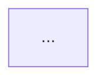

# write-devnote

Guide for writing notes in the [devnotes-garden-content](https://github.com/lolofx/devnotes-garden-content) repository — a digital garden on software architecture (DDD, Event Storming, Clean Architecture, CQRS, BFF…). Notes are rendered by a separate app on Azure Static Web Apps.

## Quick checklist

- [ ] Frontmatter complet avec `draft: true`
- [ ] Nom de fichier = valeur du champ `slug`
- [ ] Dossier = catégorie existante (ou nouvelle si vraiment nouveau thème)
- [ ] H1 identique au `title`
- [ ] Rédaction en français, ton pédagogique
- [ ] Footer *Note liée :* si une note connexe existe
- [ ] Passer `draft: false` quand la note est prête à publier

## Frontmatter

```yaml
---
title: "Titre lisible de la note"
slug: titre-en-kebab-case
tags: [tag1, tag2, tag3]
created: YYYY-MM-DD
updated: YYYY-MM-DD
summary: "Une phrase qui décrit la note — affichée dans les cards de l'app."
draft: true
---
```

| Champ | Règles |
|-------|--------|
| `title` | Lisible, peut contenir des caractères spéciaux |
| `slug` | Kebab-case strict : lettres minuscules, chiffres, tirets uniquement |
| `tags` | Minuscules, sans accents, tableau YAML |
| `created` / `updated` | Format `YYYY-MM-DD`, sans guillemets |
| `summary` | Une phrase courte, affichée dans les cards — pas de spoiler |
| `draft` | **Toujours `true` pendant la rédaction.** Passer à `false` uniquement quand la note est prête. |

## Catégories (dossiers existants)

```
notes/
  ddd/             → DDD, agrégats, value objects, bounded contexts
  event-storming/  → Ateliers, niveaux Big Picture / Process / Design, code couleur
  bff/             → Backend For Frontend, orchestration, Clean Architecture
```

Pour un nouveau thème (ex: `cqrs/`, `hexagonal/`), créer un nouveau dossier. Ne pas forcer un concept dans un dossier existant s'il n'y appartient pas vraiment.

## Structure du corps

```markdown
# Titre identique au frontmatter title

Introduction : contexte + problème résolu (1-2 §)

## Section principale
...

## Exemple concret
...

## Limites / quand ne pas l'utiliser
...

## Pour aller plus loin
Liens externes (articles, livres, vidéos)

---

*Note liée : [Titre de la note](../categorie/slug) — une phrase d'accroche.*
```

**Règles de ton :**
- Français, pédagogique, concret — privilégier les exemples réels au pseudo-code abstrait
- Une note = un concept. Préférer plusieurs notes courtes et liées plutôt qu'une longue
- Le "tu" est acceptable pour s'adresser au lecteur

## Blocs de code spéciaux

````markdown

````

Diagrammes Mermaid rendus nativement par l'app. Utiliser pour : flux, architectures, séquences.

````markdown
```event-storming
actor Client
command "Passer commande"
aggregate Commande
event "CommandePassée"
policy "Quand CommandePassée → préparer pizza"
```
````

Bloc custom rendu par l'app pour représenter un Event Storming textuel. Types valides : `actor`, `command`, `aggregate`, `event`, `policy`, `externalSystem`, `readModel`.

## Footer "Note liée"

Toujours au singulier, en italique, avec le chemin relatif :

```markdown
*Note liée : [Titre de la note](../categorie/slug) — une phrase d'accroche.*
```

Si plusieurs liens sont pertinents, les séparer par un point :

```markdown
*Notes liées : [Note A](../cat/slug-a) — accroche. [Note B](../cat/slug-b) — accroche.*
```

## Erreurs fréquentes

| Erreur | Correction |
|--------|-----------|
| `draft: false` dès le début | Toujours `draft: true` pendant la rédaction |
| Slug avec majuscules ou accents | Kebab-case strict : `introduction-cqrs` pas `Introduction-CQRS` |
| Date entre guillemets : `created: "2026-05-29"` | Sans guillemets : `created: 2026-05-29` |
| "Notes liées" pour un seul lien | "Note liée" au singulier |
| Nom de fichier ≠ slug | `notes/ddd/introduction-ddd.md` pour `slug: introduction-ddd` |
| Créer `notes/architecture/cqrs.md` pour un concept DDD | CQRS va dans `notes/ddd/` ou un nouveau `notes/cqrs/` |
