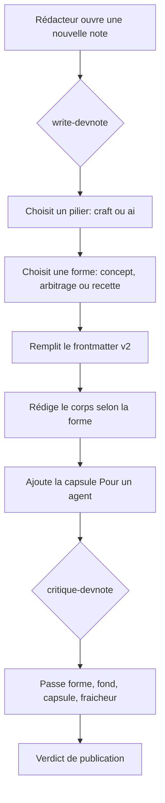
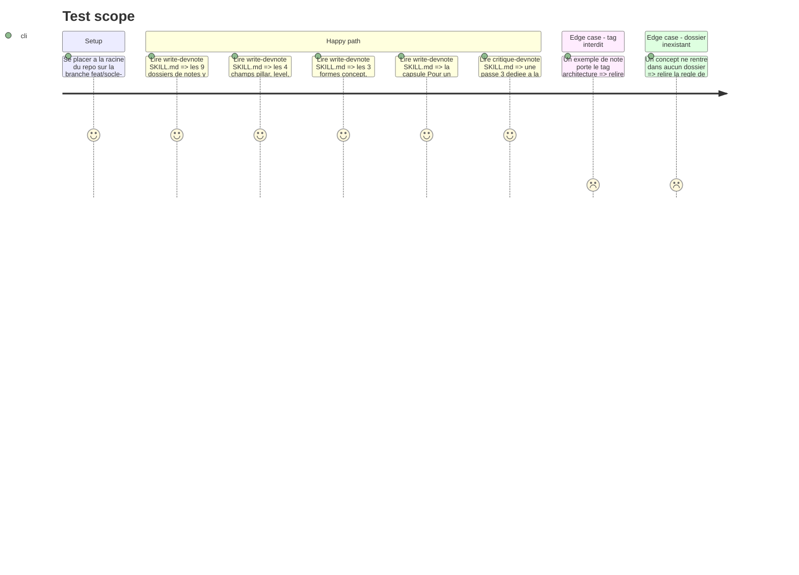

# Instruction: Conventions v2 dans les skills du repo

## Architecture projection

> Tree of the final files. ✅ create · ✏️ modify · ❌ delete

```txt
.
└── .claude/
    └── skills/
        ├── write-devnote/
        │   └── SKILL.md        ✏️ encode la taxonomie 2 piliers, le frontmatter v2, la politique de tags, les 3 formes de note et la capsule agent
        └── critique-devnote/
            └── SKILL.md        ✏️ ajoute la passe capsule agent et le contrôle de fraîcheur, aligne la passe forme sur le frontmatter v2
```

## User Journey



## Test Scope



## Tasks to do

### `1)` Réécrire la section taxonomie de `write-devnote`

> Remplacer la liste périmée de 3 dossiers par la taxonomie complète à 2 piliers.

1. Lister les 6 dossiers craft existants : `ddd/`, `cqrs/`, `hexagonal/`, `bff/`, `event-storming/`, `messaging/`.
2. Lister les 3 dossiers IA : `agents/`, `orchestration/`, `aidd/`, avec une ligne de périmètre chacun.
3. Lister les 3 dossiers craft prévus mais non ouverts : `dotnet/`, `testing/`, `infrastructure/`.
4. Écrire la règle : aucun nouveau dossier tant que 3 notes ne le remplissent pas ; en attendant, la note va dans le dossier le plus proche.
5. Écrire l'avertissement : la route de l'app est plate (`/notes/:slug`), les slugs sont uniques **globalement**, une collision fait disparaître silencieusement la note la plus ancienne.

### `2)` Documenter le frontmatter v2 dans `write-devnote`

> Ajouter les 4 champs optionnels sans toucher aux 7 existants.

1. Conserver le tableau des 7 champs actuels à l'identique.
2. Ajouter un second tableau « champs v2 (optionnels) » : `pillar` (`craft` | `ai`), `level` (`fondation` | `intermediaire` | `avance`), `related` (liste de slugs), `verified` (date `YYYY-MM-DD`).
3. Préciser que `related` double le footer *Note liée* en version machine, et que les deux doivent rester cohérents.
4. Préciser que `verified` n'est obligatoire **que** sur les notes de forme recette.
5. Ajouter l'exemple de frontmatter complet d'une note IA de forme recette.

### `3)` Écrire la politique de tags dans `write-devnote`

> Rendre la page `/tags` utile au lieu de bruyante.

1. Règle : 5 tags maximum, dont exactement 1 tag de domaine.
2. Lister le vocabulaire de domaine réservé : `ddd`, `cqrs`, `hexagonal`, `bff`, `event-storming`, `messaging`, `dotnet`, `testing`, `infrastructure`, `agents`, `orchestration`, `aidd`.
3. Lister le vocabulaire transverse autorisé, repris des tags déjà en usage : `clean-architecture`, `microservices`, `idempotence`, `reliability`, `read-model`, `api`, `workshop`, `modeling`, `integration-events`, `domain-events`, `angular`, `signalr`, `graphql`, `gateway`.
4. Bannir explicitement `architecture` : présent sur 10 notes sur 12, il ne filtre plus rien.
5. Règle d'ouverture : un tag transverse nouveau ne s'ajoute qu'à partir de sa 2e note.

### `4)` Formaliser les 3 formes de note dans `write-devnote`

> Remplacer le template unique par trois squelettes explicites.

1. **Concept** — intro et problème résolu, mécanisme, exemple concret, limites, pour aller plus loin, capsule, footer.
2. **Arbitrage** — intro et question tranchée, options en présence, tableau de critères, verdict assumé, quand se tromper coûte cher, capsule, footer.
3. **Recette** — intro et résultat visé, prérequis, étapes numérotées avec configuration exacte, vérification observable, pièges, `verified:`, capsule, footer.
4. Indiquer quelle forme est attendue par défaut selon le pilier : craft penche concept ou arbitrage, IA penche concept ou recette.
5. Rappeler la règle de longueur et l'assouplir de ~200 à **250 lignes**, en cohérence avec les 4 notes existantes qui la dépassent déjà pour de bonnes raisons.

### `5)` Définir la convention de capsule « Pour un agent »

> La brique qui transforme le garden en skill lisible par une machine.

1. Emplacement : dernière section `## Pour un agent`, avant le footer *Note liée*.
2. Volume : 3 à 8 lignes, jamais plus.
3. Format : blockquote, une ligne par règle, préfixée `**Règle** —` ou `**Signal d'alerte** —`.
4. Style obligatoire : impératif, vérifiable, autoportant hors du contexte de la note.
5. Interdits explicites : reformuler le résumé, énoncer un principe non vérifiable, dépendre d'une phrase du corps de la note.
6. Fournir un exemple complet extrait de `introduction-ddd` et un contre-exemple commenté.

### `6)` Ajouter la passe 3 à `critique-devnote`

> Étendre la critique aux nouvelles conventions.

1. Aligner la passe 1 (forme) sur le frontmatter v2 : présence de `pillar`, cohérence `related` ↔ footer, `verified` présent si forme recette.
2. Ajouter la passe 1 : conformité à la politique de tags (5 max, 1 domaine, `architecture` banni).
3. Créer la **passe 3 — capsule agent** : présence, volume, style impératif, vérifiabilité, autonomie hors contexte.
4. Créer le contrôle de fraîcheur : sur une note de forme recette, `verified` de plus de 6 mois devient un point 🟡.
5. Ajouter les nouveaux cas au tableau des niveaux de sévérité : capsule absente sur une note publiée = 🟡, capsule non vérifiable = 🟡, tag `architecture` = 🟡, slug en collision = 🔴.

## Test acceptance criteria

| Task | Acceptance criteria                                                                                                                 |
| ---- | ------------------------------------------------------------------------------------------------------------------------------------- |
| 1    | `write-devnote` liste les 9 dossiers ouverts, les 3 prévus, la règle des 3 notes et l'avertissement d'unicité globale des slugs        |
| 2    | Les 4 champs v2 sont documentés avec leurs valeurs autorisées, et les 7 champs existants sont inchangés mot pour mot                   |
| 3    | La politique de tags énonce le plafond de 5, le vocabulaire réservé, et bannit `architecture` en donnant sa raison chiffrée            |
| 4    | Les 3 formes ont chacune un squelette de sections distinct, et la limite de longueur affichée est 250 lignes                           |
| 5    | La convention de capsule donne emplacement, volume, format, style, interdits, un exemple et un contre-exemple                          |
| 6    | `critique-devnote` exécute 3 passes, contrôle la fraîcheur des recettes, et son tableau de sévérité couvre les 4 nouveaux cas          |
