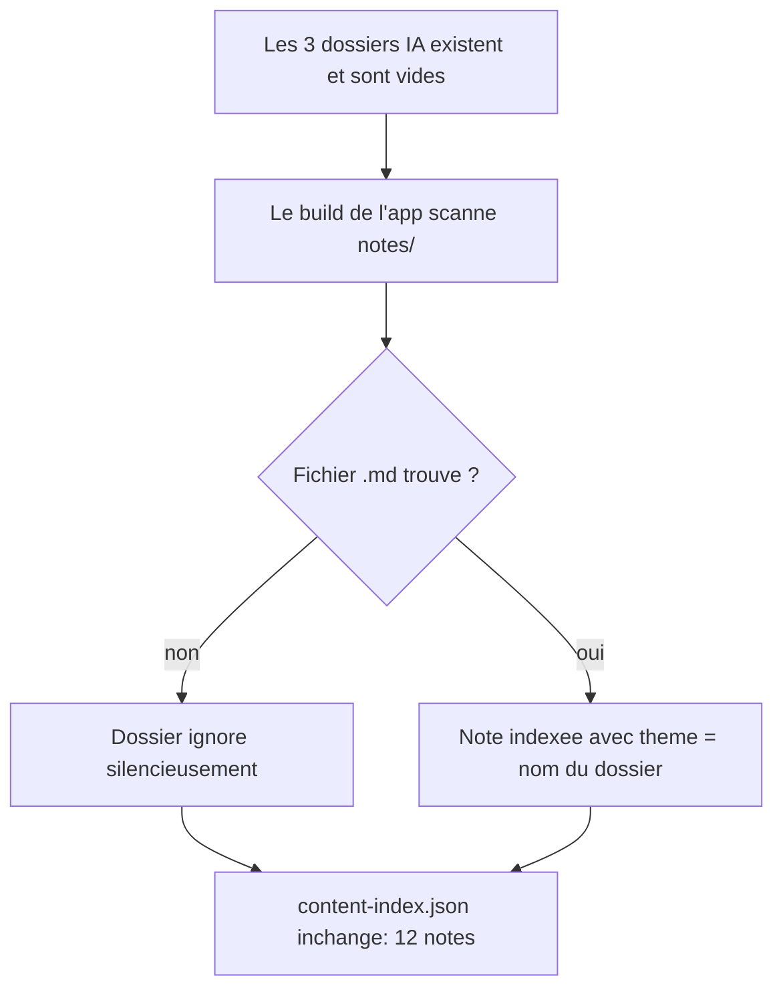
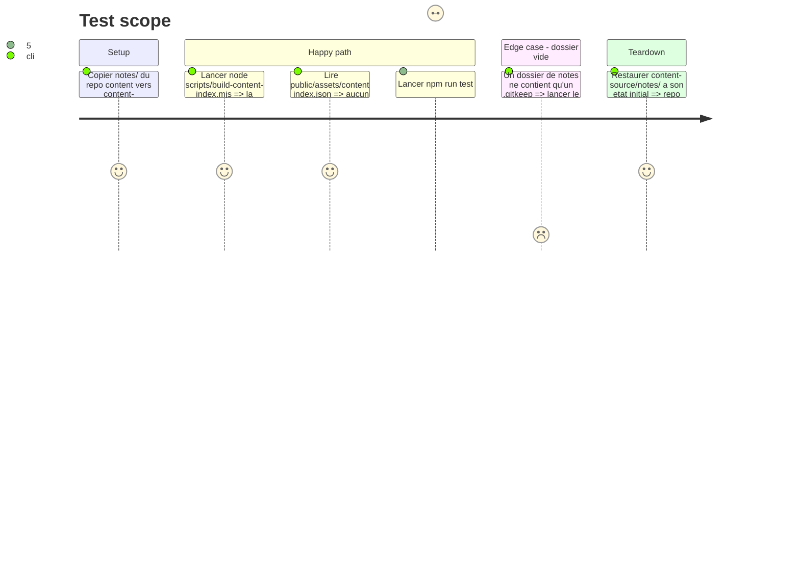

# Instruction: Squelette de taxonomie du pilier IA

## Architecture projection

> Tree of the final files. ✅ create · ✏️ modify · ❌ delete

```txt
.
└── notes/
    ├── agents/
    │   └── .gitkeep            ✅ ouvre le dossier des fondamentaux agents sans note
    ├── orchestration/
    │   └── .gitkeep            ✅ ouvre le dossier des equipes d'agents sans note
    └── aidd/
        └── .gitkeep            ✅ ouvre le dossier de la methode AIDD sans note
```

## User Journey



## Test Scope



## Tasks to do

### `1)` Créer les trois dossiers du pilier IA

> Rendre la taxonomie réelle avant d'y écrire quoi que ce soit.

1. Créer `notes/agents/.gitkeep`, `notes/orchestration/.gitkeep`, `notes/aidd/.gitkeep`.
2. Ne créer **aucun** des dossiers craft prévus (`dotnet/`, `testing/`, `infrastructure/`) : ils restent documentés dans `write-devnote` jusqu'à leur 1re note.

### `2)` Vérifier la neutralité pour le build de l'app

> S'assurer que des dossiers vides ne cassent ni ne polluent la production.

1. Copier l'arbre `notes/` courant dans `content-source/notes/` du repo `devnotes-garden-app`.
2. Exécuter `node scripts/build-content-index.mjs` et relever le nombre de notes indexées et les warnings.
3. Confirmer que `collectMarkdownFiles` ignore `.gitkeep` (filtre `.endsWith('.md')`) et qu'aucun thème vide n'entre dans l'index.
4. Restaurer `content-source/notes/` à son état initial : cette phase ne modifie pas le repo app.

## Test acceptance criteria

| Task | Acceptance criteria                                                                                                     |
| ---- | ------------------------------------------------------------------------------------------------------------------------- |
| 1    | `notes/` contient 9 dossiers, dont `agents/`, `orchestration/` et `aidd/` suivis par git via leur `.gitkeep`               |
| 2    | Le build annonce 12 notes indexées, n'émet aucun warning, et `content-index.json` ne contient aucun thème sans note        |
