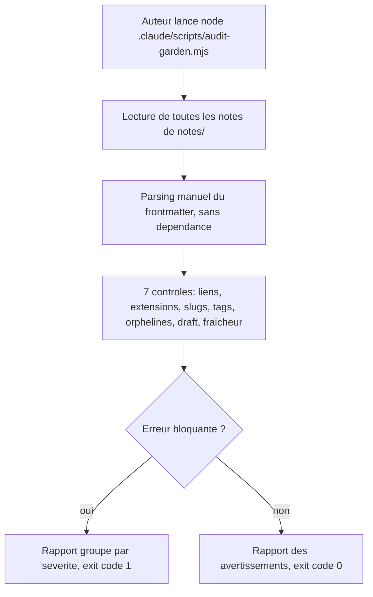
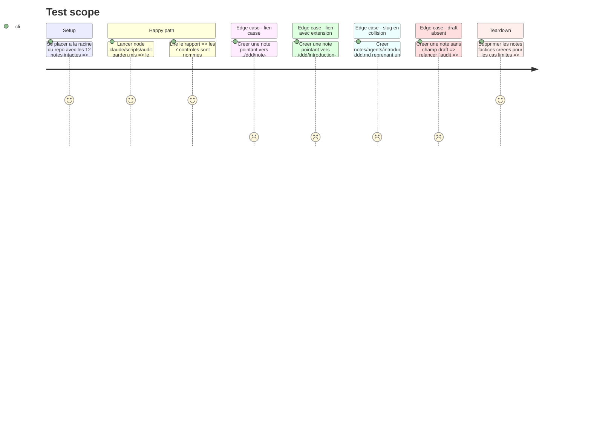

# Instruction: Script d'audit du garden

## Architecture projection

> Tree of the final files. ✅ create · ✏️ modify · ❌ delete

```txt
.
└── .claude/
    └── scripts/
        └── audit-garden.mjs    ✅ audite le corpus en Node sans dependance et sort en code 1 si une regle bloquante casse
```

## User Journey



## Test Scope



## Tasks to do

### `1)` Écrire le lecteur de corpus

> Zéro dépendance : ni `gray-matter`, ni `package.json`, ni Python.

1. Parcourir récursivement `notes/` et ne retenir que les `.md`.
2. Extraire le bloc frontmatter entre les deux `---` par découpage de lignes.
3. Parser à la main les scalaires (`title`, `slug`, `created`, `updated`, `summary`, `draft`, `pillar`, `level`, `verified`) et les listes inline (`tags`, `related`).
4. Déduire le `theme` du 1er segment de dossier, exactement comme `deriveTheme` côté app.

### `2)` Implémenter les 7 contrôles

> Chaque contrôle porte une sévérité fixe.

1. 🔴 **Lien interne cassé** — chaque `](../cat/slug)` doit correspondre à un fichier existant.
2. 🔴 **Extension interdite** — aucun lien interne ne finit par `.md`.
3. 🔴 **Collision de slug** — un slug ne doit apparaître qu'une fois, tous dossiers confondus ; nommer les deux fichiers en cause.
4. 🔴 **Incohérence nom de fichier ↔ slug** — le nom de fichier sans `.md` doit égaler le champ `slug`.
5. 🟡 **Dérive de tags** — plus de 5 tags, aucun tag de domaine, ou usage d'un tag banni.
6. 🟡 **Note orpheline** — aucune autre note ne pointe vers elle, ni par lien ni par `related`.
7. 🟡 **Fraîcheur** — note de forme recette dont `verified` dépasse 6 mois, ou note dont `updated` dépasse 18 mois.

### `3)` Ajouter les contrôles de publication

> Deux pièges silencieux du build de l'app.

1. 🟡 **`draft` absent** — le build ne teste que `data.draft === true`, donc une note sans le champ est **publiée** ; l'audit doit le dire.
2. 🔴 **Champ requis manquant** — rejouer les 6 champs de `validateFrontMatter` du repo app, car le build ignore silencieusement toute note incomplète.

### `4)` Produire le rapport et le code de sortie

> Utilisable à la main aujourd'hui, branchable en hook demain.

1. Grouper par sévérité, 🔴 d'abord, puis 🟡, puis un résumé chiffré.
2. Chaque ligne cite le fichier et la règle enfreinte.
3. Sortir en code 1 dès qu'un 🔴 existe, 0 sinon.
4. Documenter l'usage en tête de fichier : `node .claude/scripts/audit-garden.mjs`.

## Test acceptance criteria

| Task | Acceptance criteria                                                                                                                      |
| ---- | ------------------------------------------------------------------------------------------------------------------------------------------ |
| 1    | Le script lit les 12 notes et leur frontmatter sans aucune dépendance installée                                                             |
| 2    | Une note factice violant chacun des 7 contrôles est détectée, avec la bonne sévérité et le bon fichier cité                                  |
| 3    | Une note sans `draft` et une note sans `summary` sont toutes deux signalées, la seconde en bloquant                                          |
| 4    | Sur le corpus sain, le rapport annonce 12 notes et sort en code 0 ; avec un seul 🔴 injecté, il sort en code 1                               |
