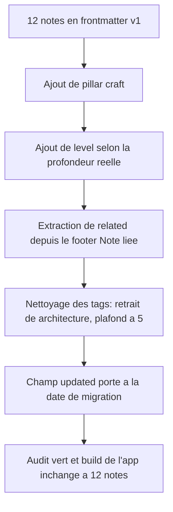
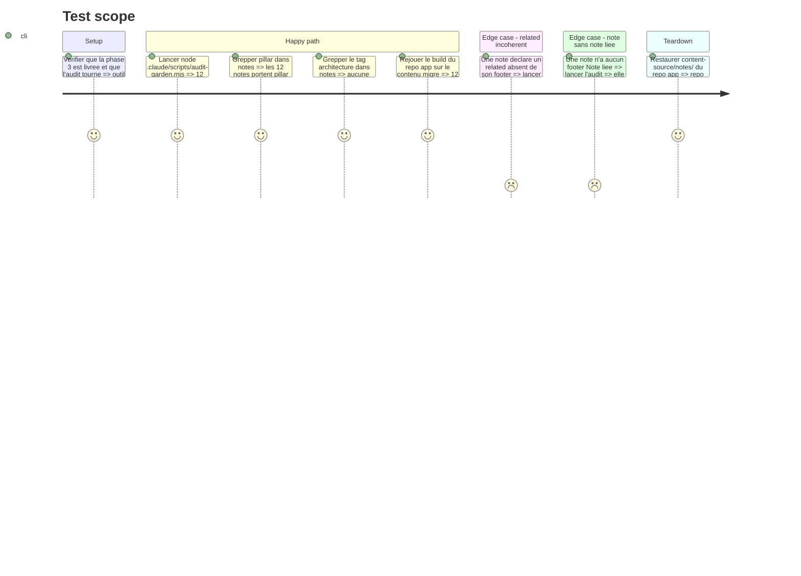

# Instruction: Migration des 12 notes existantes

## Architecture projection

> Tree of the final files. ✅ create · ✏️ modify · ❌ delete

```txt
.
└── notes/
    ├── bff/
    │   ├── bff-clean-archi.md                    ✏️ frontmatter v2 + tags nettoyes
    │   ├── bff-signalr-gateway-arbitrage.md      ✏️ frontmatter v2 + tags nettoyes
    │   └── bff-vs-graphql.md                     ✏️ frontmatter v2 + tags nettoyes
    ├── cqrs/
    │   ├── composition-multi-contexte.md         ✏️ frontmatter v2 + tags nettoyes
    │   └── introduction-cqrs.md                  ✏️ frontmatter v2 + tags nettoyes
    ├── ddd/
    │   ├── integration-events-vs-domain-events.md ✏️ frontmatter v2 + tags nettoyes
    │   └── introduction-ddd.md                   ✏️ frontmatter v2 + tags nettoyes
    ├── event-storming/
    │   ├── event-storming-color-code.md          ✏️ frontmatter v2 + tags nettoyes
    │   └── livraison-pizza-event-storming.md     ✏️ frontmatter v2 + tags nettoyes
    ├── hexagonal/
    │   └── ports-et-adapters.md                  ✏️ frontmatter v2 + tags nettoyes
    └── messaging/
        ├── inbox-pattern.md                      ✏️ frontmatter v2 + tags nettoyes
        └── outbox-pattern.md                     ✏️ frontmatter v2 + tags nettoyes
```

## User Journey



## Test Scope



## Tasks to do

### `1)` Ajouter `pillar` et `level` aux 12 notes

> Le pilier est trivial, le niveau est un jugement à assumer note par note.

1. `pillar: craft` sur les 12 notes.
2. `level: fondation` sur `introduction-ddd`, `introduction-cqrs`, `event-storming-color-code`, `ports-et-adapters`.
3. `level: intermediaire` sur `bff-clean-archi`, `livraison-pizza-event-storming`, `integration-events-vs-domain-events`, `outbox-pattern`, `inbox-pattern`.
4. `level: avance` sur `bff-vs-graphql`, `bff-signalr-gateway-arbitrage`, `composition-multi-contexte`.
5. Insérer les deux champs après `tags`, avant `created`, dans le même ordre partout.

### `2)` Extraire `related` depuis les footers existants

> Rendre le graphe du garden lisible par une machine sans reparser du markdown.

1. Pour chaque note, relever les slugs cités dans son footer *Note liée* / *Notes liées*.
2. Écrire `related: [slug-a, slug-b]` avec exactement ces slugs, dans l'ordre du footer.
3. Ne rien inventer : une note sans footer reçoit `related: []` et sera remontée comme orpheline par l'audit.
4. Ne pas modifier le texte des footers : `related` double le footer, il ne le remplace pas.

### `3)` Appliquer la politique de tags

> Retirer le bruit sans casser la navigation utile.

1. Retirer `architecture` des 10 notes qui le portent.
2. Ramener chaque note à 5 tags maximum en supprimant les moins discriminants.
3. Vérifier que chaque note conserve exactement 1 tag de domaine du vocabulaire réservé.
4. Fusionner les singletons redondants relevés à l'audit initial quand deux tags disent la même chose.
5. Ne créer aucun tag nouveau dans cette phase.

### `4)` Mettre à jour `updated` et vérifier la non-régression

> Une migration de métadonnées reste une modification de la note.

1. Porter `updated` à la date de migration sur les 12 notes ; ne jamais toucher `created`.
2. Lancer `node .claude/scripts/audit-garden.mjs` et obtenir un code 0.
3. Rejouer le build du repo app sur le contenu migré, confirmer 12 notes indexées et zéro warning, puis restaurer `content-source/notes/`.
4. Confirmer qu'aucun corps de note n'a été modifié : le diff ne doit porter que sur les blocs de frontmatter.

## Test acceptance criteria

| Task | Acceptance criteria                                                                                                              |
| ---- | ---------------------------------------------------------------------------------------------------------------------------------- |
| 1    | Les 12 notes portent `pillar: craft` et un `level` parmi les 3 valeurs, insérés au même endroit du frontmatter                      |
| 2    | Chaque `related` reprend exactement les slugs du footer de sa note, sans ajout ni omission                                          |
| 3    | Le tag `architecture` a disparu du corpus, aucune note ne dépasse 5 tags, chacune garde 1 tag de domaine                            |
| 4    | L'audit sort en code 0, le build de l'app annonce 12 notes sans warning, et le diff git ne touche que des lignes de frontmatter     |
