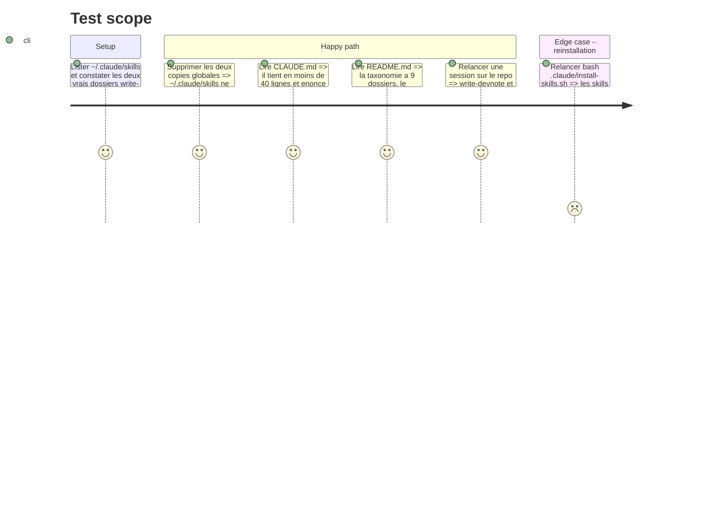

# Instruction: Consolidation de la source de vérité

## Architecture projection

> Tree of the final files. ✅ create · ✏️ modify · ❌ delete

```txt
.
├── CLAUDE.md                                  ✏️ reduit a un routeur court vers les skills du repo
├── README.md                                  ✏️ documente la taxonomie v2, le frontmatter v2, l'audit et les URL machine
└── .claude/
    ├── install-skills.sh                      ✏️ mentionne la suppression des copies globales obsoletes
    └── settings.local.json                    ✏️ retire les permissions ponctuelles de copie de skill devenues caduques

~/.claude/skills/
├── write-devnote/                             ❌ copie divergente du skill porte par le repo
└── critique-devnote/                          ❌ copie divergente du skill porte par le repo
```

## User Journey

```mermaid
flowchart TD
  A[Un agent ouvre une session sur le repo] --> B[Lit CLAUDE.md]
  B --> C[CLAUDE.md pointe vers les skills du repo]
  C --> D[.claude/skills/ charge automatiquement]
  D --> E{Une copie globale existe ?}
  E -->|avant| F[Deux versions divergentes possibles]
  E -->|apres| G[Une seule source de verite]
```



## Test Scope



## Tasks to do

### `1)` Supprimer les copies globales divergentes

> Une convention écrite à deux endroits finit toujours par dire deux choses.

1. Diffuser un diff entre `~/.claude/skills/write-devnote/SKILL.md` et la version du repo avant toute suppression, et signaler tout écart non trivial.
2. Faire de même pour `critique-devnote`.
3. Supprimer les deux répertoires globaux une fois l'absence d'écart utile confirmée.
4. Vérifier que les autres entrées de `~/.claude/skills/` restent des symlinks intacts.

### `2)` Réduire `CLAUDE.md` à un routeur

> Il doit dire où sont les règles, jamais les répéter.

1. Conserver : rôle de l'agent, liste des skills et quand les déclencher, règles Git, setup.
2. Retirer toute règle de contenu dupliquée depuis `write-devnote` (draft, longueur, qualité) et la remplacer par un renvoi explicite.
3. Ajouter la règle Git manquante : ne jamais committer directement sur `main`, car un push sur `main` déclenche le `repository_dispatch` qui rebuild le site en production.
4. Ajouter la commande d'audit et le moment où la lancer.

### `3)` Réécrire `README.md`

> C'est la vitrine du repo pour un humain comme pour un agent.

1. Mettre à jour le tableau « Thèmes existants » : les 9 dossiers ouverts, plus les 3 prévus.
2. Documenter le frontmatter v2 en séparant les 7 champs requis des 4 champs optionnels.
3. Ajouter une section « Consommer le garden par programme » : `/llms.txt`, `/assets/content-index.json`, `/assets/content/<theme>/<slug>.md`, `/rss.xml`.
4. Ajouter la commande d'audit et ce qu'elle vérifie.
5. Renvoyer vers les skills pour tout le reste, sans recopier les conventions.

### `4)` Nettoyer l'outillage

> Supprimer les traces du contournement qui avait créé la duplication.

1. Retirer de `.claude/settings.local.json` les deux permissions ponctuelles de `mkdir` et `cp` vers `~/.claude/skills/critique-devnote`.
2. Ajouter dans `install-skills.sh` un commentaire indiquant que `write-devnote` et `critique-devnote` sont portés par le repo et ne doivent jamais être copiés globalement.
3. Confirmer que le script n'installe que les deux skills communautaires.

## Test acceptance criteria

| Task | Acceptance criteria                                                                                                             |
| ---- | --------------------------------------------------------------------------------------------------------------------------------- |
| 1    | `~/.claude/skills/` ne contient plus `write-devnote` ni `critique-devnote`, et ses autres entrées restent des symlinks valides     |
| 2    | `CLAUDE.md` fait moins de 40 lignes, n'énonce aucune convention de rédaction en propre, et interdit explicitement de committer sur `main` |
| 3    | `README.md` liste les 9 dossiers, distingue champs requis et optionnels, et documente les 4 URL machine                            |
| 4    | `settings.local.json` ne contient plus les permissions de copie de skill, et `install-skills.sh` porte l'avertissement             |
