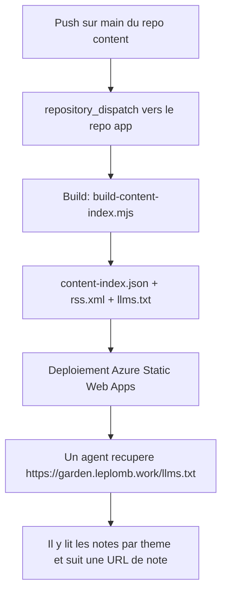
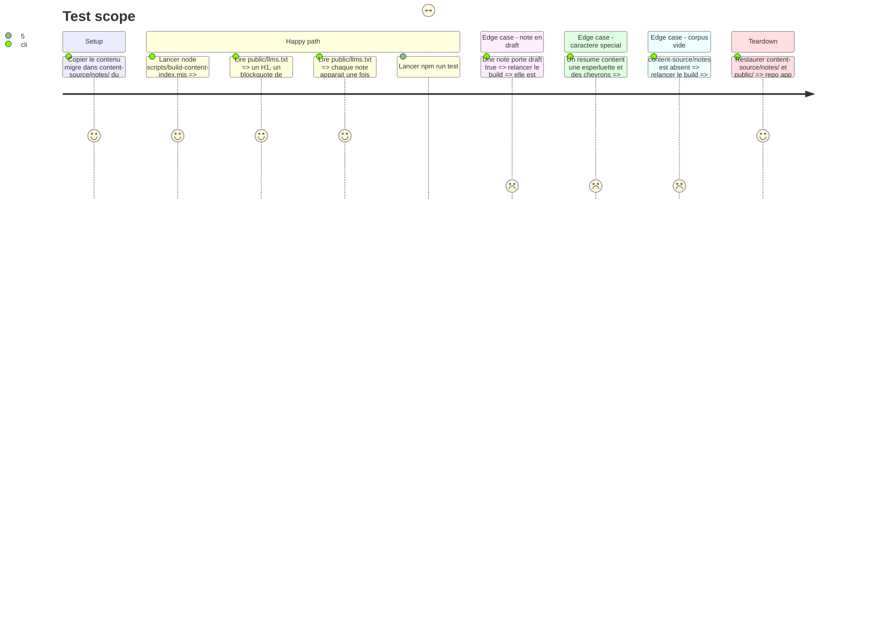

# Instruction: Génération de /llms.txt côté app

## Architecture projection

> Tree of the final files. ✅ create · ✏️ modify · ❌ delete

```txt
~/dev/github/devnotes-garden-app/
└── scripts/
    ├── build-content-index.mjs        ✏️ exporte generateLlmsTxt et l'ecrit dans public/llms.txt
    └── build-content-index.spec.mjs   ✏️ couvre le format llms.txt, le groupement par theme et l'echappement
```

## User Journey



## Test Scope



## Tasks to do

### `1)` Écrire `generateLlmsTxt`

> Même forme que `generateRssFeed` : fonction pure exportée, testable sans I/O.

1. Signature `generateLlmsTxt(notes, siteUrl = SITE_URL)`, exportée comme l'est `generateRssFeed`.
2. En-tête : `# devnotes·garden`, puis un blockquote décrivant le garden et ses deux piliers.
3. Un paragraphe indiquant où trouver le markdown brut et l'index JSON.
4. Une section `## <theme>` par thème, dans l'ordre alphabétique des thèmes.
5. Un item par note : `- [<title>](<siteUrl>/notes/<slug>) : <summary>`.
6. Aucun échappement XML ici : c'est du markdown, pas du XML ; les caractères spéciaux passent tels quels.

### `2)` Brancher l'écriture dans `main`

> À côté de l'index et du RSS, jamais à leur place.

1. Déclarer `LLMS_OUTPUT = join(ROOT, 'public', 'llms.txt')` près des autres constantes de sortie.
2. Écrire le fichier juste après `generateRssFeed`, à partir du même tableau `index` déjà dédupliqué et trié.
3. Logger `[ok] llms.txt généré → public/llms.txt`, dans le style des logs existants.
4. Gérer la branche « contenu absent » : produire un `llms.txt` avec ses en-têtes et zéro section, comme l'index vide.

### `3)` Couvrir par des tests

> La suite `test:scripts` est le seul filet de ce script.

1. Cas nominal : 2 notes de 2 thèmes différents produisent 2 sections H2 dans l'ordre alphabétique.
2. Les URL sont absolues et construites sur `/notes/<slug>`.
3. Un `siteUrl` passé en paramètre remplace bien la valeur par défaut.
4. Un corpus vide produit les en-têtes sans aucune section.
5. Un résumé contenant `&` et `<` reste intact dans `llms.txt`, alors que `generateRssFeed` continue de l'échapper.

### `4)` Vérifier de bout en bout

> Ce qui n'est pas exécuté n'est pas livré.

1. Exécuter le build sur le contenu migré et lire le `public/llms.txt` produit.
2. Confirmer que les 12 notes y figurent, groupées sous 6 thèmes.
3. Confirmer qu'aucune note `draft: true` n'y apparaît.
4. Exécuter `npm run test:scripts` puis `npm run lint`, et restaurer `content-source/notes/` et `public/`.

## Test acceptance criteria

| Task | Acceptance criteria                                                                                                       |
| ---- | ----------------------------------------------------------------------------------------------------------------------------- |
| 1    | `generateLlmsTxt` est exportée, pure, et rend un H1, un blockquote et une section H2 par thème triée alphabétiquement        |
| 2    | Le build écrit `public/llms.txt` en plus de l'index et du RSS, et le log le confirme, y compris sur un corpus absent          |
| 3    | Les 5 cas de test passent, dont celui qui distingue l'absence d'échappement markdown de l'échappement XML du RSS              |
| 4    | Le `llms.txt` réel liste les 12 notes sous 6 thèmes, aucun draft, et `test:scripts` comme `lint` passent                      |
