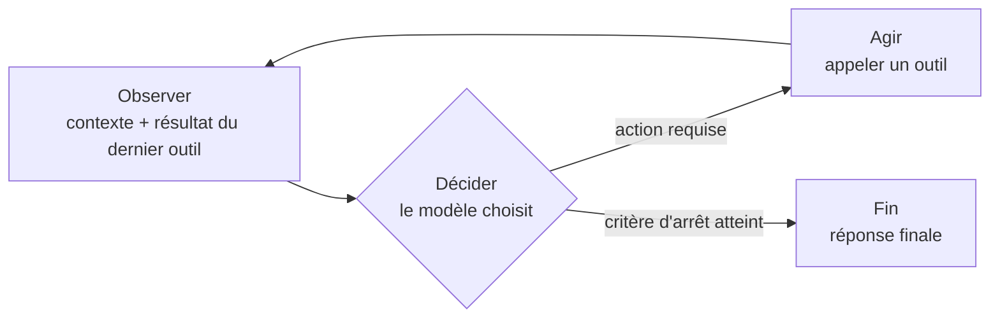

# Anatomie d'un agent

"Agent" est devenu le mot qu'on colle sur n'importe quel produit qui appelle un LLM. Le mot mérite une définition plus stricte, parce qu'elle a des conséquences concrètes : un agent ne se teste pas, ne se sécurise pas et ne se debug pas comme un appel API classique.

La différence ne tient ni au modèle utilisé, ni au nombre d'appels effectués. Elle tient à une seule question : **qui décide de la prochaine action ?**

## Trois niveaux, une seule frontière qui compte

| Niveau | Qui décide la suite | Exemple |
|---|---|---|
| Appel LLM simple | Le code appelant | Un prompt, une réponse, terminé |
| Workflow scripté avec LLM | Le développeur, à l'écriture du script | `résumer → traduire → formater`, séquence fixe même si chaque étape appelle un modèle |
| Agent | Le modèle, à chaque itération | Le modèle regarde le résultat du dernier outil et choisit lui-même le suivant |

Un workflow scripté peut appeler un LLM dix fois et rester déterministe dans son enchaînement : l'ordre des étapes est écrit dans le code, pas décidé par le modèle. Un agent, même avec un seul outil disponible, est non déterministe dans son enchaînement dès que c'est le modèle qui décide s'il rappelle l'outil, avec quels arguments, et quand il s'arrête.

## La boucle : observer → décider → agir → observer



Le modèle est le **moteur de décision** : à chaque tour, il reçoit l'état courant (l'historique, le résultat du dernier outil) et produit soit un appel d'outil, soit une réponse finale. Les outils sont son **seul moyen d'agir** sur le monde extérieur — il ne peut pas lire un fichier ou appeler une API autrement qu'en émettant un appel d'outil que le programme hôte exécute pour lui.

Le **critère d'arrêt** est la partie qu'on oublie le plus souvent de concevoir explicitement. Sans lui, une boucle agentique n'a aucune raison structurelle de s'arrêter : elle continue tant que le modèle continue de vouloir appeler un outil. Un critère d'arrêt combine typiquement :

- une condition de succès (le modèle décide que la tâche est terminée),
- un budget (nombre de tours, tokens, temps),
- une détection de blocage (le modèle répète la même action sans progrès).

## Exemple concret — la boucle minimale

Une boucle agentique tient dans une dizaine de lignes. Ce qui la rend "agent" n'est pas la complexité, c'est que `next_action` sort du modèle et pas du code :

```typescript
async function runAgent(task: string, tools: ToolRegistry, maxTurns = 10) {
  const history: Message[] = [{ role: "user", content: task }];

  for (let turn = 0; turn < maxTurns; turn++) {
    const decision = await model.decide(history, tools.describe()); // le modèle choisit

    if (decision.type === "final_answer") {
      return decision.content; // critère d'arrêt : succès
    }

    const result = await tools.execute(decision.toolName, decision.args); // agir
    history.push(decision, { role: "tool", content: result });          // observer
  }

  throw new BudgetExceeded(task); // critère d'arrêt : budget épuisé
}
```

Rien dans ce code ne dit "d'abord lire le fichier, puis le modifier, puis relancer les tests". C'est `model.decide` qui le décide à chaque tour, en fonction de ce qu'il observe. Retire cette ligne et remplace-la par une séquence écrite en dur : tu obtiens un workflow scripté, pas un agent — souvent plus fiable pour une tâche connue à l'avance.

## Le modèle ne connaît que des ports

C'est ici que l'anatomie d'un agent rejoint directement l'[architecture hexagonale](../hexagonal/ports-et-adapters) : un **outil**, du point de vue du modèle, fonctionne comme un **port**. Le modèle ne voit qu'une description — un nom, des paramètres, un contrat — jamais l'implémentation qui se cache derrière. Que `read_file` lise sur un disque local, un bucket objet ou un mock de test, le modèle raisonne à l'identique : il ne connaît que l'interface.

L'analogie a une limite à poser : en hexagonal, le port est déclaré *par l'intérieur* — c'est le domaine qui dicte ce dont il a besoin. Le schéma d'un outil, lui, est écrit par le développeur hôte, pas négocié par le modèle. Ce qui se transfère, ce n'est pas la paternité du contrat, c'est la règle de dépendance.

L'implémentation du tool — le code qui ouvre réellement le fichier, appelle réellement l'API — est l'**adapter**. Et le modèle, dans cette lecture, joue le rôle du **domaine** : il porte la logique de décision, et ne doit jamais dépendre d'un détail d'infrastructure. Un bon design d'agent respecte la même règle de dépendance que l'hexagonal : le prompt qui pilote le modèle décrit des ports (« tu as accès à un outil qui lit des fichiers »), jamais des adapters (« tu appelles l'API interne montée sur tel cluster »).

## Pourquoi le non-déterminisme est la propriété centrale

Le non-déterminisme n'est pas un défaut d'implémentation qu'une prochaine version du modèle corrigera. C'est la définition même de ce qui fait qu'un système est un agent plutôt qu'un workflow : si l'enchaînement des actions était garanti identique à chaque exécution, il n'y aurait pas besoin d'un modèle pour le décider — un script suffirait, moins cher et plus rapide.

Ce que ça coûte concrètement :

- **Le test "ça marche" ne prouve rien** — la même tâche peut emprunter un chemin d'outils différent à la prochaine exécution, réussir cette fois-ci et échouer la suivante sans qu'aucune ligne de code n'ait changé.
- **Le debug se déplace** — le bug n'est plus forcément dans le code, il peut être dans la description d'un outil, dans le prompt, ou dans l'historique de contexte fourni au modèle à ce tour précis.
- **Le coût et la latence deviennent variables** — un agent qui boucle trois fois sur un outil avant de trouver la bonne réponse ne coûte pas la même chose qu'un agent qui la trouve du premier coup, pour une tâche pourtant identique en apparence.

## Limites : quand un workflow déterministe vaut mieux

Un agent ne se justifie que si la séquence d'actions **ne peut pas être connue à l'avance**. Dès que tu peux écrire "d'abord ça, puis ça, puis ça" sans avoir besoin d'observer un résultat intermédiaire pour savoir ce qui vient après, un workflow scripté (avec ou sans appel LLM à l'intérieur d'une étape) est presque toujours préférable : plus prévisible, moins cher, plus facile à tester, à auditer et à sécuriser.

Réserve l'agent aux tâches où le chemin dépend réellement de ce qui est découvert en cours de route — explorer un code inconnu, diagnostiquer une panne dont la cause n'est pas connue, arbitrer entre plusieurs contraintes. Pour une pipeline ETL, une validation de formulaire ou une génération de rapport au format fixe, l'agent n'ajoute que de l'aléa.

## Pour aller plus loin

- Anthropic, *Building Effective Agents* — la distinction workflow / agent, et quand chacun se justifie
- Yao et al., *ReAct: Synergizing Reasoning and Acting in Language Models* (2022) — la formalisation de la boucle raisonner/agir/observer
- Russell & Norvig, *Artificial Intelligence: A Modern Approach*, chapitre « Intelligent Agents » — la définition classique agent/environnement, antérieure aux LLM et toujours valable

## Pour un agent

> **Règle** — Si tu peux écrire la séquence d'actions à l'avance sans avoir besoin d'observer un résultat intermédiaire, n'implémente pas un agent : implémente un workflow scripté.
> **Règle** — Un outil décrit un contrat (port), jamais son implémentation (adapter) : le prompt ne doit jamais nommer un détail d'infrastructure.
> **Règle** — Toute boucle agentique a besoin d'un critère d'arrêt explicite combinant condition de succès, budget et détection de blocage.
> **Signal d'alerte** — Une séquence d'étapes connue à l'avance, câblée dans un agent au lieu d'un script : c'est un workflow qui s'ignore.
> **Signal d'alerte** — Un prompt qui décrit "comment" appeler un outil (détail technique) plutôt que "ce que" l'outil fait (contrat).

---

*Notes liées : [Outils et garde-fous](./outils-et-garde-fous) — ce que doit garantir un outil pour qu'un agent puisse l'utiliser sans risque. [Contexte et mémoire d'un agent](./contexte-et-memoire) — ce que la boucle observe à chaque tour. [Architecture Hexagonale — Ports & Adapters](../hexagonal/ports-et-adapters) — la règle de dépendance que l'outil applique au modèle. [Évaluer un agent](./evaluer-un-agent) — comment vérifier qu'une boucle non déterministe fait ce qu'on attend d'elle.*
