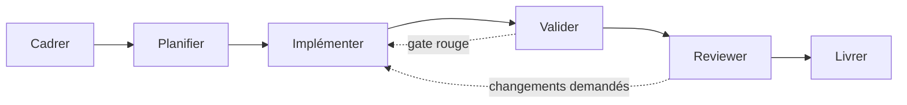

# Un cycle de développement piloté par des agents

Cadrer un besoin, le planifier, l'implémenter, le valider, le faire relire, le livrer : cette chaîne n'a rien de nouveau, elle existe depuis que le développement logiciel existe. Ce qui change quand des agents entrent dans la boucle, ce n'est pas cette chaîne — c'est le **coût relatif de chacune de ses étapes**. Écrire du code, longtemps l'étape la plus chère en temps humain, devient bon marché : un agent produit une implémentation plausible en quelques minutes. Ce qui reste cher, parce que ça engage un jugement qu'aucun agent ne peut porter à ta place, c'est de décider ce qu'il faut construire et de vérifier que ce qui a été construit est effectivement ça. Le centre de gravité du travail se déplace du clavier vers le cadrage et la vérification — une équipe qui continue d'investir son temps dans la frappe plutôt que dans le plan et les gates optimise la mauvaise étape.

## Le problème que résout une chaîne explicite

Sans étapes nommées et ordonnées, un agent comble le vide lui-même : il déduit un cadrage à partir d'une phrase courte, planifie implicitement en écrivant du code, et livre sans qu'aucun jugement extérieur n'ait été exercé. Le résultat est souvent syntaxiquement correct et sémantiquement à côté — l'agent a résolu un problème plausible, pas le problème réel. Rendre la chaîne explicite force chaque étape à produire un artefact que l'étape suivante consomme, au lieu de laisser un seul agent tout décider en silence entre le prompt et le commit.

## La chaîne, et pourquoi l'ordre compte

Six étapes, chacune avec un artefact et un propriétaire :

- **Cadrer** — transformer un besoin flou en un problème défini, avec ses critères d'acceptation. C'est ici que se prennent les décisions produit : que fait-on, et surtout que ne fait-on pas.
- **Planifier** — découper le problème cadré en étapes vérifiables, identifier ce qui est touché, nommer les risques. Le plan devient l'artefact que tout le monde — humain et agents — lit avant de coder (voir [Les artefacts de contexte](./artefacts-de-contexte)).
- **Implémenter** — un ou plusieurs agents écrivent le code à partir du plan, pas à partir du besoin brut.
- **Valider** — des gates automatiques tranchent sans opinion (voir [Gates et vérification](./gates-et-verification)).
- **Reviewer** — un regard indépendant de celui qui a implémenté examine le diff, pas seulement le fait qu'il compile. Ce n'est jamais le même agent que l'Implémenteur : c'est une condition structurelle, pas une préférence d'organisation (voir [Pourquoi spécialiser ses agents](../orchestration/roles-specialises)).
- **Livrer** — le changement rejoint la base, avec une trace de ce qui a été décidé et vérifié à chaque étape.

L'ordre n'est pas arbitraire : planifier avant implémenter empêche un agent d'improviser son propre plan implicite et invérifiable ; valider avant reviewer évite de faire perdre du temps de relecture à un code qui ne compile pas ; reviewer avant livrer garde un dernier filet entre l'agent et la production. Inverser deux étapes casse la garantie que l'étape suivante apportait.

## Où l'humain reste dans la boucle

Un cycle piloté par des agents n'élimine pas l'humain, il resserre son rôle sur ce qu'aucun agent ne peut trancher à sa place :

- **La décision produit**, à l'étape Cadrer — quel problème vaut la peine d'être résolu, avec quel niveau de risque acceptable. Un agent peut proposer, il ne peut pas arbitrer une priorité business.
- **L'arbitrage irréversible**, n'importe où dans la chaîne — une migration de schéma qui casse la compatibilité, un choix d'architecture coûteux à défaire. La réversibilité, pas la difficulté technique, est le bon critère pour décider qui tranche.
- **L'acceptation finale**, à l'étape Livrer — le dernier geste qui engage la responsabilité de quelqu'un. Automatiser jusque-là et laisser un humain appuyer sur le bouton n'est pas de la friction inutile : c'est la frontière entre « un agent a produit ça » et « on a décidé de le déployer ».

## Exemple concret

Prends une demande réelle : « ajouter un code de réduction sur le panier ». Voici ce que produit chaque étape.

| Étape | Artefact | Qui tranche |
|---|---|---|
| Cadrer | Réduction en pourcentage, plafonnée à 20 %, un seul code par commande | Product owner |
| Planifier | Plan en 3 points : value object `CodeRéduction`, application dans l'agrégat `Panier`, test du plafond | Agent, revu par l'humain vu l'impact sur le total |
| Implémenter | Diff : value object + méthode `Panier.AppliquerReduction` | Agent implémenteur |
| Valider | Tests unitaires et build verts | Machine |
| Reviewer | Vérifie que le plafond est testé, pas seulement le cas nominal | Agent reviewer indépendant |
| Livrer | Merge, avec le plan et le verdict de review comme trace | Humain |

Le plan produit à l'étape 2 n'est pas un document jetable : c'est lui que l'agent implémenteur exécute, lui que le reviewer confronte au diff final. Sans ce plan écrit, chaque agent reconstruirait sa propre interprétation du besoin — et elles ne convergeraient pas forcément. [TDD à trois agents](./tdd-a-trois-agents) détaille ce même mécanisme de spécialisation, appliqué aux étapes Implémenter et Valider.

## Le plan comme langage ubiquitaire

Le plan joue ici le rôle que le [langage ubiquitaire](../ddd/introduction-ddd) joue en DDD : la référence partagée qui empêche humain et agents de diverger sans s'en apercevoir. Un plan divergent entre agents produit exactement le dégât qu'un vocabulaire divergent entre équipes produit dans un modèle de domaine : chacun implémente sa propre idée de ce qui a été demandé, et les deux versions ne se recollent qu'au moment de la review — trop tard, trop cher.

L'analogie a une limite qu'il faut poser tout de suite, sous peine de faire dire au DDD ce qu'il ne dit pas. Le langage ubiquitaire est **vivant** : il se construit et se révise en continu dans la conversation avec le métier, il n'est jamais figé. Le plan, lui, est un artefact **daté** : on l'écrit, on le valide, on l'exécute, on le confronte au diff. Le plan n'est donc pas le langage ubiquitaire du projet — c'est son instanciation ponctuelle pour un chantier donné. Ce qui se transfère, c'est le mécanisme : une référence explicite et partagée coûte moins cher que la reconstruction implicite que chacun ferait dans son coin.

## Limites

Sur une tâche de trois lignes — corriger une faute dans un message d'erreur — faire passer le changement par un cadrage formel, un plan écrit, plusieurs gates et une review indépendante coûte largement plus cher que la tâche elle-même. La cérémonie a un coût fixe qui ne se rembourse qu'au-delà d'un certain risque ou d'une certaine taille. Le bon réflexe n'est pas d'appliquer le cycle complet à tout, mais de calibrer son épaisseur au risque réel du changement — et de garder un chemin court pour ce qui est trivial et réversible.

## Pour aller plus loin

- Les principes du **flux** (Lean, Kanban) sur la réduction du travail en cours et la visibilité des étapes bloquantes, directement transposables au pilotage d'agents.
- *Accelerate* (Forsgren, Humble, Kim) — sur ce qui distingue réellement la vitesse de livraison de la vitesse de frappe.

## Pour un agent

> **Règle** — Un agent implémente à partir d'un plan écrit et validé, jamais à partir du besoin brut directement.
> **Règle** — Une étape ne se saute pas en silence : on peut décider explicitement d'alléger le cycle sur une tâche triviale, jamais l'oublier en cours de route.
> **Règle** — Toute décision irréversible ou tout arbitrage produit remonte à l'humain, quelle que soit l'étape où elle apparaît.
> **Signal d'alerte** — Un agent qui livre un changement sans qu'aucun artefact de cadrage ou de plan n'existe en amont.
> **Signal d'alerte** — Un plan qui change de sens entre l'étape « planifier » et l'étape « implémenter » sans que personne ne le retranscrive.

---

*Notes liées : [Pourquoi spécialiser ses agents](../orchestration/roles-specialises) — pourquoi le Reviewer n'est jamais l'Implémenteur. [Les artefacts de contexte](./artefacts-de-contexte) — comment les artefacts durables alimentent chaque étape de la chaîne. [Gates et vérification](./gates-et-verification) — le détail des points de passage vérifiables de l'étape Valider. [TDD à trois agents](./tdd-a-trois-agents) — un exemple concret de rôles spécialisés appliqué aux étapes Implémenter et Valider. [Introduction au DDD](../ddd/introduction-ddd) — le langage ubiquitaire, modèle du plan partagé.*
