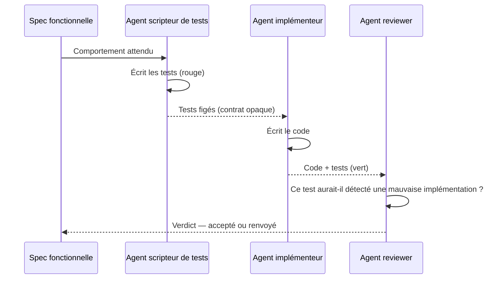

# TDD à trois agents

Le TDD classique — rouge, vert, refactor — repose sur une discipline : celui qui écrit le test résiste à la tentation de l'adapter à l'implémentation qu'il a déjà en tête. Cette discipline tient plus ou moins bien chez un développeur humain fatigué en fin de sprint. Elle ne tient pas du tout chez un agent, qui optimise par défaut pour « faire passer le test » — y compris en réécrivant le test si rien ne l'en empêche. Le TDD à trois agents ne demande pas plus de discipline : il déplace le problème hors du domaine de la volonté, en séparant les rôles sur trois agents qui n'ont pas accès aux mêmes informations ni aux mêmes fichiers.

## Le problème que résout la séparation des rôles

Un seul agent qui écrit le test puis l'implémentation a accès aux deux en même temps. Rien ne l'empêche, consciemment ou non, d'écrire un test qui colle à l'implémentation qu'il s'apprête à produire plutôt qu'au comportement attendu par la spec. Le test passe, la couverture affiche un chiffre correct, et pourtant rien n'a été vérifié : le test constate ce que fait le code, il ne prouve pas que le code fait ce qu'il fallait. Séparer les rôles retire cette possibilité à la racine : l'agent qui écrit le test à partir de la spec ne voit jamais l'implémentation, donc il ne peut tester que le comportement attendu. L'agent qui implémente ne voit jamais le test avant qu'il soit figé, donc il ne peut pas l'adapter pour le faire passer. C'est un cas particulier de la [spécialisation des rôles](../orchestration/roles-specialises) : séparer des points de vue, pas seulement des tâches.

## Le protocole

| Agent | Reçoit | Produit | Interdit |
|---|---|---|---|
| Scripteur de tests | La spec fonctionnelle, jamais le code | Les tests, rouges par construction | Lire ou écrire l'implémentation |
| Implémenteur | La spec + les tests, comme un contrat opaque | Le code qui fait passer les tests | Modifier les tests, même pour « les corriger » |
| Reviewer | La spec, les tests, l'implémentation | Un verdict argumenté | Modifier tests ou code — seulement escalader |



Le point clé du protocole : l'Implémenteur ne reçoit jamais l'autorisation de toucher au fichier de tests. Si un test lui semble faux, il ne le corrige pas — il l'escalade au Reviewer, seul habilité à renvoyer les tests au Scripteur.

### Ce « jamais » doit être une permission, pas une consigne

C'est le point sur lequel tout le protocole tient ou s'effondre. Si l'interdiction d'écrire dans le fichier de tests n'est qu'une phrase dans le prompt de l'Implémenteur, on retombe **exactement** dans le problème du premier paragraphe : une consigne qu'un agent optimisant pour « faire passer le test » finira par contourner, précisément parce que rien ne l'en empêche.

La séparation ne vaut que si elle est appliquée par l'hôte : l'outil d'écriture de l'Implémenteur n'a pas le droit d'écrire sur le chemin des tests, et une tentative échoue au niveau du programme, pas au niveau du jugement du modèle. C'est la même distinction que pour les [garde-fous d'outils](../agents/outils-et-garde-fous) : un garde-fou se vérifie dans le code, jamais dans le prompt.

Sans cette application technique, le TDD à trois agents reste utile — il rend la triche visible dans le diff et coûteuse à commettre — mais il ne la rend pas impossible. Annoncer l'inverse serait vendre la méthode au lieu de la décrire.

## Exemple concret

Spec donnée au Scripteur de tests : « un code de réduction en pourcentage s'applique au sous-total, mais jamais au-delà de 20 %, même si le code en promet plus. »

```csharp
[Fact]
public void Reduction_Est_Plafonnee_A_20_Pourcent()
{
    var panier = Panier.Creer(sousTotal: 100m);

    panier.AppliquerReduction(new CodeReduction(pourcentage: 35m)); // au-dessus du plafond

    Assert.Equal(80m, panier.Total); // 20 % de réduction, pas 35 %
}
```

Implémentation naïve qui échouerait à ce test, et serait renvoyée :

```csharp
public void AppliquerReduction(CodeReduction code)
{
    Total = SousTotal * (1 - code.Pourcentage / 100m); // pas de plafond → échoue au test
}
```

L'Implémenteur ne peut pas « arranger » ce désaccord en réécrivant l'assertion à `65m` — le fichier de tests ne lui appartient pas. Il doit corriger le code pour plafonner réellement la réduction.

## Le mode d'échec principal : le test est faux

Le protocole élimine la triche, pas l'erreur. Le mode d'échec dominant devient différent : le Scripteur de tests écrit un test qui ne couvre pas le bon comportement — par exemple, un test qui vérifie le plafond à 20 % mais oublie de vérifier qu'une réduction *sous* le plafond s'applique intégralement. L'Implémenteur satisfait ce test partiel sans que personne ne remarque que le comportement réellement attendu n'est que partiellement couvert. C'est pour ça que le Reviewer ne relit pas seulement le code : il relit **le test lui-même**, avec une question précise — ce test aurait-il détecté une implémentation manifestement fausse ? S'il l'aurait laissée passer, il n'apporte aucune garantie, même vert. C'est la même exigence de recul que dans [Évaluer un agent](../agents/evaluer-un-agent) : un résultat qui a l'air bon ne prouve rien tant que le contrôle lui-même n'a pas été mis à l'épreuve.

## Pont CQRS — séparer n'est pas une commodité, ça change le modèle

Découper le travail en trois agents n'est pas qu'une astuce d'organisation, au même titre qu'un standup découpe une réunion. C'est un changement de modèle, comme quand [CQRS](../cqrs/introduction-cqrs) sépare lecture et écriture : une fois la frontière posée, chaque côté a des contraintes propres qu'il n'avait pas quand il partageait le même code. Le Scripteur de tests ne raisonne plus jamais en termes d'implémentation possible ; l'Implémenteur ne raisonne plus jamais en termes de test à satisfaire, seulement de comportement à produire. La séparation ne rajoute pas une étape à un même modèle mental, elle en crée deux qui ne se recroisent qu'à la review — exactement comme le Write Model et le Read Model ne se recroisent que via la projection.

## Limites

Le protocole coûte trois passes d'agent au lieu d'une, plus une synchronisation à chaque renvoi. Sur une fonction triviale, ce coût dépasse largement celui de l'écrire directement. Il existe aussi des cas où **spécifier le test est plus dur qu'écrire le code** — un algorithme dont le comportement attendu ne devient clair qu'en le voyant tourner (un rendu graphique, un tri approximatif, un cas d'optimisation sans oracle simple). Dans ces cas, imposer un test rouge écrit à l'aveugle avant tout code produit un test arbitraire, pas un contrat utile — mieux vaut explorer d'abord, puis figer un test a posteriori sous revue explicite de sa légitimité.

## Pour aller plus loin

- Kent Beck, *Test-Driven Development: By Example* — le rouge-vert-refactor original, dont ce protocole est une variante à rôles séparés.
- Le principe de séparation des devoirs (*segregation of duties*), emprunté à l'audit financier, appliqué ici au code plutôt qu'à la caisse.

## Pour un agent

> **Règle** — L'agent qui écrit un test ne lit jamais le code de l'implémentation qu'il teste.
> **Règle** — L'agent qui implémente n'a pas le droit d'écriture sur le fichier de tests, sous aucun prétexte.
> **Règle** — Un test contesté est escaladé au Reviewer, jamais corrigé unilatéralement par l'Implémenteur.
> **Signal d'alerte** — Un même agent produit le test et l'implémentation dans le même tour.
> **Signal d'alerte** — Un test vert dont personne ne peut dire s'il aurait échoué sur une implémentation fausse.

---

*Notes liées : [Pourquoi spécialiser ses agents](../orchestration/roles-specialises) — le principe général dont ce protocole est un cas d'application. [Un cycle de développement piloté par des agents](./sdlc-pilote-par-ia) — où ce protocole s'insère dans les étapes Implémenter et Valider. [Évaluer un agent](../agents/evaluer-un-agent) — pourquoi un résultat vert ne prouve rien sans mise à l'épreuve du contrôle. [Introduction au CQRS](../cqrs/introduction-cqrs) — la séparation des responsabilités qui change le modèle, pas seulement l'organisation.*
