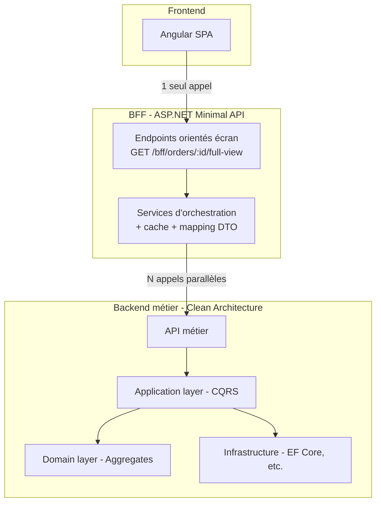
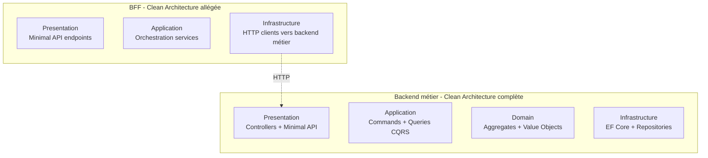

# Backend For Frontend & Clean Architecture

Le pattern **Backend For Frontend (BFF)** a été popularisé par SoundCloud en 2015 pour résoudre un problème concret : leur API unique servait à la fois leur web, leur mobile, et leurs partenaires, et chacun tirait dans une direction différente. La solution : une API dédiée à chaque type de client, pilotée par l'équipe frontend qui en est le consommateur principal.

Cette note explore comment intégrer un BFF dans une architecture propre, sans trahir les principes de la Clean Architecture ni du DDD.

## Le problème que résout un BFF

Imagine une appli de e-commerce avec une API REST classique :

```
GET /orders/{id}           → retourne la commande
GET /customers/{id}        → retourne le client
GET /products/{id}         → retourne un produit
GET /invoices/{id}         → retourne la facture
```

L'écran « Détail de ma commande » côté web a besoin de : la commande, ses lignes, le client, chaque produit de chaque ligne, et la facture associée. Ça fait **1 + N + 1 + 1 appels**. Sur mobile avec un réseau instable, c'est une catastrophe UX.

Trois solutions classiques, chacune avec ses défauts :

1. **Enrichir l'API métier** pour retourner tout d'un coup. → Couple l'API aux besoins UI, casse le principe de responsabilité unique.
2. **Appeler les endpoints en parallèle côté client**. → Complexité côté front, latence cumulée, gestion d'erreurs compliquée.
3. **GraphQL**. → Solution valide mais impose une stack entière et une courbe d'apprentissage.

Le BFF propose une quatrième voie : **une couche d'orchestration dédiée au frontend**, qui agrège, transforme et simplifie.

## Architecture cible



Le BFF **ne contient pas de logique métier**. C'est son principe fondateur. Il orchestre, il transforme, il agrège. Toute règle métier doit rester dans le Domain du backend principal.

## Le BFF dans une Clean Architecture

Question classique : le BFF fait-il partie de la Clean Architecture du backend métier, ou c'est une application séparée ?

**Réponse : une application séparée, avec sa propre Clean Archi, mais allégée.**



Le BFF n'a **pas de couche Domain**. Il n'a pas d'Aggregates, pas de règles métier. Il a :

- **Presentation** : endpoints Minimal API orientés écran (`/bff/orders/{id}/full-view`)
- **Application** : services d'orchestration qui appellent le backend métier en parallèle
- **Infrastructure** : clients HTTP typés (via `HttpClient` + `Refit` par exemple) vers le backend métier, plus éventuellement un cache Redis

Les DTOs du BFF sont **pensés pour l'écran**, pas pour le métier. `OrderFullViewDto` contient exactement ce que l'écran affiche, ni plus ni moins.

## Exemple concret — Détail d'une commande

### Côté backend métier

Trois endpoints indépendants, chacun dans son bounded context :

```csharp
// Ordering context
GET /api/orders/{id}           → OrderDto (id, customerId, status, lines)

// Billing context
GET /api/invoices/by-order/{orderId}  → InvoiceDto

// Catalog context
GET /api/products?ids={ids}    → List<ProductDto>
```

Chacun respecte son périmètre. L'API Ordering ne sait rien des factures, l'API Billing ne sait rien des produits.

### Côté BFF

Un seul endpoint consommé par l'écran :

```csharp
app.MapGet("/bff/orders/{id}/full-view", async (
    Guid id,
    IOrderFullViewService service,
    CancellationToken ct) =>
{
    var view = await service.GetFullViewAsync(id, ct);
    return view is null ? Results.NotFound() : Results.Ok(view);
});
```

Et le service d'orchestration :

```csharp
public async Task<OrderFullViewDto?> GetFullViewAsync(Guid orderId, CancellationToken ct)
{
    var order = await _orderingApi.GetOrderAsync(orderId, ct);
    if (order is null) return null;

    // Appels parallèles pour minimiser la latence
    var invoiceTask = _billingApi.GetInvoiceByOrderAsync(orderId, ct);
    var productIds = order.Lines.Select(l => l.ProductId).Distinct().ToArray();
    var productsTask = _catalogApi.GetProductsAsync(productIds, ct);

    await Task.WhenAll(invoiceTask, productsTask);

    return _mapper.ToFullView(order, invoiceTask.Result, productsTask.Result);
}
```

### Côté Angular

Un seul appel, un modèle déjà prêt à afficher :

```typescript
export class OrderDetailPage {
  private readonly bff = inject(OrderBffService);
  protected readonly orderId = input.required<string>();

  protected readonly view = toSignal(
    toObservable(this.orderId).pipe(
      switchMap(id => this.bff.getFullView(id))
    )
  );
}
```

Pas d'agrégation côté front, pas de gestion de dépendances entre appels, pas de cascade d'erreurs.

## Les règles à ne jamais violer

1. **Pas de logique métier dans le BFF.** Si tu écris une règle du type « si le total > 1000€ alors appliquer la remise fidélité », elle est au mauvais endroit. Elle appartient au Domain du backend métier.

2. **Le BFF appartient à l'équipe frontend.** C'est fondamental. Un BFF maintenu par l'équipe backend devient vite une API de plus, pas un BFF. Si ton équipe front est timide sur le C#, forme-la — c'est moins coûteux que de rater le pattern.

3. **Un BFF par type de client, pas par client.** Si ton web et ton mobile ont des besoins d'écran similaires, un seul BFF les sert. Si les besoins divergent (mobile très contraint en taille de payload par exemple), alors deux BFFs.

4. **Authentification au niveau du BFF.** Le BFF est le point d'entrée, il valide les tokens et propage l'identité vers le backend métier. Ne laisse pas chaque service backend re-valider.

5. **Le BFF est stateless.** Si tu as besoin de cache, mets du Redis derrière. Pas d'état en mémoire dans le BFF, il doit être scalable horizontalement.

## Quand ne PAS mettre de BFF

Le BFF est un pattern, pas une obligation. Tu n'en as probablement pas besoin si :

- Tu as **un seul type de client** (web uniquement, par exemple)
- Ton API métier retourne **des vues qui correspondent à tes écrans** sans agrégation
- Tu es sur un **petit projet** où l'overhead d'une application supplémentaire coûte plus qu'il ne rapporte
- Tu utilises **GraphQL** : il joue déjà le rôle d'agrégateur

Le BFF brille quand tu as au moins deux clients différents, ou quand ton API métier est fortement structurée en bounded contexts indépendants et que tes écrans ont besoin d'agréger plusieurs contextes.

## Pour aller plus loin

- L'article fondateur de Sam Newman sur [le pattern BFF](https://samnewman.io/patterns/architectural/bff/) (2015)
- *Building Microservices* de Sam Newman, chapitre sur les API Gateways et BFFs
- *Clean Architecture* de Robert C. Martin pour les principes de découpage en couches

---

*Note liée : [Event Storming — Le code couleur expliqué](./event-storming-color-code) — comment modéliser le domaine avant de décider où placer la logique.*
