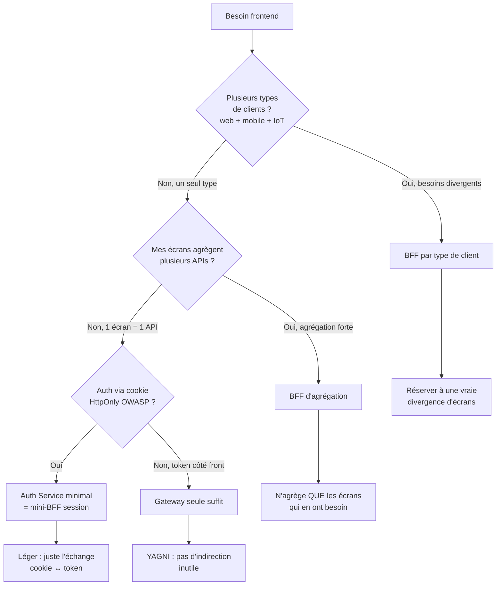
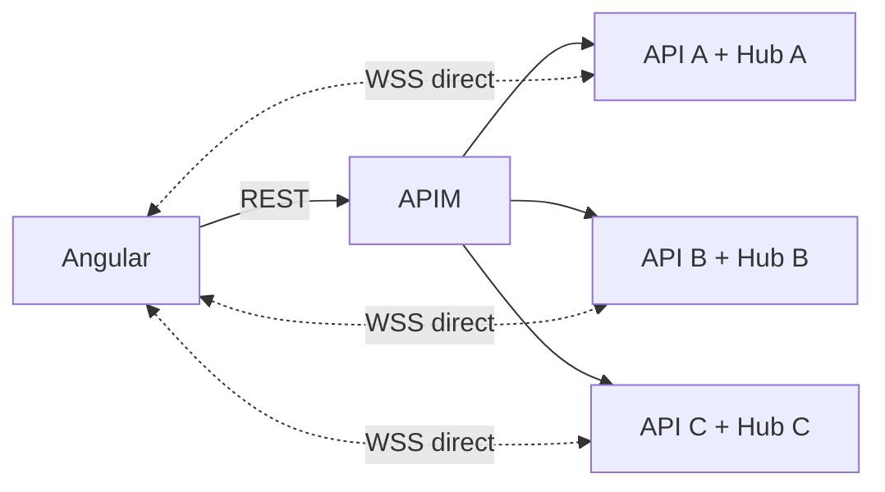
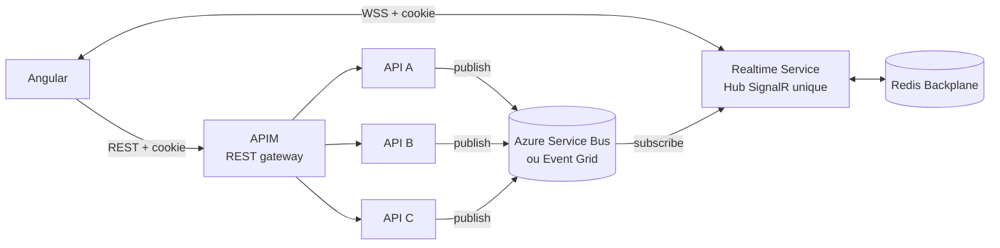
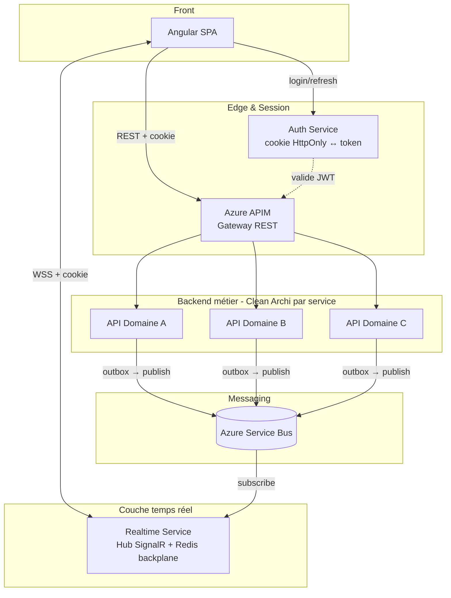
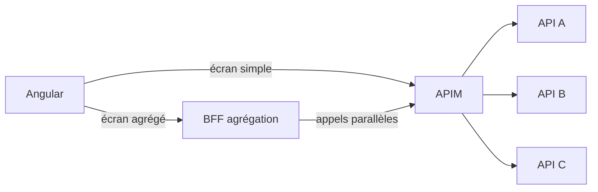

# BFF, SignalR et Gateway — Arbitrages d'architecture

Cette note prolonge [BFF & Clean Architecture](./bff-clean-archi) en répondant à deux questions très concrètes qui reviennent dès qu'on a une infra réelle :

1. **Si j'ai déjà une API Gateway (Azure APIM, Kong, etc.), ai-je vraiment besoin d'un BFF ?**
2. **Comment intégrer SignalR / WebSocket dans tout ça sans réinventer un god-service ?**

La réponse courte aux deux : ça dépend de la **responsabilité réelle** de chaque composant. 
La plupart des erreurs viennent de la confusion entre Gateway, BFF et service temps réel, qu'on finit par fusionner par paresse.

## Le piège fondamental : BFF ≠ Gateway ≠ Hub temps réel

Ces trois composants ont des responsabilités **différentes et complémentaires**. Les confondre, c'est créer un monolithe déguisé.

| Composant | Responsabilité principale | Ce qu'il **ne** fait **pas** |
|-----------|---------------------------|------------------------------|
| **API Gateway** (APIM) | Routing, throttling, validation JWT, CORS, versioning, transformation de réponse | Agrégation multi-API, logique d'écran, état temps réel |
| **BFF** | Agrégation orientée écran, mapping vers view models, session navigateur (cookie HttpOnly) | Logique métier, routing générique, broadcast temps réel |
| **Hub SignalR** | Diffusion d'événements temps réel, gestion des connexions WebSocket, groupes | Logique métier, autorisation (décisions), proxy REST |

Si tu fais transiter du REST classique par le BFF *juste pour passer*, tu réimplémentes ta Gateway. 
Si tu mets de l'autorisation métier dans ton Hub, tu trahis le principe que **le Hub traduit, il ne décide pas** — exactement comme un `SpecificationEvaluator` qui traduit sans autoriser.

## Décisionnel : ai-je besoin d'un BFF ?



**Règle simple : un BFF se justifie par un besoin précis (agrégation, session, divergence client). 
Pas par défaut.** Avec APIM en place, l'ajout d'un BFF doit être motivé écran par écran ou besoin par besoin.

## Le cas SignalR : où placer le Hub ?

Trois options réelles, par ordre de complexité croissante.

### Option A — Hub dans chaque API métier (front → N hubs)

Chaque service métier expose son propre Hub. Le front ouvre N connexions WebSocket.



**Quand c'est valide :**
- Un seul service fait vraiment du temps réel (les autres sont REST)
- Petite appli interne, peu d'utilisateurs simultanés
- Domaines parfaitement étanches (aucun événement cross-context)

**Pourquoi c'est dangereux à l'échelle :**
- N connexions WebSocket persistantes par utilisateur (coût mémoire, file descriptors)
- Auth dupliquée dans chaque Hub (cookie HttpOnly et CORS deviennent un cauchemar avec N origines)
- Le front devient orchestrateur (violation SRP côté Angular)
- Coordination cross-domaine impossible sans bus inter-services en plus

### Option B — Hub centralisé dédié (recommandé)

Un service Realtime dédié, qui n'est **pas** un proxy REST. Il expose un seul Hub et consomme les événements via un bus.



**Principe clé :** le Realtime Service **traduit** des événements bus → messages SignalR. 
Il ne décide pas qui a droit à quoi. 
L'autorisation est résolue **en amont** par l'API qui publie l'événement, qui enrichit le payload avec les destinataires :

```csharp
public sealed record RealtimeEvent<TPayload>(
    string EventType,                       // "Islet.Updated"
    IReadOnlyList<string> TargetUserIds,    // résolu en amont
    string TenantId,
    TPayload Payload,
    DateTimeOffset OccurredAt);
```

**Avantages :**
- Une seule connexion WSS par utilisateur
- Auth centralisée (cookie HttpOnly, pattern OWASP)
- Évolutivité : changer une API métier ne casse pas le contrat front
- Le front reste bête : un Hub, des événements typés

**Coûts :**
- Redis backplane obligatoire dès qu'on scale horizontalement
- Couche de plus à exploiter
- Contrat d'événements à maintenir entre APIs et Realtime Service

### Option C — Hub via APIM (WebSocket passthrough)

APIM supporte le passthrough WebSocket depuis 2021. Techniquement on peut router les connexions Hub via APIM.

**Mon avis :** rarement intéressant pour SignalR. APIM ne comprend pas le protocole SignalR (négociation HTTP puis upgrade WS), donc il ne fait que du tunnel TCP. Tu perds les bénéfices de l'agrégation centralisée et tu ajoutes un hop. À considérer uniquement si tu as une raison forte (politique de sécurité réseau qui interdit les WebSocket directs vers les services).

## Architecture cible recommandée

Pour une app SPA (type Angular, ...) avec plusieurs utilisateurs simultanés, plusieurs APIs métier derrière APIM, et besoin de temps réel multi-domaine :



**Lecture de l'archi :**

- **Front Angular** parle à 3 origines selon le besoin : APIM (REST), Auth (login), Realtime (WSS). Une seule origine apparente possible via reverse proxy (YARP, nginx) si on veut.
- **APIM** garde son rôle classique : pas de duplication, pas de BFF générique qui le doublonne.
- **Realtime Service** est focalisé : Hub SignalR, abonnement bus, diffusion. Pas de logique métier, pas de proxy REST.
- **APIs métier** publient des événements via **outbox pattern** pour garantir la cohérence transactionnelle entre l'écriture DB et la publication.

## Ajouter un BFF d'agrégation ciblé (si besoin)

Si certains écrans Angular ont besoin d'agréger 3+ APIs en parallèle, ajoute un BFF d'agrégation **uniquement pour ces écrans**. Il appelle APIM en interne, pas les APIs en direct :



Pourquoi passer par APIM depuis le BFF aussi ? Pour ne pas dupliquer les politiques de throttling, auth, retry — APIM les applique uniformément quel que soit l'appelant.

## Les pièges à éviter

### 1. Le BFF qui devient proxy REST de tout

Symptôme : chaque endpoint du backend a son équivalent dans le BFF qui ne fait que `await _api.GetXxx()`. C'est de la duplication pure. **Si ton BFF n'agrège pas, ne transforme pas, ne compose pas → il n'a pas de raison d'exister sur cet endpoint.**

### 2. Le Hub SignalR qui prend des décisions d'autorisation

Symptôme : `if (user.HasRight("X")) await Clients.User(id).SendAsync(...)`. La décision d'autorisation doit être prise par l'API métier qui produit l'événement, et le Hub ne fait que diffuser aux destinataires déjà résolus. **Le Hub traduit, il ne décide pas.**

### 3. Logique métier dans le BFF ou le Realtime Service

Le `if (total > 1000) appliquerRemise()` n'a rien à faire ici. Toute règle métier appartient au Domain de l'API métier compétente. Le BFF et le Realtime Service sont des couches d'**adaptation**, pas de **règle**.

### 4. Publier des événements sans outbox pattern

Si l'API métier écrit en DB puis publie sur le bus sans transaction commune, tu auras tôt ou tard une incohérence (DB OK + bus KO, ou inverse). Outbox pattern : insérer l'événement dans une table `outbox` dans la même transaction que la modification métier, puis un worker dépile la table vers le bus. C'est le seul moyen propre.

### 5. WebSocket sans Redis backplane dès qu'on scale

Symptôme : avec 2 instances du Realtime Service, un user connecté à l'instance 1 ne reçoit pas les messages publiés par l'instance 2. **Dès que tu envisages plus d'une instance, Redis backplane est non-négociable.**

## Tableau récapitulatif des décisions

| Situation | Gateway seule | BFF agrégation | Realtime Service | BFF par client |
|-----------|:-------------:|:--------------:|:----------------:|:--------------:|
| 1 type de client, écrans simples | ✅ | ❌ | ❌ | ❌ |
| 1 client, écrans agrégeant 3+ APIs | ✅ | ✅ | ❌ | ❌ |
| Web + mobile avec besoins divergents | ✅ | selon | selon | ✅ |
| Cookie HttpOnly (BFF pattern OWASP) | ✅ + Auth Service | selon | selon | selon |
| Temps réel single-domaine | ✅ | ❌ | ❌ (Hub dans l'API) | ❌ |
| Temps réel multi-domaines | ✅ | selon | ✅ | selon |
| Beaucoup d'utilisateurs simultanés en WSS | ✅ | selon | ✅ | selon |

## Pour aller plus loin

- [BFF & Clean Architecture](./bff-clean-archi) — la note de référence sur le BFF
- [SignalR scale-out avec Redis](https://learn.microsoft.com/en-us/aspnet/core/signalr/redis-backplane) — doc officielle
- Outbox pattern : *Microservices Patterns* de Chris Richardson, chapitre 3
- APIM et WebSocket : [Azure APIM WebSocket passthrough](https://learn.microsoft.com/en-us/azure/api-management/websocket-api)

---

*Note liée : [BFF & Clean Architecture](./bff-clean-archi) — fondamentaux du pattern BFF.*
