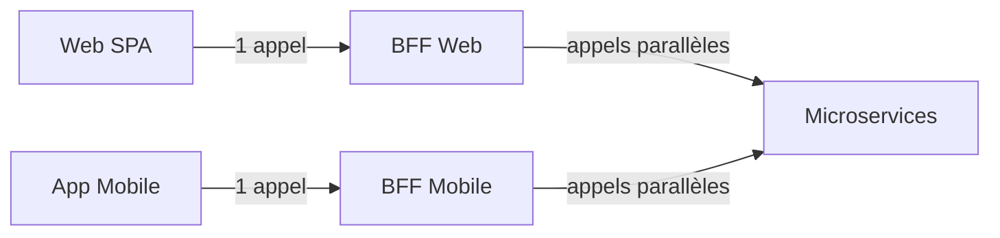

# BFF vs GraphQL — Choisir son mode de composition

Le problème est toujours le même : plusieurs clients (web, mobile, partenaires) ont besoin de **formes et volumes différents** de données. Deux réponses architecturales sont classiques. Choisir consciemment entre les deux — plutôt qu'empiler l'une sur l'autre par défaut — est l'essentiel de cette note.

## Le problème

Un écran web affiche une fiche commande complète (20 champs, lignes, historique). La même fiche sur mobile n'affiche que le statut et le total. L'API métier sous-jacente expose des endpoints par bounded context.

Options naïves et leurs défauts :
- **Enrichir côté API** : l'API métier devient esclave des UI → couplage, perte d'autonomie des contextes
- **Tout assembler côté front** : N appels HTTP, latence cumulée, gestion d'erreurs complexe
- **Un seul gros endpoint** : surcharge les clients qui n'ont besoin que d'une partie

## Approche A — BFF (Backend For Frontend)

Un **backend dédié par type de client**. Le BFF web expose des endpoints orientés écran, façonnés exactement pour ce client.



L'endpoint BFF est orienté écran, pas ressource — il retourne exactement ce dont une page a besoin :

```csharp
// GET /bff/orders/{id}/full-view — façonné pour la page détail commande web
app.MapGet("/bff/orders/{id}/full-view", async (Guid id, IOrderViewService svc, CancellationToken ct) =>
{
    var view = await svc.GetAsync(id, ct); // appels parallèles vers Ordering, Billing, Catalog
    return view is null ? Results.NotFound() : Results.Ok(view);
});
```

**Avantages :**
- **Contrôle total** sur la forme de la réponse par client
- **Composition explicite** : le code d'assemblage est lisible et traçable
- Optimisable par client : cache différent, circuit breaker adapté, logique de retry propre
- Pas de changement chez les microservices quand une UI évolue

**Inconvénients :**
- **N backends à maintenir** si les clients divergent vraiment (web, mobile, IoT…)
- **Duplication** si web et mobile se ressemblent à 90% — on réécrit la même composition deux fois
- L'équipe frontend doit **posséder un backend** (ou dépendre du backend pour chaque changement d'UI)

### Combien de BFFs ?

> Sam Newman (l'auteur du pattern) le formule clairement : on crée un BFF **par *classe* de clients similaires**, pas un par client.

Deux clients quasi-identiques à 2-3 champs près ne justifient **pas** un second backend — ça se gère par sélection de champs ou par paramètre. On démarre avec un BFF partagé (*Experience API*) et on splitte le jour où la divergence devient réelle.

Le **signal de split**, c'est l'accumulation de branches `if mobile / if web` dans le code de composition — pas le compteur de clients.

## Approche B — GraphQL

**Une seule couche**, côté serveur, que **chaque client interroge à la forme dont il a besoin**.

```graphql
# Web — demande tout
query OrderDetail($id: ID!) {
  order(id: $id) {
    id status total
    lines { productName quantity unitPrice }
    history { date event }
    customer { name email }
  }
}

# Mobile — demande le minimum
query OrderSummary($id: ID!) {
  order(id: $id) { id status total }
}
```

**Avantages :**
- Résout **littéralement** le problème « gros/petit » : chaque client demande exactement ses champs
- **Un seul serveur** à maintenir, peu importe le nombre de types de clients
- Introspection, auto-documentation, tooling riche

**Inconvénients :**
- **Complexité serveur** : résolution N+1, DataLoader, protection contre les requêtes profondes et coûteuses
- **Sécurité** : une requête mal formulée peut charger des arbres entiers de données — nécessite depth limiting, query cost analysis
- **Moins adapté à un contrat figé** : pas de versioning natif, difficile à stabiliser pour des partenaires
- Courbe d'apprentissage non nulle côté front et back

## Tableau comparatif

| Critère | BFF | GraphQL |
|---|---|---|
| Clients aux besoins vraiment différents | ✅ un BFF par type | ✅ chaque client choisit ses champs |
| Contrat stable pour partenaires | ✅ REST versionné possible | ⚠️ complexe à versionner |
| Requêtes imbriquées flexibles | ⚠️ à implémenter manuellement | ✅ natif |
| N+1 queries | Géré explicitement dans le handler | Nécessite DataLoader |
| Overhead opérationnel | N backends si clients divergent | 1 serveur + complexité resolver |
| Ownership équipe frontend | Possible (BFF = micro-backend front) | Partagé via le schema |

## Comment choisir

**Choisis GraphQL si :**
- Tes clients ont des besoins très variés et imprévisibles en termes de champs
- Tu as une équipe capable de gérer la complexité serveur
- Tu construis une plateforme où des consommateurs tiers vont requêter de façon flexible

**Choisis BFF si :**
- Tes clients sont en nombre limité et leur périmètre est connu
- Tu veux des contrats explicites et stables
- L'équipe frontend veut l'ownership complet de sa couche d'adaptation

**Ne les empile pas par défaut.** Un BFF qui expose du GraphQL est possible mais rarement justifié — tu paies les coûts des deux sans bénéfice supplémentaire. Commence par l'un.

## L'API Partenaire : un troisième cas à ne pas confondre

Ni BFF ni GraphQL n'est la bonne réponse pour exposer une API à des partenaires externes. Une **API Partenaire** est un *produit* à part entière :

- **Contrat stable et versionné** — un partenaire ne peut pas être forcé à migrer du jour au lendemain
- **Consentement et gestion des accès** — OAuth, scopes, quotas par partenaire, SLA formalisé

Un BFF change vite pour suivre le frontend. Une API Partenaire doit être conservatrice et contractuelle. Ce sont deux produits avec des cycles de vie opposés — les séparer est la seule architecture saine si tu as les deux.

## Pour aller plus loin

- Sam Newman, *Building Microservices* — chapitre sur les BFFs
- Sam Newman, [Pattern: Backends For Frontends](https://samnewman.io/patterns/architectural/bff/) — l'article de référence
- Documentation officielle [GraphQL](https://graphql.org/learn/)

---

*Notes liées : [Backend For Frontend & Clean Architecture](../bff/bff-clean-archi) — implémentation concrète d'un BFF. [BFF, SignalR et Gateway — Arbitrages d'architecture](../bff/bff-signalr-gateway-arbitrage) — BFF vs Gateway vs Realtime Service. [Composer un dashboard multi-contexte](../cqrs/composition-multi-contexte) — comment le BFF compose des données issues de plusieurs bounded contexts.*
