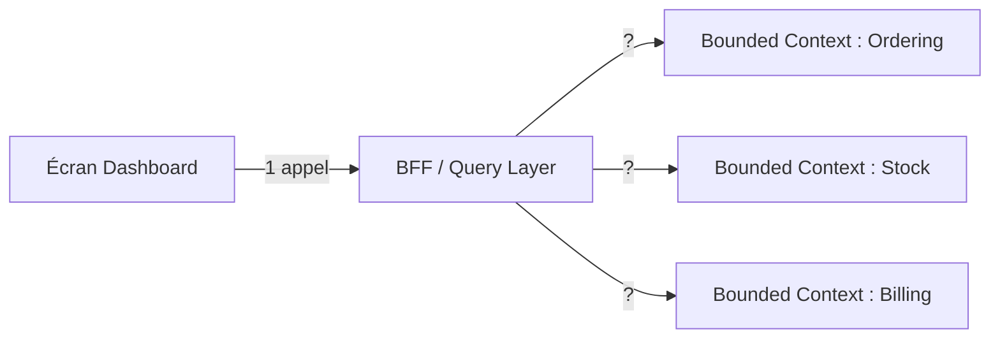
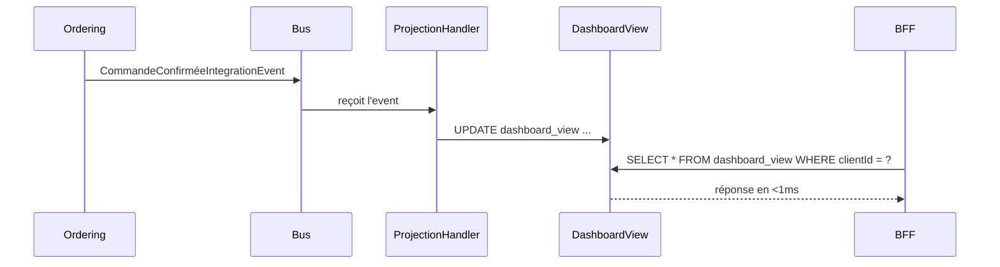

# Composer un dashboard multi-contexte : fan-out vs projection

Un dashboard d'exploitation typique agrège des données de **plusieurs bounded contexts** en un seul écran. C'est le problème que ni CQRS, ni le BFF, ni les microservices seuls ne résolvent complètement — ils posent chacun un bout de la réponse, mais l'assemblage requiert une décision architecturale explicite.

Deux stratégies s'opposent. Aucune n'est universellement supérieure : le choix dépend de critères précis.

## Le contexte : pourquoi c'est difficile

Dans une architecture en bounded contexts, chaque contexte est autonome. Un écran « tableau de bord commandes » a besoin de : l'état des commandes (Ordering), les niveaux de stock (Stock), et les encours de facturation (Billing).

On ne peut pas demander à l'agrégat Ordering d'aller chercher les données Stock — ça recouplerait les bounded contexts et tuerait leur autonomie. Il faut un **point de composition externe**.



La question : comment ce point de composition produit-il la réponse ?

## Stratégie A — Fan-out à la volée

Le BFF appelle les trois services **à chaque requête** et assemble la réponse.

```csharp
public async Task<DashboardDto> GetDashboardAsync(CancellationToken ct)
{
    var ordersTask  = _orderingApi.GetSummaryAsync(ct);
    var stockTask   = _stockApi.GetLevelsAsync(ct);
    var billingTask = _billingApi.GetEncourAsync(ct);

    await Task.WhenAll(ordersTask, stockTask, billingTask);

    return new DashboardDto(ordersTask.Result, stockTask.Result, billingTask.Result);
}
```

**Avantages :**
- Simple à implémenter — pas de projection à construire
- Données toujours **fraîches**, aucun décalage possible

**Inconvénients :**
- La **latence totale = service le plus lent** (même avec les appels parallèles)
- Si un service est down, **le dashboard est down** — couplage de disponibilité
- Sur des dashboards très fréquemment consultés, la charge sur chaque service devient significative

## Stratégie B — Projection pré-calculée (Read Model)

Une vue dénormalisée `dashboard_view` est maintenue à jour en s'abonnant aux **Integration Events** publiés par chaque bounded context.



```csharp
public class DashboardProjectionHandler
    : IIntegrationEventHandler<CommandeConfirméeIntegrationEvent>
{
    public async Task HandleAsync(CommandeConfirméeIntegrationEvent @event, CancellationToken ct)
    {
        await _db.DashboardViews
            .Where(v => v.ClientId == @event.ClientId)
            .ExecuteUpdateAsync(
                v => v.SetProperty(d => d.OrdersCount, d => d.OrdersCount + 1),
                ct);
    }
}
```

**Avantages :**
- Lecture **rapide** — une seule source pré-calculée
- **Résilient** — si Ordering est down, la dernière vue connue est toujours servable
- Charge découplée des services sources

**Inconvénients :**
- **Cohérence éventuelle** : la vue a quelques secondes (ou minutes) de retard par rapport aux données sources — un event publié n'est pas encore reflété dans la projection au moment où une query arrive immédiatement après
- Une projection à **construire et maintenir** : gestion des events, idempotence, reconstruction si la structure évolue
- Dépend de la qualité et de la fiabilité du bus

## Critères de choix

| Critère | Fan-out (A) | Projection (B) |
|---|---|---|
| Fraîcheur exigée | Temps réel strict | Léger retard tolérable |
| Fréquence d'affichage | Rare | Très fréquente |
| Tolérance à un service indisponible | Faible | Élevée |
| Coût de développement | Faible | Significatif |
| Nombre de bounded contexts impliqués | 2-3 | 4+ |

> Si les données du dashboard servent aussi à **déclencher des écritures** (validation, action utilisateur), la projection reste la lecture — l'écriture déclenche des Commands vers les bounded contexts concernés. Une projection ne remplace jamais un agrégat.

## Relation avec CQRS

La projection B *est* un Read Model au sens CQRS : une vue optimisée pour l'affichage, alimentée par des événements, sans agrégat. La note [Introduction au CQRS](../cqrs/introduction-cqrs) décrit ce mécanisme à l'intérieur d'un contexte ; ici c'est le même principe appliqué **entre contextes**.

La **source** de la projection sont les [Integration Events](../ddd/integration-events-vs-domain-events) publiés par chaque bounded context. C'est là que CQRS, integration events, et composition cross-contexte convergent.

## Et si l'écran doit aussi écrire ?

Cette note traite uniquement la **lecture**. Si un écran composite doit aussi déclencher une écriture qui touche plusieurs bounded contexts (ex: valider une commande *et* réserver le stock *et* créer la facture en un seul clic), c'est un problème différent : la **Saga** (ou *Process Manager*). Une saga orchestre plusieurs Commands cross-contexte via le bus, avec compensation en cas d'échec partiel. Ne pas étendre une projection à ce rôle — ce sont des responsabilités opposées.

## Limites et pièges

- **Ne pas créer une projection par défaut.** L'investissement se justifie pour des vues **très fréquentes** avec des sources multiples. Si seules 3 pages sur 40 sont vraiment composites, le poids architectural de la projection doit le refléter.
- **La reconstruction.** Si la structure de la projection change, il faut la reconstruire depuis les events historiques. Sans replay d'events, une projection mal conçue devient un fardeau.
- **Ne pas coupler écriture et lecture.** La projection n'est jamais la source de vérité — c'est une vue. La source de vérité reste dans chaque bounded context.

## Pour aller plus loin

- Greg Young, *CQRS Documents* — Read Models et projections
- Vaughn Vernon, *Implementing Domain-Driven Design* — projection de vues cross-context
- Chris Richardson, *Microservices Patterns* — composition cross-service

---

*Notes liées : [Introduction au CQRS](../cqrs/introduction-cqrs) — Read Model et projections à l'intérieur d'un contexte. [Events de domaine vs Events d'intégration](../ddd/integration-events-vs-domain-events) — le bus qui nourrit les projections. [Backend For Frontend & Clean Architecture](../bff/bff-clean-archi) — où se situe le BFF dans cette composition.*
