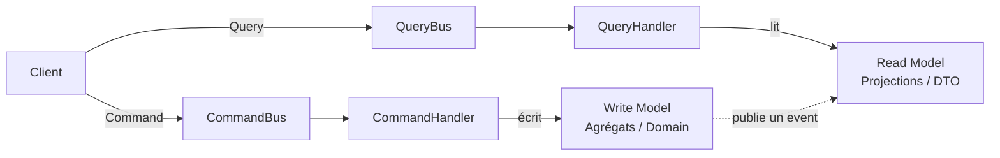
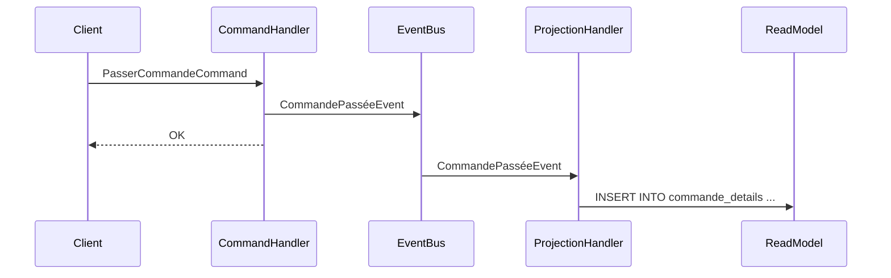

# Introduction au CQRS

**CQRS** (Command Query Responsibility Segregation) est un pattern architectural qui consiste à séparer strictement les opérations qui **modifient** l'état du système (les *Commands*) de celles qui **lisent** cet état (les *Queries*). Cette distinction, popularisée par Greg Young et Udi Dahan au milieu des années 2000, s'inspire du principe CQS (Command Query Separation) de Bertrand Meyer, appliqué au niveau de l'architecture plutôt que des méthodes.

Le problème que CQRS résout est simple : un service applicatif classique accumule des responsabilités incompatibles. Une méthode `GetOrder(id)` et une méthode `PlaceOrder(command)` n'ont pas les mêmes contraintes — l'une doit être rapide et tolérante à la lecture de données légèrement déphasées, l'autre doit être cohérente et transactionnelle. Les mélanger dans un même service introduit du couplage, complique les tests et rend difficile l'optimisation indépendante de chaque côté.

## Le principe fondamental

En CQRS, une opération ne peut pas à la fois modifier l'état **et** retourner une valeur métier.

- Une **Command** exprime une intention : `PasserCommande`, `AnnulerCommande`, `ChangerAdresseLivraison`. Au sens strict du CQS de Meyer, elle ne retourne aucune valeur métier. En pratique, CQRS tolère le retour d'un **identifiant technique** (celui de la ressource créée) ou d'un statut succès/échec — ce qu'elle ne fait jamais, c'est retourner des données de lecture.
- Une **Query** interroge l'état actuel : `GetCommandeById`, `ListCommandesEnCours`. Elle ne modifie jamais rien.



Les deux côtés peuvent utiliser des **modèles de données différents**. Le Write Model travaille avec les agrégats DDD, garants des invariants métier. Le Read Model expose des projections plates, optimisées pour l'affichage — souvent une simple vue SQL dénormalisée ou un document NoSQL.

## Commands : exprimer une intention

Une Command est un message nommé à l'impératif, portant exactement les données nécessaires à l'opération.

```csharp
public record PasserCommandeCommand(
    Guid ClientId,
    IReadOnlyList<LigneCommandeDto> Lignes
);

public class PasserCommandeHandler : ICommandHandler<PasserCommandeCommand, Guid>
{
    public async Task<Guid> HandleAsync(PasserCommandeCommand command, CancellationToken ct)
    {
        var client = await _clientRepository.GetAsync(command.ClientId, ct);
        var commande = Commande.Passer(client, command.Lignes);
        await _commandeRepository.SaveAsync(commande, ct);

        return commande.Id; // identifiant technique, pas une donnée de lecture
    }
}
```

Le handler est la seule unité de code qui s'occupe de cette intention. Il n'expose aucune logique vers l'extérieur : il orchestre le domaine, persiste l'agrégat, et c'est tout.

## Queries : lire sans contrainte

Une Query ne touche pas aux agrégats. Elle lit directement le Read Model — une table de projection, un cache, ou un document — et retourne un DTO prêt à l'emploi.

```csharp
public record GetCommandeByIdQuery(Guid CommandeId);

public record CommandeDetailDto(
    Guid Id,
    string StatutLabel,
    string ClientNom,
    decimal Total,
    IReadOnlyList<LigneDto> Lignes
);

public class GetCommandeByIdHandler : IQueryHandler<GetCommandeByIdQuery, CommandeDetailDto?>
{
    public async Task<CommandeDetailDto?> HandleAsync(
        GetCommandeByIdQuery query,
        CancellationToken ct)
    {
        // Lecture directe sur une vue SQL ou un document NoSQL
        return await _db.CommandeDetails
            .Where(c => c.Id == query.CommandeId)
            .Select(c => new CommandeDetailDto(...))
            .FirstOrDefaultAsync(ct);
    }
}
```

Pas d'agrégat, pas de mapping complexe, pas de transaction. Le Read Model est pensé pour l'écran, pas pour le domaine.

## Synchroniser les deux modèles

Comment le Read Model reste-t-il à jour quand le Write Model change ? Il y a deux approches :

**1. Synchrone dans le même processus** (CQRS sans Event Sourcing) : à la fin du `CommandHandler`, on met à jour la projection directement dans la même transaction. Simple, cohérent, suffisant pour la plupart des projets.

**2. Asynchrone via des Domain Events** (CQRS + Event Sourcing ou messaging) : le `CommandHandler` publie un événement (`CommandePassée`), et un `ProjectionHandler` séparé met à jour le Read Model en réaction. Cohérence éventuelle, mais découplage maximal.



L'approche asynchrone doit être choisie consciemment : elle introduit la **cohérence éventuelle**, ce qui signifie qu'une Query immédiatement après une Command peut retourner l'ancien état. C'est acceptable pour beaucoup de cas, mais pas tous.

## CQRS dans une Clean Architecture

CQRS s'intègre naturellement dans la couche **Application** d'une Clean Architecture. Commands et Queries sont les *use cases* de l'application.

```
src/
  Application/
    Commands/
      PasserCommande/
        PasserCommandeCommand.cs
        PasserCommandeHandler.cs
        PasserCommandeValidator.cs
    Queries/
      GetCommandeById/
        GetCommandeByIdQuery.cs
        GetCommandeByIdHandler.cs
        CommandeDetailDto.cs
  Domain/
    Commande/
      Commande.cs           ← agrégat (utilisé côté Command uniquement)
  Infrastructure/
    Persistence/
      ReadModels/
        CommandeDetailView.cs ← projection (utilisée côté Query uniquement)
```

Cette organisation rend chaque use case **autonome** : son dossier contient tout ce dont il a besoin. Ajouter un nouveau use case ne touche pas aux existants.

## Limites et pièges

CQRS n'est pas gratuit. Voici ce qu'il faut peser avant de l'adopter :

- **Complexité accrue** : deux modèles à maintenir, une synchronisation à gérer, plus de classes. Sur un petit projet CRUD, CQRS est un sur-engineering certain.
- **Cohérence éventuelle** (si asynchrone) : tout le code appelant une Query doit accepter que la donnée puisse être légèrement en retard. Certaines UX ne le tolèrent pas.
- **Prolifération de classes** : un use case = au moins trois classes. Avec 50 use cases, l'arborescence grossit vite. Un mediateur (MediatR, en .NET) aide à ne pas câbler les handlers manuellement.
- **Pas un remplacement du DDD** : CQRS organise les flux applicatifs, mais n'impose pas un modèle de domaine riche. Les deux se combinent bien, mais sont indépendants.

## Quand adopter CQRS

CQRS est pertinent quand :

- Les **besoins de lecture et d'écriture divergent** : des écrans qui aggrègent des données de plusieurs agrégats, ou des volumes de lecture très supérieurs aux volumes d'écriture.
- Tu travailles avec du **DDD** et veux préserver la pureté des agrégats — ne pas les charger pour satisfaire des requêtes d'affichage.
- Tu as besoin d'**optimiser les lectures indépendamment des écritures** (index différents, stores différents, caches agressifs côté Read Model).
- Tu veux des **use cases explicites et testables** : chaque Command/Query est un contrat clair, facile à tester unitairement sans dépendance à l'infrastructure.

Évite CQRS si ton application est principalement CRUD, si l'équipe n'est pas familière avec le pattern, ou si la cohérence forte est une contrainte non négociable sur la majorité des opérations.

## Pour aller plus loin

- Greg Young, [CQRS Documents](https://cqrs.files.wordpress.com/2010/11/cqrs_documents.pdf) (2010) — la référence originale
- Udi Dahan, [Clarified CQRS](http://udidahan.com/2009/12/09/clarified-cqrs/) — les nuances sur la cohérence éventuelle
- *Implementing Domain-Driven Design* de Vaughn Vernon — CQRS appliqué à DDD en profondeur
- La bibliothèque [MediatR](https://github.com/jbogard/MediatR) pour implémenter Commands/Queries en .NET sans câblage manuel

---

*Notes liées : [Backend For Frontend & Clean Architecture](../bff/bff-clean-archi) — comment le BFF orchestre les Queries exposées par plusieurs contextes. [Introduction au DDD](../ddd/introduction-ddd) — les agrégats au cœur du Write Model CQRS. [Composer un dashboard multi-contexte](../cqrs/composition-multi-contexte) — fan-out vs projection quand plusieurs bounded contexts alimentent un même écran.*
