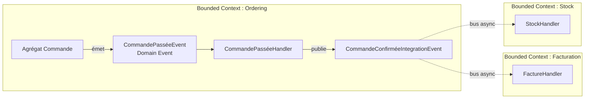
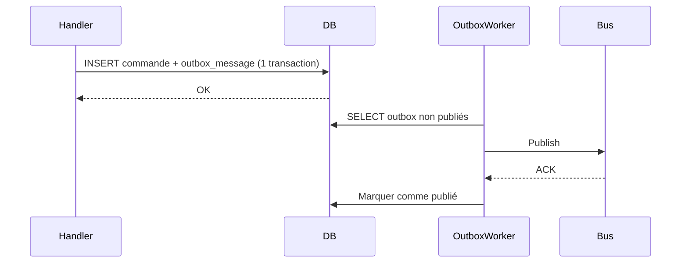

# Events de domaine vs Events d'intégration

Dans un système distribué en bounded contexts, deux types d'événements coexistent. Les **confondre** génère du couplage caché et des architectures fragiles.

## Domain Events : la vie interne de l'agrégat

Un **Domain Event** est un fait accompli **à l'intérieur d'un agrégat**, dans le périmètre d'un seul bounded context. Il exprime quelque chose qui s'est produit dans le domaine : `CommandePassée`, `StockRéservé`, `PaiementValidé`.

```csharp
// Dans Domain/Commande/
public sealed record CommandePasséeEvent(
    Guid CommandeId,
    Guid ClientId,
    decimal Total,
    DateTimeOffset OccurredAt) : IDomainEvent;
```

Il est déclenché par l'agrégat lui-même, dans la même transaction :

```csharp
public class Commande
{
    private readonly List<IDomainEvent> _events = [];

    public static Commande Passer(Client client, IReadOnlyList<LigneDto> lignes)
    {
        var commande = new Commande(client.Id, lignes);
        commande._events.Add(new CommandePasséeEvent(commande.Id, client.Id, commande.Total, DateTimeOffset.UtcNow));
        return commande;
    }
}
```

Les Domain Events sont traités **in-process** : via des handlers locaux (MediatR notifications, pipeline), dans la même transaction. Ils ne quittent pas le bounded context.

## Integration Events : contrats entre contextes

Un **Integration Event** est un **fait publié sur un bus** à destination d'**autres bounded contexts**. Il est asynchrone et découple les contextes les uns des autres.

```csharp
// Dans Application/ — ce qui part sur le bus
public sealed record CommandeConfirméeIntegrationEvent(
    Guid CommandeId,
    DateTimeOffset ConfirméeAt
    // Contient UNIQUEMENT ce que les autres contextes ont besoin de savoir
    // Pas les détails internes de l'agrégat Commande
);
```

La différence n'est pas que de forme : un Integration Event **est un contrat public**. Les autres services s'abonnent à lui ; le modifier sans coordination casse les abonnés. Un Domain Event est privé et peut évoluer librement.



Quand `Ordering` publie `CommandeConfirméeIntegrationEvent`, `Facturation` génère la facture et `Stock` réserve les articles — **sans qu'Ordering les connaisse**. C'est l'autonomie des bounded contexts.

## Le pont : du Domain Event à l'Integration Event

Les deux types d'events ne vivent pas dans le même code. Le **Domain Event est émis par l'agrégat** ; l'**Integration Event est produit par un handler applicatif** qui réagit à ce Domain Event.

```csharp
// Handler in-process du Domain Event (couche Application)
public class CommandePasséeHandler : INotificationHandler<CommandePasséeEvent>
{
    private readonly AppDbContext _db;

    public async Task Handle(CommandePasséeEvent notification, CancellationToken ct)
    {
        // Traduit le Domain Event en Integration Event, le stocke dans l'outbox
        // (même transaction que le SaveChanges de l'agrégat)
        _db.OutboxMessages.Add(new OutboxMessage
        {
            Id = Guid.NewGuid(),
            Type = nameof(CommandeConfirméeIntegrationEvent),
            Payload = JsonSerializer.Serialize(new CommandeConfirméeIntegrationEvent(
                notification.CommandeId,
                notification.OccurredAt
            )),
            CreatedAt = DateTimeOffset.UtcNow
        });
    }
}
```

Ce handler est exécuté **dans la même transaction** que la modification de l'agrégat. Le Domain Event reste privé ; seul l'Integration Event — plus pauvre, contractuel — quitte le bounded context.

## L'Outbox Pattern : garantir la cohérence

Le problème : si on écrit en DB puis on publie sur le bus, les deux peuvent diverger.

```
❌ Fragile :
1. db.SaveChanges()   → OK
2. bus.Publish()      → échec réseau → l'événement est perdu, la DB est à jour
```

L'**Outbox Pattern** résout ça : on insère l'événement **dans la même transaction** que la modification de l'agrégat, dans une table `outbox`. Un worker séparé lit cette table et publie sur le bus.

```csharp
// Dans le CommandHandler — une seule transaction
await using var tx = await _db.BeginTransactionAsync(ct);

_db.Commandes.Add(commande);
_db.OutboxMessages.Add(new OutboxMessage
{
    Id = Guid.NewGuid(),
    Type = nameof(CommandeConfirméeIntegrationEvent),
    Payload = JsonSerializer.Serialize(integrationEvent),
    CreatedAt = DateTimeOffset.UtcNow
});

await _db.SaveChangesAsync(ct);
await tx.CommitAsync(ct);
// Le worker lit outbox → bus, de façon idempotente
```



Même si le bus est indisponible, l'événement est sauvegardé. La publication est **at-least-once** : si le worker publie, se crashe, puis redémarre, il republiera le même message. L'abonné peut donc recevoir deux fois le même event — il doit être **idempotent** (par exemple en mémorisant les IDs déjà traités dans une table `processed_events`).

## Récapitulatif

| | Domain Event | Integration Event |
|---|---|---|
| **Scope** | Interne à un bounded context | Cross-context |
| **Transport** | In-process (sync ou async local) | Bus de messages (async) |
| **Transaction** | Même transaction que l'agrégat | Publiée via Outbox |
| **Contrat** | Privé, peut changer librement | Public, versionnement nécessaire |
| **Exemple** | `CommandePasséeEvent` | `CommandeConfirméeIntegrationEvent` |

## Limites

- **Cohérence éventuelle** : entre la publication et la réception, les contextes sont temporairement désynchronisés. Acceptable dans la majorité des cas ; pas toujours tolérable.
- **Idempotence** : les handlers d'Integration Events doivent gérer les doublons (réseau instable, retry du bus).
- **Versionnement** : une fois un Integration Event consommé par d'autres services, son contrat ne peut plus changer sans coordination. Anticiper dès le départ.

## Pour aller plus loin

- Vaughn Vernon, *Implementing Domain-Driven Design* — Domain Events et Integration Events en détail
- Chris Richardson, *Microservices Patterns* — Outbox Pattern, Saga Pattern
- Udi Dahan, [Clarified CQRS](http://udidahan.com/2009/12/09/clarified-cqrs/) — la relation entre events et cohérence éventuelle

---

*Notes liées : [Introduction au DDD](../ddd/introduction-ddd) — agrégats qui émettent des Domain Events. [Introduction au CQRS](../cqrs/introduction-cqrs) — projections alimentées par les Integration Events. [Composer un dashboard multi-contexte](../cqrs/composition-multi-contexte) — fan-out vs read model nourri par les Integration Events. [Architecture Hexagonale — Ports & Adapters](../hexagonal/ports-et-adapters) — les adapters d'infrastructure qui publient sur le bus.*
