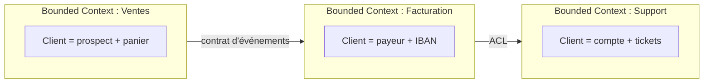

# Introduction au DDD

Le **Domain-Driven Design** (DDD), formalisé par Eric Evans en 2003, est une approche de conception logicielle qui place le **domaine métier** — pas la technique — au centre des décisions. Son pari : un logiciel complexe ne se maîtrise que si le code reflète fidèlement le langage et les règles du métier qu'il sert.

DDD n'est pas un framework ni une stack. C'est un ensemble de principes de modélisation et un vocabulaire partagé pour découper un système complexe en parties cohérentes. Cette note pose les briques de base ; les patterns tactiques détaillés (repository, domain events…) font l'objet de notes dédiées.

## Le problème que résout DDD

Sur un domaine riche (assurance, logistique, santé…), le piège classique est le **modèle anémique** : des classes qui ne sont que des sacs de données (`Order` avec des getters/setters publics), et toute la logique éparpillée dans des services. Résultat : personne ne sait où vit la règle « une commande payée ne peut plus être modifiée », elle est dupliquée, contournée, et le métier ne se reconnaît pas dans le code.

DDD répond par deux niveaux d'outils :

- **Stratégique** — comment découper le système : langage ubiquitaire, bounded contexts, context map.
- **Tactique** — comment modéliser à l'intérieur d'un découpage : entités, value objects, agrégats, domain events, repositories.

## Langage ubiquitaire

C'est le socle. Un **vocabulaire unique**, partagé entre développeurs et experts métier, utilisé partout : conversations, documentation, **et noms dans le code**.

Si le métier dit « affréter un transport », la classe s'appelle `Affrètement`, pas `TransportManager`. Quand le code et le métier parlent la même langue, les malentendus s'effondrent et les règles trouvent naturellement leur place.

> Le code devient le modèle, le modèle devient le code.

## Value Object

Un objet défini **uniquement par ses attributs**, sans identité propre. Deux value objects aux mêmes valeurs sont interchangeables. Ils sont **immuables** : on n'en modifie pas un, on en crée un nouveau.

```csharp
public readonly record struct Money(decimal Amount, string Currency)
{
    public Money Add(Money other)
    {
        if (other.Currency != Currency)
            throw new InvalidOperationException("Devises incompatibles");
        return new Money(Amount + other.Amount, Currency); // nouvel objet
    }
}

var prix = new Money(10, "EUR");
var total = prix.Add(new Money(5, "EUR")); // prix reste 10 EUR, total = 15 EUR
new Money(10, "EUR") == new Money(10, "EUR"); // true : égalité structurelle
```

Bons candidats : `Money`, `Email`, `Adresse`, `Période`. Ils portent souvent des **règles de validation** (un `Email` invalide ne peut pas exister), ce qui élimine des contrôles dispersés partout.

## Entité

Un objet doté d'une **identité persistante dans le temps**, indépendante de ses attributs. Un `Client` reste le même client même s'il change de nom ou d'adresse — son identité (`ClientId`) ne change pas.

La distinction est cruciale : une entité se compare **par son identité**, un value object **par ses valeurs**.

## Agrégat et Aggregate Root

Un **agrégat** est un cluster d'entités et de value objects traité comme **une seule unité de cohérence**. Une entité du groupe, l'**aggregate root**, est le seul point d'entrée : tout accès passe par elle, et c'est elle qui garantit les **invariants** (les règles toujours vraies).

```csharp
public class Commande // aggregate root
{
    private readonly List<LigneCommande> _lignes = new();
    public IReadOnlyList<LigneCommande> Lignes => _lignes;
    public StatutCommande Statut { get; private set; }

    public void AjouterLigne(Produit produit, int quantite)
    {
        if (Statut != StatutCommande.Brouillon)
            throw new InvalidOperationException(
                "On ne modifie pas une commande déjà validée"); // invariant protégé
        _lignes.Add(new LigneCommande(produit.Id, quantite, produit.Prix));
    }
}
```

Deux règles d'or :

1. **Une transaction = un agrégat.** On ne modifie qu'un seul agrégat par transaction ; les autres réagissent ensuite (via domain events). C'est ce qui garde le système cohérent et scalable.
2. **Garder les agrégats petits.** Un agrégat n'inclut que ce qui doit être cohérent *immédiatement et ensemble*. Le reste se référence par identité (`ClientId`), pas par objet.

## Bounded Context

Une **frontière explicite** à l'intérieur de laquelle un modèle a un sens unique et non ambigu. Le mot « Client » ne signifie pas la même chose en *Facturation* (un payeur avec un IBAN) et en *Support* (un compte avec un historique de tickets). Vouloir un seul modèle « Client » universel produit une usine à gaz.



La **context map** décrit comment ces contextes communiquent (événements, API, *anti-corruption layer* pour se protéger d'un modèle externe). Découper en bounded contexts est *la* décision DDD à fort impact : c'est elle qui détermine tes futurs microservices ou modules.

## Limites et quand ne pas faire de DDD

DDD a un coût réel : courbe d'apprentissage, plus de classes, dialogue continu avec le métier.

- **Domaine simple / CRUD** : si l'app ne fait que stocker et afficher des formulaires sans règles riches, le DDD tactique est du sur-engineering. Un modèle simple suffit.
- **Pas d'accès au métier** : sans expert métier disponible, le langage ubiquitaire ne peut pas émerger — DDD tourne à vide.
- **DDD partout** : appliquer les patterns tactiques à un sous-domaine *générique* (envoi d'e-mails, auth) gaspille de l'énergie. Réserve l'investissement au **cœur de métier** (le domaine qui te différencie).

Le bon réflexe : faire du **DDD stratégique** (langage, bounded contexts) presque toujours, et du **DDD tactique** (agrégats, value objects) seulement là où la complexité métier le justifie.

## Pour aller plus loin

- Eric Evans, *Domain-Driven Design* (2003) — le livre fondateur (« le blue book »)
- Vaughn Vernon, *Implementing Domain-Driven Design* — l'application concrète (« le red book »)
- Vaughn Vernon, *Domain-Driven Design Distilled* — la version courte pour démarrer

---

*Notes liées : [Event Storming — Le code couleur expliqué](../event-storming/event-storming-color-code) — modéliser un domaine en atelier avant de coder. [Introduction au CQRS](../cqrs/introduction-cqrs) — comment les agrégats deviennent le Write Model.*
