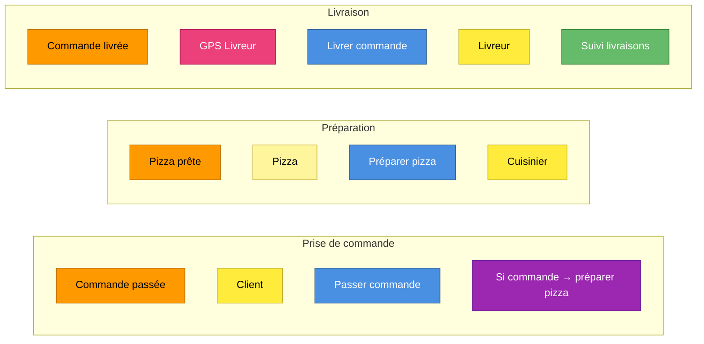

# Workshop : Livraison de pizza — démo — Export Event Storming

> Niveau : Design Level | Exporté le 2026-05-07 | 16 stickies

## Vue d'ensemble

## Chronologie des domain events
1. **Commande passée** — position (430, 140)
2. **Pizza prête** — position (1070, 140)
3. **Commande livrée** — position (1710, 140)

## Commands
- **Livrer commande**
- **Passer commande**
- **Préparer pizza**

## Actors
- **Client**
- **Cuisinier**
- **Livreur**

## Policies
- **Si commande → préparer pizza**

## External Systems
- **GPS Livreur**

## Aggregates
- **Pizza**

## Read Models
- **Suivi livraisons**

## Bounded Contexts
- **Livraison**
- **Préparation**
- **Prise de commande**

## Métadonnées
- Nom : Livraison de pizza — démo
- Niveau actif : Design Level
- Niveaux débloqués : Big Picture, Process Level, Design Level
- Nombre de stickies : 16
- Export généré par EventStormer v0.0.0