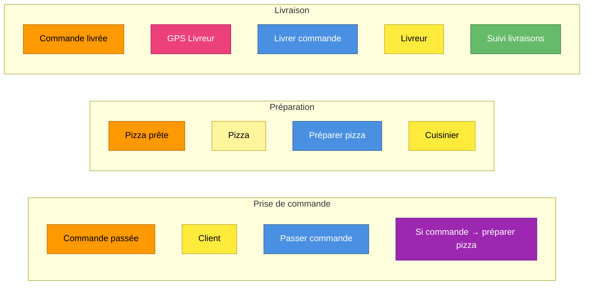

# Event Storming en pratique — Livraison de pizza

Cette note présente un **Event Storming complet et minimal** sur un domaine que tout le monde comprend : commander, préparer et livrer une pizza. Le but n'est pas le domaine lui-même, mais d'**apprendre à lire un mur** de bout en bout après avoir vu le [code couleur](./event-storming-color-code) en théorie.

Le diagramme ci-dessous est un export réel produit par **[EventStormer](https://github.com/lolofx/event-stormer-app)**, un outil web d'animation d'ateliers Event Storming (canvas SVG, palette pédagogique, niveaux Big Picture → Process → Design). L'export Markdown + Mermaid permet de versionner un atelier dans un digital garden comme celui-ci.

> Niveau : Design Level | Exporté le 2026-05-07 | 16 stickies

## Vue d'ensemble

## Comment lire ce mur

En appliquant les 5 questions de lecture vues dans la note sur le code couleur :

1. **Quels sont les Domain Events ?** (oranges) — `Commande passée` → `Pizza prête` → `Commande livrée`. C'est l'ossature : trois faits, dans l'ordre du temps.
2. **Qui les déclenche ?** — chaque event est précédé d'une Command (bleue) et d'un Actor (jaune) : le `Client` *passe commande*, le `Cuisinier` *prépare la pizza*, le `Livreur` *livre la commande*.
3. **Qu'est-ce qui s'enchaîne automatiquement ?** — la Policy (violette) `Si commande → préparer pizza` relie le contexte *Prise de commande* au contexte *Préparation* sans intervention humaine. C'est la logique cachée du domaine.
4. **Où sont les frontières ?** — trois **bounded contexts** (`Prise de commande`, `Préparation`, `Livraison`), l'aggregate `Pizza`, un système externe `GPS Livreur` (hors domaine) et un read model `Suivi livraisons` (la vue de pilotage).
5. **Quelles questions restent ouvertes ?** — aucun Hotspot (rouge) ici : c'est un exemple « propre ». Sur un vrai atelier, on en trouverait (« que se passe-t-il si le client est absent à la livraison ? »).

## L'export brut

Le reste de l'export liste les stickies par type — utile pour transformer le mur en backlog ou en modèle de code.

### Chronologie des domain events
1. **Commande passée** — position (430, 140)
2. **Pizza prête** — position (1070, 140)
3. **Commande livrée** — position (1710, 140)

### Commands
- **Livrer commande**
- **Passer commande**
- **Préparer pizza**

### Actors
- **Client**
- **Cuisinier**
- **Livreur**

### Policies
- **Si commande → préparer pizza**

### External Systems
- **GPS Livreur**

### Aggregates
- **Pizza**

### Read Models
- **Suivi livraisons**

### Bounded Contexts
- **Livraison**
- **Préparation**
- **Prise de commande**

### Métadonnées
- Nom : Livraison de pizza — démo
- Niveau actif : Design Level
- Niveaux débloqués : Big Picture, Process Level, Design Level
- Nombre de stickies : 16
- Export généré par EventStormer v0.0.0

## Limites de cet exemple

- C'est un **Design Level épuré** : pas de Hotspot, pas de chemin alternatif (paiement refusé, pizza ratée, client absent). Un vrai atelier est plus brouillon — et c'est sain.
- Le découpage en trois bounded contexts est ici une **hypothèse de modélisation**, pas une vérité : sur un petit restaurant, tout pourrait tenir dans un seul contexte. L'Event Storming sert justement à débattre de ces frontières.
- Un export figé ne remplace pas l'**atelier vivant** : la valeur de l'Event Storming est dans la conversation, pas dans le livrable.

## Pour aller plus loin

- [EventStormer](https://github.com/lolofx/event-stormer-app) — l'outil qui a généré cet export (Angular 21, canvas SVG, niveaux Big Picture / Process / Design)
- *Introducing EventStorming* — Alberto Brandolini (Leanpub)

---

*Note liée : [Event Storming — Le code couleur expliqué](./event-storming-color-code) — la théorie du code couleur appliquée ici.*
