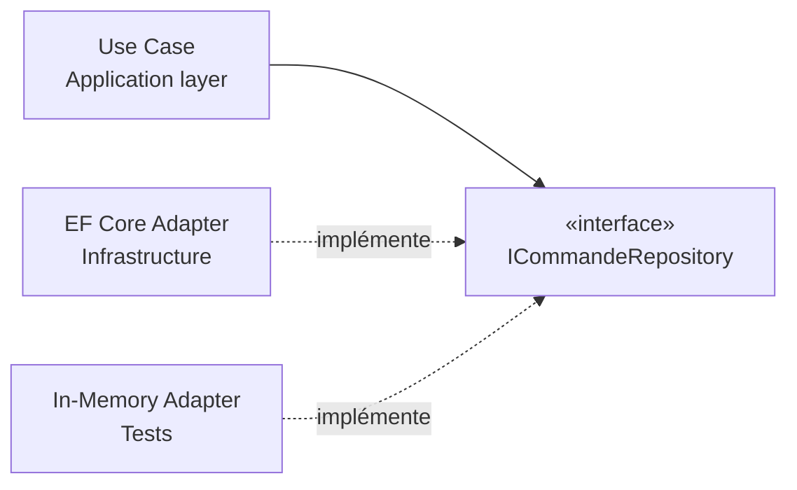

# Architecture Hexagonale — Ports & Adapters

Clean Architecture (Robert C. Martin) et Architecture Hexagonale / Ports & Adapters (Alistair Cockburn) décrivent essentiellement la même idée avec des mots différents : **le code métier ne doit jamais dépendre des détails techniques**. Bases de données, frameworks HTTP, services externes — tout ça est jetable et interchangeable. Les règles métier, elles, ne le sont pas.

## La règle de dépendance

**Les dépendances pointent vers l'intérieur.** Le code externe connaît le code interne ; jamais l'inverse. Le Domaine ne sait pas qu'une base de données existe.

```
┌────────────────────────────────────────────────┐
│  Infrastructure (DB, HTTP, clients tiers…)     │  ← détails, jetables
│   ┌──────────────────────────────────────────┐ │
│   │  Application (Use Cases)                 │ │  ← orchestration
│   │   ┌────────────────────────────────────┐ │ │
│   │   │  Domaine                           │ │ │  ← règles métier pures
│   │   │  Aggregates, Entities, VOs         │ │ │
│   │   └────────────────────────────────────┘ │ │
│   └──────────────────────────────────────────┘ │
└────────────────────────────────────────────────┘
         les flèches de dépendance pointent  →  vers le centre
```

Concrètement : si tu changes de PostgreSQL pour MongoDB, le Domain ne bouge pas. Si tu passes de REST à gRPC, le Domain ne bouge pas. L'infra s'adapte au domaine, pas l'inverse.

## Deux types de ports : entrants et sortants

L'hexagonale distingue deux directions :

- **Ports entrants** (*driving* / primaires) : l'application est *appelée* depuis l'extérieur. L'interface est définie du côté de l'application, et les adapters sont des contrôleurs HTTP, des CLI, des tests. Exemple : `IPasserCommandeUseCase` implémenté par `PasserCommandeHandler`, appelé par un contrôleur ASP.NET Core.
- **Ports sortants** (*driven* / secondaires) : l'application *appelle* l'extérieur. L'interface est définie dans l'application, l'adapter est dans l'infra. Exemple : `ICommandeRepository` implémenté par `CommandeRepository` (EF Core).

La plupart des exemples dans les tutorials ne montrent que les ports sortants (repos, services externes). Les ports entrants sont tout aussi importants — ils permettent de tester les use cases sans démarrer un serveur HTTP.

## Ports : ce que le domaine déclare

Un **port** est une **interface**, définie dans la couche Domain ou Application, qui exprime un besoin sans dire comment il est satisfait.

```csharp
// Dans Application/ — le use case déclare ce dont il a besoin
public interface ICommandeRepository
{
    Task<Commande?> GetAsync(Guid id, CancellationToken ct);
    Task SaveAsync(Commande commande, CancellationToken ct);
}

public interface IEmailService
{
    Task EnvoyerConfirmationAsync(string destinataire, string contenu, CancellationToken ct);
}
```

Le Domain déclare le contrat (`ICommandeRepository`). Il ne sait pas si derrière c'est EF Core, un fichier JSON, ou un mock de test. C'est l'**inversion de dépendance** (principe D de SOLID) appliquée à une architecture entière.

## Adapters : ce que l'infra fournit

Un **adapter** est l'**implémentation concrète** d'un port, posée dans la couche Infrastructure.

```csharp
// Dans Infrastructure/Persistence/ — l'implémentation EF Core
public class CommandeRepository : ICommandeRepository
{
    private readonly AppDbContext _db;

    public async Task<Commande?> GetAsync(Guid id, CancellationToken ct)
        => await _db.Commandes.FindAsync([id], ct);

    public async Task SaveAsync(Commande commande, CancellationToken ct)
    {
        _db.Commandes.Update(commande);
        await _db.SaveChangesAsync(ct);
    }
}
```

En test, tu branches un adapter en mémoire. En prod, tu branches l'EF Core. Le Domain et l'Application ne voient pas la différence.



## La couche Application : les Use Cases

Un **use case** (aussi appelé *interactor*) orchestre un scénario métier unique. Il charge les agrégats via les ports, leur fait appliquer leurs règles, persiste, et publie d'éventuels événements.

```csharp
public class PasserCommandeHandler
{
    private readonly IClientRepository _clientRepo;
    private readonly ICommandeRepository _commandeRepo;
    private readonly IEmailService _emailService;

    public PasserCommandeHandler(
        IClientRepository clientRepo,
        ICommandeRepository commandeRepo,
        IEmailService emailService)
    {
        _clientRepo   = clientRepo;
        _commandeRepo = commandeRepo;
        _emailService = emailService;
    }

    public async Task<Guid> HandleAsync(PasserCommandeCommand command, CancellationToken ct)
    {
        var client = await _clientRepo.GetAsync(command.ClientId, ct);
        var commande = Commande.Passer(client, command.Lignes); // règle métier dans l'agrégat

        await _commandeRepo.SaveAsync(commande, ct);
        await _emailService.EnvoyerConfirmationAsync(client.Email, ..., ct);

        return commande.Id;
    }
}
```

Le use case **orchestre** — il ne contient pas la règle métier (`Commande.Passer` la porte). Il ne sait pas non plus comment la commande est persistée ou comment l'email est envoyé : ce sont des détails d'infra injectés via les ports.

> **Use Case vs Application Service** — Un *Application Service* peut regrouper plusieurs use cases proches du même domaine ; un *Use Case* est l'unité d'un seul scénario (`PasserCommande`, `AnnulerCommande`). En pratique avec CQRS, chaque Command Handler et Query Handler est un use case.

## L'Anti-Corruption Layer (ACL)

Un **Anti-Corruption Layer** est un cas particulier d'adapter dont le rôle est de **traduire** le modèle d'un système externe vers ton modèle interne. Sans ACL, les concepts du système externe contaminent ton Domain.

```csharp
// Le modèle externe (API partenaire logistique)
public class ShipmentApiResponse
{
    public string TrackingRef { get; set; }
    public string DeliveryStatus { get; set; } // "IN_TRANSIT", "DELIVERED", "EXCEPTION"
}

// L'ACL traduit vers ton modèle — ton Domain parle StatutLivraison, pas DeliveryStatus
public class LogistiqueAcl : ILogistiqueService
{
    public async Task<StatutLivraison> GetStatutAsync(Guid commandeId, CancellationToken ct)
    {
        var response = await _api.GetShipmentAsync(commandeId.ToString(), ct);
        return response.DeliveryStatus switch
        {
            "IN_TRANSIT" => StatutLivraison.EnCours,
            "DELIVERED"  => StatutLivraison.Livree,
            _            => StatutLivraison.Incident
        };
    }
}
```

Si le partenaire change d'API, seul l'ACL bouge. Ton Domain reste intact.

> Tout adapter n'est pas un ACL. Réserve le terme aux cas où tu te protèges d'un **modèle externe** qui risquerait de contaminer le tien.

## Limites et quand simplifier

L'hexagonal apporte une vraie valeur quand :
- Le **domaine est riche** et les règles métier doivent être isolées des détails techniques
- Tu as besoin de **tester le domaine sans infrastructure** (sans DB, sans SMTP…)
- L'infrastructure est **susceptible de changer** (migration DB, changement de prestataire)

C'est du **sur-engineering** si :
- L'application est principalement **CRUD** avec peu de règles métier
- L'équipe est **petite et le périmètre court** — le coût des abstractions dépasse le gain

Un modèle anémique avec des interfaces partout n'est pas de la Clean Architecture — c'est de la complexité ajoutée sans bénéfice.

## Pour aller plus loin

- Alistair Cockburn — *Hexagonal Architecture / Ports & Adapters* (l'article de référence)
- Robert C. Martin — *Clean Architecture* (2017)
- Vaughn Vernon, *Implementing Domain-Driven Design* — pour le lien entre ports et bounded contexts

---

*Notes liées : [Introduction au DDD](../ddd/introduction-ddd) — les agrégats qui vivent dans la couche Domain. [Introduction au CQRS](../cqrs/introduction-cqrs) — Commands et Queries comme use cases dans la couche Application. [Backend For Frontend & Clean Architecture](../bff/bff-clean-archi) — le BFF comme application séparée avec sa propre architecture allégée.*
