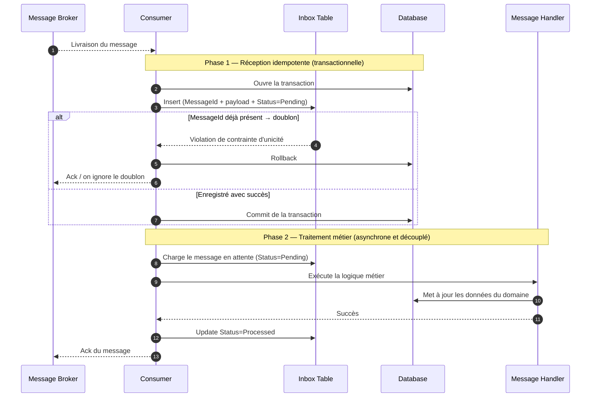

# Inbox Pattern — consommation idempotente de messages

[#inbox-pattern](#inbox-pattern)

L'**Inbox Pattern** résout un problème incontournable des systèmes distribués pilotés par messages : la plupart des brokers (Azure Service Bus, RabbitMQ, Kafka…) garantissent une livraison **at-least-once**, jamais **exactly-once**. Concrètement, un même message peut être livré plusieurs fois — typiquement quand un consommateur traite un message, plante avant d'avoir envoyé son `Ack`, et que le broker le re-livre après expiration du lock. Si la logique métier n'est pas idempotente, ce doublon provoque un double débit, un double envoi d'e-mail, une double création d'entité.

L'Inbox Pattern consiste à **persister l'identifiant des messages reçus dans une table dédiée**, dans la même transaction que le traitement métier. Cette table joue le rôle de garde-fou : un message déjà enregistré est détecté comme doublon et ignoré. On transforme ainsi un canal *at-least-once* en un traitement *effectivement exactly-once* du point de vue du domaine.

C'est le pendant côté **consommateur** de l'[Outbox Pattern](../messaging/outbox-pattern), qui lui sécurise la **publication** : Outbox = « je publie de façon fiable », Inbox = « je consomme de façon idempotente ».

## Le problème : at-least-once n'est pas exactly-once

[#le-problème--at-least-once-nest-pas-exactly-once](#le-problème--at-least-once-nest-pas-exactly-once)

Un broker ne peut pas garantir l'*exactly-once* de bout en bout sans coordination distribuée coûteuse (transactions distribuées, 2PC). Il choisit donc le compromis pragmatique : il re-livre tant qu'il n'a pas reçu d'accusé de réception. Les causes de redelivery sont nombreuses :

- Le consommateur traite le message mais crashe avant d'envoyer l'`Ack`.
- L'`Ack` se perd sur le réseau.
- Le lock du message expire car le traitement a été trop long.
- Un rééquilibrage de partitions (Kafka) ou un failover du broker.

La responsabilité de la déduplication est donc **déléguée au consommateur**. L'Inbox Pattern formalise cette responsabilité : on ne fait pas confiance au broker pour l'unicité, on la garantit nous-mêmes via une contrainte d'unicité en base.

## Le diagramme de séquence

[#le-diagramme-de-séquence](#le-diagramme-de-séquence)



Deux phases distinctes apparaissent, et c'est volontaire :

1. **La réception** se contente d'enregistrer le message de façon idempotente. C'est rapide, transactionnel, et c'est là que la déduplication opère. Sur un doublon, on `Ack` immédiatement le broker et on s'arrête : le message ne génère pas de nouvelle ligne `Pending`, donc la phase 2 ne le re-traitera jamais.
2. **Le traitement** lit les messages `Pending` et exécute la logique métier. Ce découplage permet de re-tenter le traitement indépendamment de la réception (un crash entre les deux phases laisse le message en `Pending`, prêt à être repris au redémarrage).

## La table Inbox

[#la-table-inbox](#la-table-inbox)

Le cœur du pattern tient dans le schéma de la table et **la contrainte d'unicité sur le `MessageId`**.

```sql
CREATE TABLE InboxMessages (
    MessageId    UNIQUEIDENTIFIER NOT NULL,  -- identifiant fourni par le broker / l'émetteur
    MessageType  NVARCHAR(500)    NOT NULL,
    Payload      NVARCHAR(MAX)    NOT NULL,
    Status       TINYINT          NOT NULL,  -- 0=Pending, 1=Processed, 2=Failed
    ReceivedAt   DATETIME2        NOT NULL,
    ProcessedAt  DATETIME2        NULL,
    Attempts     INT              NOT NULL DEFAULT 0,
    Error        NVARCHAR(MAX)    NULL,

    CONSTRAINT PK_InboxMessages PRIMARY KEY (MessageId)  -- l'unicité EST le mécanisme de dédup
);
```

Le `MessageId` ne doit **pas** être généré côté consommateur : il doit être stable et porté par le message lui-même (en-tête du broker, ou champ métier déterministe). Sans cela, deux livraisons du même message produiraient deux identifiants différents et la déduplication échouerait.

## Implémentation en .NET

[#implémentation-en-net](#implémentation-en-net)

La réception, avec capture de la violation d'unicité comme signal de doublon plutôt qu'un `SELECT` préalable (qui introduirait une *race condition* entre la vérification et l'insert) :

```csharp
public sealed class InboxReceiver(AppDbContext db, ILogger<InboxReceiver> logger)
{
    public async Task<ReceptionResult> ReceiveAsync(IncomingMessage message, CancellationToken ct)
    {
        var inbox = new InboxMessage
        {
            MessageId   = message.Id,           // identifiant porté par le message, jamais regénéré
            MessageType = message.Type,
            Payload     = message.Payload,
            Status      = InboxStatus.Pending,
            ReceivedAt  = DateTime.UtcNow
        };

        db.InboxMessages.Add(inbox);

        try
        {
            await db.SaveChangesAsync(ct);
            return ReceptionResult.Stored;
        }
        catch (DbUpdateException ex) when (ex.IsUniqueConstraintViolation())
        {
            // Doublon : le message a déjà été reçu. On Ack et on ignore.
            logger.LogInformation("Message {MessageId} déjà reçu, doublon ignoré.", message.Id);
            return ReceptionResult.Duplicate;
        }
    }
}
```

Le traitement, découplé, idempotent par construction (il ne prend que les `Pending`) :

```csharp
public sealed class InboxProcessor(AppDbContext db, ISender mediator, ILogger<InboxProcessor> logger)
{
    public async Task ProcessPendingAsync(CancellationToken ct)
    {
        var pending = await db.InboxMessages
            .Where(m => m.Status == InboxStatus.Pending)
            .OrderBy(m => m.ReceivedAt)
            .Take(50)
            .ToListAsync(ct);

        foreach (var message in pending)
        {
            try
            {
                // La logique métier et la mise à jour du statut sont dans la même transaction :
                // soit tout réussit, soit le message reste Pending pour un nouvel essai.
                var command = InboxCommandFactory.From(message); // factory applicative : mappe MessageType + Payload vers une ICommand MediatR
                await mediator.Send(command, ct);

                message.Status      = InboxStatus.Processed;
                message.ProcessedAt = DateTime.UtcNow;
            }
            catch (Exception ex)
            {
                message.Attempts++;
                message.Error = ex.Message;
                if (message.Attempts >= 5)
                    message.Status = InboxStatus.Failed; // bascule en dead-letter applicatif
                logger.LogError(ex, "Échec traitement message {MessageId} (essai {Attempts}).",
                    message.MessageId, message.Attempts);
            }

            await db.SaveChangesAsync(ct);
        }
    }
}
```

Le point critique de cohérence : **la mise à jour métier (`MH->>DB`) et le passage à `Processed` doivent être dans la même transaction**. Sinon, un crash entre les deux laisserait le message marqué `Processed` alors que la logique métier n'a pas abouti — ou l'inverse, un double traitement. Quand le handler métier et l'inbox partagent la même base, un seul `SaveChangesAsync` suffit.

## Inbox vs Outbox

[#inbox-vs-outbox](#inbox-vs-outbox)

Les deux patterns sécurisent les deux extrémités d'un échange asynchrone et se combinent souvent dans un même service :

| | Outbox Pattern | Inbox Pattern |
|---|---|---|
| **Côté** | Producteur | Consommateur |
| **Problème résolu** | Publier de façon atomique avec le changement d'état (pas de message perdu) | Consommer de façon idempotente (pas de doublon traité) |
| **Mécanisme** | Écrire le message dans une table dans la transaction métier, le publier ensuite | Enregistrer le `MessageId` reçu, rejeter les doublons via contrainte d'unicité |
| **Garantit** | Au moins une publication | Au plus un traitement |

L'Outbox crée des doublons (il re-publie tant qu'il n'a pas confirmation), l'Inbox les absorbe. Ensemble, ils approchent un *exactly-once* applicatif sans transaction distribuée.

## Limites et pièges

[#limites-et-pièges](#limites-et-pièges)

- **Croissance de la table** : sans purge, `InboxMessages` grossit indéfiniment. Il faut un job de nettoyage qui supprime les messages `Processed` au-delà d'une fenêtre de rétention (assez large pour couvrir le délai maximal de redelivery du broker).
- **L'identifiant doit être stable** : si le `MessageId` change entre deux livraisons du même message, la dédup ne marche plus. Ne jamais le générer côté consommateur.
- **Transaction métier + statut indissociables** : si le traitement écrit dans une autre base que l'inbox, on retombe sur le problème de cohérence distribuée. Privilégier une base partagée, ou un Outbox côté traitement.
- **Faux sentiment d'idempotence** : l'Inbox protège contre les doublons de *livraison*, pas contre une logique métier intrinsèquement non idempotente appelée par d'autres chemins. L'idempotence métier reste un objectif à part entière.
- **Latence ajoutée** : le découplage réception/traitement introduit un délai. Pour des messages à traiter en quasi temps réel, dimensionner la fréquence du `InboxProcessor` en conséquence (ou le déclencher par notification).
- **Concurrence multi-instances** : si plusieurs instances du service tournent (scale-out), deux `InboxProcessor` peuvent charger simultanément les mêmes messages `Pending` et les traiter en double. Protéger le `SELECT` avec `SKIP LOCKED` (PostgreSQL) ou `WITH (UPDLOCK, READPAST)` (SQL Server), ou déléguer à une librairie qui le gère nativement (`MassTransit`, `Wolverine`, Dapr).

## Quand adopter l'Inbox Pattern

[#quand-adopter-linbox-pattern](#quand-adopter-linbox-pattern)

L'Inbox Pattern est pertinent quand :

- Tu consommes des messages d'un broker **at-least-once** (c'est-à-dire quasiment tous) et que le traitement a des **effets de bord non rejouables** (paiement, envoi, création de ressource).
- Tu ne peux pas rendre la logique métier naturellement idempotente (un simple *upsert* déterministe suffirait sinon, sans Inbox).
- Tu veux **découpler la réception du traitement** pour pouvoir re-tenter le métier sans risquer de re-consommer le broker.

À l'inverse, évite la complexité de l'Inbox si ton traitement est déjà idempotent par nature (ex. : un `UPDATE` qui pose une valeur absolue, ou un *upsert* sur une clé métier) — dans ce cas, le rejeu d'un doublon est inoffensif et la table de dédup n'apporte rien.

## Pour aller plus loin

[#pour-aller-plus-loin](#pour-aller-plus-loin)

- Gregor Hohpe & Bobby Woolf, *Enterprise Integration Patterns* — l'Idempotent Receiver, ancêtre conceptuel de l'Inbox
- Documentation [Azure Service Bus — duplicate detection](https://learn.microsoft.com/azure/service-bus-messaging/duplicate-detection) — la dédup native du broker, complémentaire mais limitée dans le temps
- Chris Richardson, [microservices.io — Idempotent Consumer](https://microservices.io/patterns/communication-style/idempotent-consumer.html)

---

*Notes liées : [Outbox Pattern](../messaging/outbox-pattern) — le pendant côté producteur, qui sécurise la publication. [Introduction au CQRS](../cqrs/introduction-cqrs) — les Commands déclenchées par le traitement des messages Inbox. [Introduction au DDD](../ddd/introduction-ddd) — l'idempotence comme invariant métier au-delà de la couche messaging.*