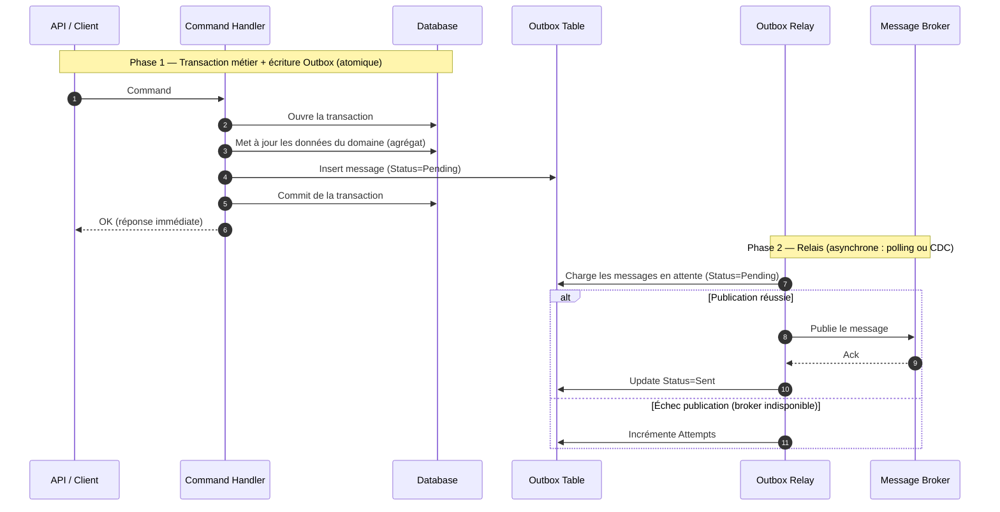

# Outbox Pattern — publication fiable de messages

[#outbox-pattern](#outbox-pattern)

L'**Outbox Pattern** résout le problème de la **double écriture** (*dual write*) : lorsqu'une opération métier doit à la fois **modifier l'état en base** et **publier un message** vers un broker, ces deux actions visent deux systèmes différents (la base de données et le broker) qui ne partagent pas la même transaction. Les exécuter l'une après l'autre crée une fenêtre d'incohérence : si le service plante entre les deux, soit l'état est modifié sans que le message parte (événement perdu), soit le message part sans que l'état soit committé (événement fantôme).

L'Outbox Pattern élimine cette fenêtre en écrivant le message **dans une table de la même base, à l'intérieur de la transaction métier**. La transaction garantit l'atomicité : soit l'état métier *et* le message sont persistés ensemble, soit rien ne l'est. Un processus séparé — le **relais** (*relay* / *dispatcher*) — lit ensuite cette table et publie réellement les messages vers le broker, puis les marque comme envoyés.

C'est le pendant côté **producteur** de l'[Inbox Pattern](../messaging/inbox-pattern), qui sécurise la **consommation** : Outbox = « je publie de façon fiable », Inbox = « je consomme de façon idempotente ».

## Le problème : la double écriture

[#le-problème--la-double-écriture](#le-problème--la-double-écriture)

Le code naïf ressemble à ça :

```csharp
await _repository.SaveAsync(commande, ct);        // 1. écriture en base
await _bus.PublishAsync(new CommandePassée(...));  // 2. publication broker
```

Entre la ligne 1 et la ligne 2, tout peut arriver : crash du process, timeout réseau vers le broker, redéploiement. Les deux opérations ne sont pas atomiques, et il n'existe pas de transaction qui couvre à la fois la base et le broker — sauf à recourir à une **transaction distribuée** (2PC), lourde, fragile, et mal supportée par la plupart des brokers cloud.

Inverser l'ordre ne résout rien : publier d'abord puis sauvegarder expose au cas symétrique (message émis, état jamais persisté). Le problème est structurel : **deux ressources transactionnelles distinctes ne peuvent pas être committées atomiquement sans coordination**. L'Outbox contourne le problème en ramenant les deux écritures dans **une seule ressource transactionnelle** : la base de données.

## Le diagramme de séquence

[#le-diagramme-de-séquence](#le-diagramme-de-séquence)



L'atomicité repose entièrement sur la **phase 1** : l'état métier et le message Outbox sont committés ensemble. À partir de là, le message *est* en base, donc garanti. La **phase 2** ne fait que rejouer la publication jusqu'à obtenir un `Ack` du broker — quitte à publier plusieurs fois (livraison **at-least-once**), ce qui est exactement la raison d'être de l'Inbox Pattern côté consommateur.

## La table Outbox

[#la-table-outbox](#la-table-outbox)

```sql
CREATE TABLE OutboxMessages (
    Id           UNIQUEIDENTIFIER NOT NULL,  -- identifiant du message, propagé jusqu'au consommateur
    MessageType  NVARCHAR(500)    NOT NULL,
    Payload      NVARCHAR(MAX)    NOT NULL,
    Status       TINYINT          NOT NULL,  -- 0=Pending, 1=Sent, 2=Failed
    OccurredAt   DATETIME2        NOT NULL,
    SentAt       DATETIME2        NULL,
    Attempts     INT              NOT NULL DEFAULT 0,
    Error        NVARCHAR(MAX)    NULL,

    CONSTRAINT PK_OutboxMessages PRIMARY KEY (Id)
);

-- Index sur les messages à publier, pour que le relais ne scanne pas toute la table
CREATE INDEX IX_OutboxMessages_Pending
    ON OutboxMessages (OccurredAt)
    WHERE Status = 0;
```

Le `Id` du message doit être **stable et propagé jusqu'au broker**, car c'est lui que le consommateur utilisera comme clé de déduplication dans son Inbox. L'`OccurredAt` permet de **préserver l'ordre** de publication par agrégat si nécessaire.

## Implémentation en .NET

[#implémentation-en-net](#implémentation-en-net)

L'écriture du message dans la transaction métier. En DDD, l'élégance consiste à laisser l'agrégat **lever des domain events**, puis à les transformer en lignes Outbox via un `SaveChanges` interceptor EF Core — ainsi le handler n'a pas à connaître l'Outbox :

```csharp
public sealed class OutboxInterceptor : SaveChangesInterceptor
{
    public override ValueTask<InterceptionResult<int>> SavingChangesAsync(
        DbContextEventData eventData, InterceptionResult<int> result, CancellationToken ct = default)
    {
        var context = eventData.Context!;

        // On récupère les domain events portés par les agrégats trackés
        var messages = context.ChangeTracker.Entries<IHasDomainEvents>()
            .SelectMany(e => e.Entity.DrainDomainEvents())
            .Select(domainEvent => new OutboxMessage
            {
                Id          = Guid.NewGuid(),
                MessageType = domainEvent.GetType().FullName!,
                Payload     = JsonSerializer.Serialize(domainEvent, domainEvent.GetType()),
                Status      = OutboxStatus.Pending,
                OccurredAt  = DateTime.UtcNow
            });

        // Insérés dans le MÊME SaveChanges → même transaction que l'état métier
        context.Set<OutboxMessage>().AddRange(messages);

        return base.SavingChangesAsync(eventData, result, ct);
    }
}
```

Le handler reste pur, il ne fait qu'orchestrer le domaine :

```csharp
public sealed class PasserCommandeHandler(AppDbContext db) : ICommandHandler<PasserCommandeCommand, Guid>
{
    public async Task<Guid> HandleAsync(PasserCommandeCommand command, CancellationToken ct)
    {
        var commande = Commande.Passer(command.ClientId, command.Lignes); // lève CommandePasséeEvent
        db.Commandes.Add(commande);

        await db.SaveChangesAsync(ct); // l'interceptor écrit l'Outbox dans la même transaction

        return commande.Id;
    }
}
```

Le relais, en `BackgroundService`, qui publie et marque `Sent` :

```csharp
public sealed class OutboxPublisher(IServiceScopeFactory scopeFactory, IMessageBus bus)
    : BackgroundService
{
    protected override async Task ExecuteAsync(CancellationToken ct)
    {
        while (!ct.IsCancellationRequested)
        {
            using var scope = scopeFactory.CreateScope();
            var db = scope.ServiceProvider.GetRequiredService<AppDbContext>();

            var pending = await db.Set<OutboxMessage>()
                .Where(m => m.Status == OutboxStatus.Pending)
                .OrderBy(m => m.OccurredAt) // préserve l'ordre
                .Take(50)
                .ToListAsync(ct);

            foreach (var message in pending)
            {
                try
                {
                    await bus.PublishAsync(message.MessageType, message.Payload, message.Id, ct);
                    message.Status = OutboxStatus.Sent;
                    message.SentAt = DateTime.UtcNow;
                }
                catch (Exception ex)
                {
                    message.Attempts++;
                    message.Error = ex.Message;
                    if (message.Attempts >= 10) message.Status = OutboxStatus.Failed;
                    // pas de Sent → réessai au prochain tour
                }
            }

            await db.SaveChangesAsync(ct);
            await Task.Delay(TimeSpan.FromSeconds(2), ct);
        }
    }
}
```

## Polling Publisher vs CDC

[#polling-publisher-vs-cdc](#polling-publisher-vs-cdc)

Deux stratégies pour le relais :

**1. Polling Publisher** (l'exemple ci-dessus) : un process interroge périodiquement la table `Pending`. Simple, portable, suffisant dans l'immense majorité des cas. Le coût est une latence (l'intervalle de polling) et une charge de lecture régulière sur la base — atténuée par l'index filtré.

**2. Transaction Log Tailing / CDC** (*Change Data Capture*, ex. Debezium) : au lieu d'interroger la table, on lit le **journal de transactions** de la base pour détecter les insertions dans l'Outbox et les pousser vers le broker. Latence quasi nulle, aucune charge de polling, mais infrastructure plus lourde (connecteur Kafka Connect, opérationnel à maintenir).

Commence toujours par le polling. Le CDC ne se justifie qu'à fort volume ou contrainte de latence stricte.

## Outbox vs Inbox

[#outbox-vs-inbox](#outbox-vs-inbox)

| | Outbox Pattern | Inbox Pattern |
|---|---|---|
| **Côté** | Producteur | Consommateur |
| **Problème résolu** | Publier de façon atomique avec le changement d'état (pas de message perdu) | Consommer de façon idempotente (pas de doublon traité) |
| **Mécanisme** | Écrire le message dans une table dans la transaction métier, le publier ensuite | Enregistrer le `MessageId` reçu, rejeter les doublons via contrainte d'unicité |
| **Garantit** | Au moins une publication | Au plus un traitement |

L'Outbox produit volontairement des doublons (il re-publie tant qu'il n'a pas l'`Ack`), l'Inbox les absorbe. Mis bout à bout, ils approchent un *exactly-once* applicatif **sans transaction distribuée**.

## Limites et pièges

[#limites-et-pièges](#limites-et-pièges)

- **At-least-once, pas exactly-once** : le relais peut publier puis planter avant de marquer `Sent`, donc republier. Le consommateur **doit** être idempotent (cf. Inbox). Ne jamais supposer une livraison unique.
- **Ordre des messages** : le polling par `OrderBy(OccurredAt)` préserve l'ordre global, mais un traitement parallèle des messages le casse. Si l'ordre par agrégat compte, partitionner par clé d'agrégat.
- **Croissance de la table** : purger régulièrement les `Sent` au-delà d'une fenêtre de rétention.
- **Latence de publication** : avec le polling, le message n'est pas publié instantanément. Inacceptable pour du temps réel strict → CDC ou notification de réveil du publisher.
- **Concurrence multi-instances** : plusieurs instances de l'`OutboxPublisher` en scale-out chargent les mêmes messages `Pending` simultanément → double publication. Protéger le `SELECT` avec `SKIP LOCKED` (PostgreSQL) ou `WITH (UPDLOCK, READPAST)` (SQL Server). Les librairies (`MassTransit`, `Wolverine`, Dapr) gèrent ça nativement.
- **Réinventer la roue** : `MassTransit`, `NServiceBus`, `Brighter` ou `Wolverine` implémentent l'Outbox de façon éprouvée (gestion des retries, dédup, ordre, concurrence). **Dapr** (v1.10+) offre une alternative sidecar : il garantit l'atomicité state + pub/sub sans table Outbox ni librairie .NET, au prix d'une infrastructure à opérer. Sur un projet sérieux, préférer l'une de ces solutions à une implémentation maison.

## Quand adopter l'Outbox Pattern

[#quand-adopter-loutbox-pattern](#quand-adopter-loutbox-pattern)

L'Outbox Pattern est pertinent quand :

- Une opération métier **doit publier un message ET modifier l'état**, et que la perte du message aurait des conséquences (intégrité entre services, déclenchement d'un workflow).
- Tu veux **éviter les transactions distribuées** tout en garantissant qu'aucun événement ne se perd.
- Tu pratiques le **DDD avec des domain events** : l'Outbox est le canal naturel pour les propager de façon fiable hors du bounded context.

À l'inverse, l'Outbox est superflu si la publication peut échouer sans conséquence (notification *best-effort*), ou si tu n'as qu'un seul système (pas de broker, pas de double écriture).

## Pour aller plus loin

[#pour-aller-plus-loin](#pour-aller-plus-loin)

- Chris Richardson, [microservices.io — Transactional Outbox](https://microservices.io/patterns/data/transactional-outbox.html) — la référence du pattern
- Documentation [MassTransit — Transactional Outbox](https://masstransit.io/documentation/patterns/transactional-outbox) — une implémentation .NET éprouvée
- [Debezium Outbox Event Router](https://debezium.io/documentation/reference/transformations/outbox-event-router.html) — la variante CDC
- Dapr v1.10+ — Transactional Outbox natif (docs.dapr.io) : atomicité state + pub/sub sans librairie .NET ni table à gérer, approche sidecar language-agnostic

---

*Notes liées : [Inbox Pattern](../messaging/inbox-pattern) — le pendant côté consommateur, qui absorbe les doublons produits par l'Outbox. [Introduction au CQRS](../cqrs/introduction-cqrs) — les Commands dont les domain events alimentent l'Outbox. [Introduction au DDD](../ddd/introduction-ddd) — les domain events levés par les agrégats, source naturelle des messages Outbox.*