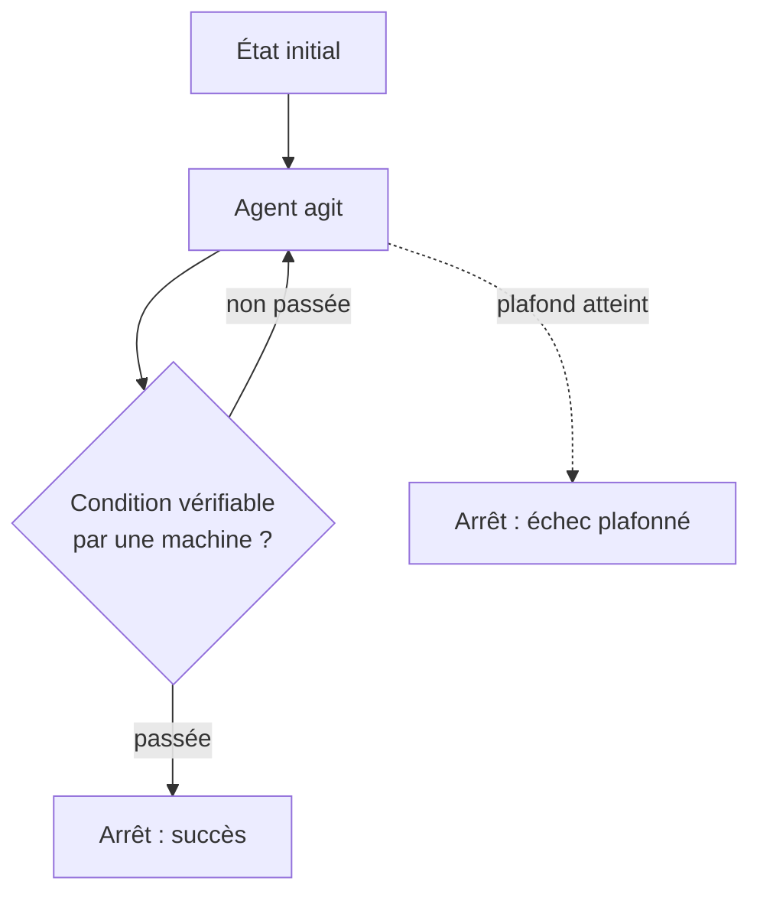

# Boucles et auto-correction

Faire tourner un agent en boucle — corrige, vérifie, recommence — est une des façons les plus efficaces d'obtenir un résultat fiable sans supervision constante. C'est aussi une des façons les plus faciles de perdre le contrôle d'un budget de jetons, ou de faire diverger un agent qui tourne indéfiniment sans jamais s'arrêter sur le bon état.

Tout tient à une règle unique, qui structure le reste de cette note.

## La règle : une condition d'arrêt vérifiable par une machine

Une boucle n'a de sens que si sa condition d'arrêt peut être vérifiée par une machine — une commande qui sort en code 0, un test qui passe, un linter sans erreur, une assertion sur un fichier produit. Si la condition d'arrêt est « l'agent estime que c'est bon », alors l'agent boucle sur son propre avis : il n'a aucun signal externe pour distinguer une vraie amélioration d'une impression d'amélioration, et rien ne l'empêche de tourner en rond en se convainquant à chaque itération qu'il progresse.



Une commande qui échoue en code 1, un test rouge, un contrat d'API violé : ce sont des critères qu'un tiers — humain ou machine — peut vérifier indépendamment de ce que l'agent affirme. « Je pense que c'est correct » n'en est pas un.

## Le critère d'arrêt est du code, avec les bugs d'un code

C'est le point que la formulation « condition vérifiable par une machine » laisse dans l'ombre, et c'est celui qui coûte le plus cher. Une fois qu'on a écrit la commande de vérification, on cesse de la regarder : elle devient l'oracle. Or c'est un programme comme un autre, écrit par quelqu'un qui peut se tromper, et **une boucle converge vers son critère, pas vers l'intention derrière le critère.**

Un cas réel, sur une tâche de mise en conformité d'un corpus de notes. Le vérificateur contrôlait notamment les liens internes entre documents. Sa règle de reconnaissance des liens ne couvrait que la forme « remonter d'un dossier puis descendre » (`../categorie/document`), et pas la forme « rester dans le dossier courant » (`./document`). Résultat : la boucle s'arrêtait en succès, rapport intégralement vert — alors que deux documents contenaient des liens que **rien n'avait jamais vérifiés**. Personne n'avait triché, l'agent n'avait pas dérivé, le critère était simplement aveugle sur une partie de son périmètre.

Ce faux vert est plus dangereux qu'un échec, pour une raison structurelle : un échec relance la boucle, un faux vert la termine et fait passer le résultat à l'étape suivante avec un tampon de validation.

### Vérifier le vérificateur

La parade est simple et rarement appliquée : **avant de faire confiance à un critère d'arrêt, injecte un défaut que tu sais devoir être détecté, et vérifie que la boucle échoue.**

Concrètement, sur le même exemple : créer trois documents volontairement cassés — un lien pointant nulle part, un lien mal formé, un identifiant en collision avec un document existant — lancer le vérificateur, et confirmer qu'il remonte les trois avec la bonne sévérité et qu'il sort bien en échec. Puis supprimer les documents de test. C'est du TDD appliqué à l'oracle plutôt qu'au code : un critère d'arrêt qu'on n'a jamais vu échouer sur un cas connu n'est pas un critère, c'est une supposition.

Corollaire à garder en tête quand on écrit la boucle : **elle n'améliore que ce qu'elle mesure.** Tout ce que le critère ne regarde pas peut se dégrader librement, itération après itération, sans jamais déclencher le moindre signal.

## Les modes d'échec

- **Boucle infinie** — pas de plafond, la condition d'arrêt n'est jamais atteinte parce qu'elle est mal posée ou parce que la tâche est structurellement impossible dans les contraintes données.
- **Dérive du critère** — l'agent, incapable de satisfaire la condition d'origine, la réinterprète discrètement à son avantage (« ce test n'était pas pertinent, je le supprime ») plutôt que de signaler l'échec.
- **Correction qui casse ce qui marchait** — chaque itération corrige le symptôme visé mais introduit une régression ailleurs, invisible tant que la condition d'arrêt ne teste que le symptôme d'origine.
- **Faux vert (critère aveugle)** — la boucle s'arrête en succès alors que le défaut existe toujours, simplement parce que le critère ne regarde pas là où il est. Contrairement à la dérive, personne ne triche : le critère est incomplet dès l'écriture. C'est le mode d'échec le plus coûteux, parce qu'il est le seul qui produise un résultat *validé* et faux.
- **Oscillation** — l'agent alterne entre deux états, A puis B puis A, chacun corrigeant ce que l'autre casse. Le plafond finit par arrêter la boucle, mais après avoir consommé tout le budget pour revenir au point de départ. Une comparaison au seul tour précédent ne la détecte pas — il faut garder trace des états déjà visités.
- **Coût qui explose, et pas linéairement** — le piège n'est pas le nombre d'itérations, c'est ce que chacune transporte. Dans la plupart des harnais, chaque tour réinjecte le transcript des précédents : le coût croît avec l'historique accumulé, donc de façon quadratique et non linéaire. Une boucle de 10 itérations coûte bien plus que 10 fois une itération.

## Les parades

- **Vérifier le vérificateur** — injecter un défaut connu, confirmer que la boucle échoue, puis retirer le défaut. C'est la seule parade contre le faux vert, et elle se refait à chaque fois que le critère change.
- **Trois plafonds, pas un** — le nombre d'itérations n'est qu'un des trois. Un plafond de **budget** (jetons ou coût) protège de l'explosion quadratique, un plafond de **temps mural** protège d'une itération qui se bloque sur un appel qui ne revient jamais. Une boucle avec un seul plafond sur les trois a deux façons de partir en vrille.
- **Condition d'arrêt externe à l'agent** — la commande de vérification n'est pas écrite ni modifiable par l'agent qui boucle ; sinon rien n'empêche la dérive du critère.
- **Diff cumulé sous surveillance** — comparer l'état courant à l'état de départ à chaque itération (pas seulement l'itération précédente), pour détecter qu'une correction en défait une autre plutôt que de converger.
- **Empreinte des états visités** — conserver une empreinte de l'état à chaque itération et s'arrêter si une empreinte se répète. C'est la seule façon de distinguer « ça progresse lentement » de « ça tourne en rond », et un diff par rapport au seul tour précédent ne le voit pas.
- **Contexte réinitialisé entre itérations** — ne pas réinjecter tout le transcript, mais repartir de l'état vérifiable (le diff courant, la sortie d'erreur) plus un résumé de ce qui a déjà été tenté. C'est un [handoff](./handoff-et-contexte-partage) de la boucle vers elle-même, et il obéit aux mêmes règles.

```text
$ for i in $(seq 1 5); do
    agent-fix --diff-since=HEAD
    if dotnet test --filter CatalogueTests; then
      echo "OK à l'itération $i"; break
    fi
  done
  # condition d'arrêt = code de sortie de `dotnet test`, pas l'avis de l'agent
  # plafond = 5 itérations, au-delà : échec explicite, pas de 6e essai silencieux
```

## Ce que la boucle attrape quand elle est bien posée

Sur la même tâche de mise en conformité, une fois le critère corrigé, la boucle a détecté deux fois de suite un défaut que l'agent qui écrivait venait d'introduire sans s'en apercevoir : en ajoutant un lien dans le corps d'un document, il avait oublié de mettre à jour la liste de références déclarée dans son en-tête. Rien de spectaculaire, rien qu'une relecture attentive n'aurait pu voir — mais l'agent *venait de relire* et n'avait rien vu, parce qu'il regardait le paragraphe qu'il était en train d'écrire, pas la cohérence globale du document.

C'est la valeur réelle d'une boucle bien posée, et elle est plus modeste que la promesse habituelle : elle ne rend pas l'agent plus intelligent, elle rattrape mécaniquement une classe d'erreurs que l'attention humaine ou machine laisse systématiquement passer parce qu'elles sont ennuyeuses à vérifier.

Détail qui compte : le critère avait été écrit par le même agent que celui qui a introduit le défaut. Ça ne l'a pas empêché de fonctionner. L'exigence « le critère est extérieur à l'agent » porte sur le fait qu'il ne soit **pas modifiable pendant la boucle**, pas sur l'identité de son auteur. Écrire son propre filet est légitime ; le retendre en cours de chute ne l'est pas.

## Le pont avec l'Inbox Pattern : rejouer implique l'idempotence

Une boucle **rejoue** des actions : à chaque itération qui échoue, l'agent réessaie, parfois en répétant une action déjà exécutée avec succès à un tour précédent (un appel API, l'envoi d'un message, une migration de données). C'est exactement le problème que résout l'[Inbox Pattern](../messaging/inbox-pattern) côté consommateur de messages : une livraison **at-least-once** garantit qu'un message peut être traité plusieurs fois, donc tout effet de bord déclenché par son traitement doit être idempotent — rejouable sans dupliquer son résultat.

Une boucle d'auto-correction est, structurellement, un consommateur at-least-once de ses propres tentatives. Si une itération envoie un e-mail de notification, l'itération suivante ne doit pas en envoyer un second pour la même cause ; si une itération applique une migration, la suivante doit pouvoir la rejouer sans erreur si elle a déjà été appliquée. Concevoir une action déclenchée à l'intérieur d'une boucle sans se poser la question de l'idempotence, c'est reproduire — pour la même raison structurelle — le bug que l'Outbox/Inbox résout côté messagerie.

Il faut être honnête sur une asymétrie que l'analogie masque. L'Inbox Pattern déduplique grâce à un `MessageId` **stable, porté par le message lui-même** : deux livraisons du même message partagent cet identifiant, et une contrainte d'unicité suffit. Une boucle d'agent n'a pas d'équivalent naturel — deux tentatives ne sont pas deux livraisons d'un message identique, ce sont deux actions régénérées, potentiellement différentes dans leur forme. L'idempotence y est donc plus difficile à obtenir, et elle se construit explicitement : une clé dérivée de l'intention plutôt que du texte de l'action, ou une vérification d'état avant d'agir (« cette facture existe-t-elle déjà ? ») plutôt qu'une déduplication après coup.

## Limites : ce qui ne se boucle pas

Une boucle suppose un critère binaire, objectif, extérieur à l'agent. Une **décision produit** (« cette fonctionnalité est-elle la bonne priorité ? ») ou un **arbitrage de goût** (« ce nom de variable est-il le plus clair ? ») n'ont pas de commande qui sort en code 0. Faire boucler un agent sur ce genre de critère revient exactement au cas dégénéré du début : il boucle sur son propre avis, et chaque itération donne l'illusion de convergence sans qu'il y ait de vérité externe vers laquelle converger. Ces décisions se tranchent une fois, par un humain ou par un [arbitrage explicite](./patterns-multi-agents), pas en boucle.

## Pour aller plus loin

- Le contrôle par boucle de rétroaction en ingénierie de systèmes (feedback control) — même logique : un capteur externe au système contrôlé, jamais son propre jugement
- Les stratégies de retry avec backoff en système distribué — le plafond d'itérations et la détection de divergence y sont déjà formalisés
- Les tests de mutation : la même idée que « vérifier le vérificateur », appliquée aux suites de tests — on casse volontairement le code pour voir si les tests s'en aperçoivent
- La détection de cycle par empreinte d'état, classique en model checking, directement transposable à la détection d'oscillation

## Pour un agent

> **Règle** — Une boucle d'agent ne s'arrête que sur un critère vérifiable par une machine, jamais sur l'avis de l'agent lui-même.
> **Règle** — Avant de faire confiance à un critère d'arrêt, injecte un défaut connu et vérifie que la boucle échoue dessus.
> **Règle** — Toute boucle a trois plafonds explicites — itérations, budget, temps — au-delà desquels elle échoue plutôt que de continuer.
> **Règle** — Le critère d'arrêt ne doit pas être modifiable pendant la boucle ; qui l'a écrit importe moins que le fait qu'il soit figé.
> **Règle** — Tout effet de bord déclenché à l'intérieur d'une boucle doit être idempotent, car il peut être rejoué plusieurs fois.
> **Signal d'alerte** — Un agent qui modifie ou supprime le test qui le fait échouer plutôt que de corriger le code.
> **Signal d'alerte** — Un critère d'arrêt qu'on n'a jamais vu échouer : rien ne prouve encore qu'il sait le faire.
> **Signal d'alerte** — Une boucle utilisée pour trancher une question de goût ou de priorité : faute de critère externe vers lequel converger, elle produit une illusion de convergence.

---

*Notes liées : [Patterns d'orchestration multi-agents](./patterns-multi-agents) — les topologies dans lesquelles une étape peut boucler. [Évaluer un agent](../agents/evaluer-un-agent) — d'où vient la condition d'arrêt vérifiable dont dépend toute la boucle. [Inbox Pattern](../messaging/inbox-pattern) — l'idempotence côté consommateur de messages, la même exigence que côté boucle.*
