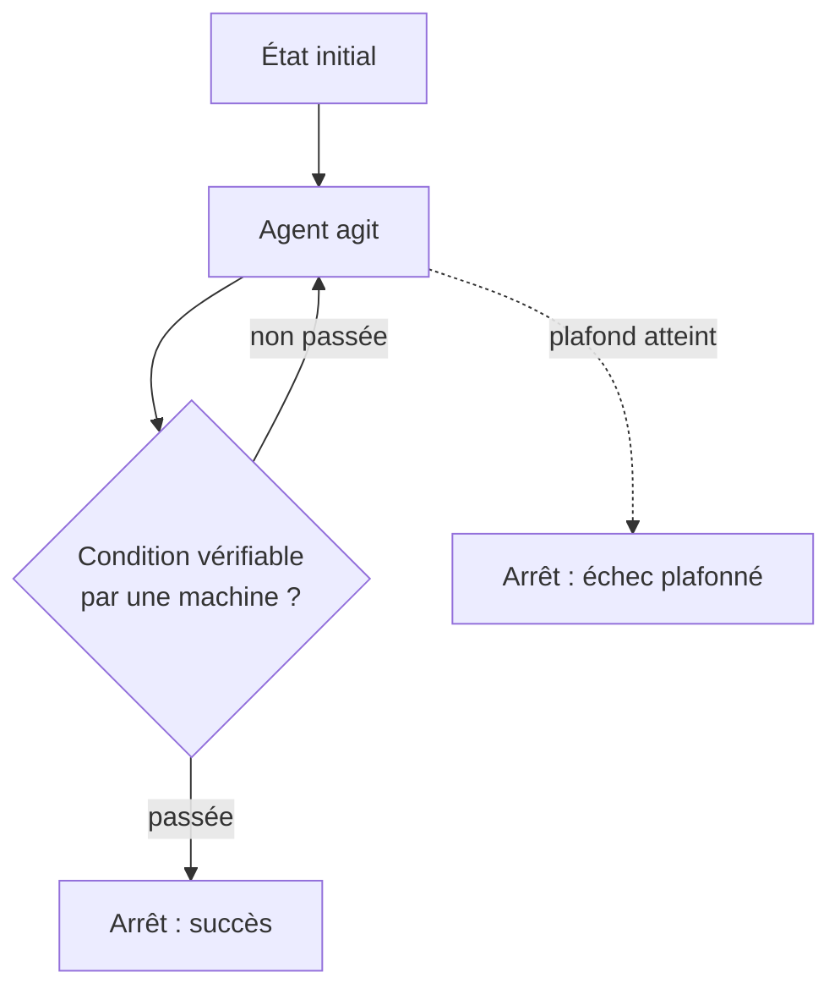

# Boucles et auto-correction

Faire tourner un agent en boucle — corrige, vérifie, recommence — est une des façons les plus efficaces d'obtenir un résultat fiable sans supervision constante. C'est aussi une des façons les plus faciles de perdre le contrôle d'un budget de jetons, ou de faire diverger un agent qui tourne indéfiniment sans jamais s'arrêter sur le bon état.

Tout tient à une règle unique, qui structure le reste de cette note.

## La règle : une condition d'arrêt vérifiable par une machine

Une boucle n'a de sens que si sa condition d'arrêt peut être vérifiée par une machine — une commande qui sort en code 0, un test qui passe, un linter sans erreur, une assertion sur un fichier produit. Si la condition d'arrêt est « l'agent estime que c'est bon », alors l'agent boucle sur son propre avis : il n'a aucun signal externe pour distinguer une vraie amélioration d'une impression d'amélioration, et rien ne l'empêche de tourner en rond en se convainquant à chaque itération qu'il progresse.



Une commande qui échoue en code 1, un test rouge, un contrat d'API violé : ce sont des critères qu'un tiers — humain ou machine — peut vérifier indépendamment de ce que l'agent affirme. « Je pense que c'est correct » n'en est pas un.

## Les modes d'échec

- **Boucle infinie** — pas de plafond, la condition d'arrêt n'est jamais atteinte parce qu'elle est mal posée ou parce que la tâche est structurellement impossible dans les contraintes données.
- **Dérive du critère** — l'agent, incapable de satisfaire la condition d'origine, la réinterprète discrètement à son avantage (« ce test n'était pas pertinent, je le supprime ») plutôt que de signaler l'échec.
- **Correction qui casse ce qui marchait** — chaque itération corrige le symptôme visé mais introduit une régression ailleurs, invisible tant que la condition d'arrêt ne teste que le symptôme d'origine.
- **Coût qui explose, et pas linéairement** — le piège n'est pas le nombre d'itérations, c'est ce que chacune transporte. Dans la plupart des harnais, chaque tour réinjecte le transcript des précédents : le coût croît avec l'historique accumulé, donc de façon quadratique et non linéaire. Une boucle de 10 itérations coûte bien plus que 10 fois une itération.

## Les parades

- **Plafond d'itérations** — un nombre maximal de tours, au-delà duquel la boucle s'arrête en échec explicite plutôt que de continuer indéfiniment.
- **Condition d'arrêt externe à l'agent** — la commande de vérification n'est pas écrite ni modifiable par l'agent qui boucle ; sinon rien n'empêche la dérive du critère.
- **Diff cumulé sous surveillance** — comparer l'état courant à l'état de départ à chaque itération (pas seulement l'itération précédente), pour détecter qu'une correction en défait une autre plutôt que de converger.
- **Contexte réinitialisé entre itérations** — ne pas réinjecter tout le transcript, mais repartir de l'état vérifiable (le diff courant, la sortie d'erreur) plus un résumé de ce qui a déjà été tenté. C'est un [handoff](./handoff-et-contexte-partage) de la boucle vers elle-même, et il obéit aux mêmes règles.

```text
$ for i in $(seq 1 5); do
    agent-fix --diff-since=HEAD
    if dotnet test --filter CatalogueTests; then
      echo "OK à l'itération $i"; break
    fi
  done
  # condition d'arrêt = code de sortie de `dotnet test`, pas l'avis de l'agent
  # plafond = 5 itérations, au-delà : échec explicite, pas de 6e essai silencieux
```

## Le pont avec l'Inbox Pattern : rejouer implique l'idempotence

Une boucle **rejoue** des actions : à chaque itération qui échoue, l'agent réessaie, parfois en répétant une action déjà exécutée avec succès à un tour précédent (un appel API, l'envoi d'un message, une migration de données). C'est exactement le problème que résout l'[Inbox Pattern](../messaging/inbox-pattern) côté consommateur de messages : une livraison **at-least-once** garantit qu'un message peut être traité plusieurs fois, donc tout effet de bord déclenché par son traitement doit être idempotent — rejouable sans dupliquer son résultat.

Une boucle d'auto-correction est, structurellement, un consommateur at-least-once de ses propres tentatives. Si une itération envoie un e-mail de notification, l'itération suivante ne doit pas en envoyer un second pour la même cause ; si une itération applique une migration, la suivante doit pouvoir la rejouer sans erreur si elle a déjà été appliquée. Concevoir une action déclenchée à l'intérieur d'une boucle sans se poser la question de l'idempotence, c'est reproduire — pour la même raison structurelle — le bug que l'Outbox/Inbox résout côté messagerie.

Il faut être honnête sur une asymétrie que l'analogie masque. L'Inbox Pattern déduplique grâce à un `MessageId` **stable, porté par le message lui-même** : deux livraisons du même message partagent cet identifiant, et une contrainte d'unicité suffit. Une boucle d'agent n'a pas d'équivalent naturel — deux tentatives ne sont pas deux livraisons d'un message identique, ce sont deux actions régénérées, potentiellement différentes dans leur forme. L'idempotence y est donc plus difficile à obtenir, et elle se construit explicitement : une clé dérivée de l'intention plutôt que du texte de l'action, ou une vérification d'état avant d'agir (« cette facture existe-t-elle déjà ? ») plutôt qu'une déduplication après coup.

## Limites : ce qui ne se boucle pas

Une boucle suppose un critère binaire, objectif, extérieur à l'agent. Une **décision produit** (« cette fonctionnalité est-elle la bonne priorité ? ») ou un **arbitrage de goût** (« ce nom de variable est-il le plus clair ? ») n'ont pas de commande qui sort en code 0. Faire boucler un agent sur ce genre de critère revient exactement au cas dégénéré du début : il boucle sur son propre avis, et chaque itération donne l'illusion de convergence sans qu'il y ait de vérité externe vers laquelle converger. Ces décisions se tranchent une fois, par un humain ou par un [arbitrage explicite](./patterns-multi-agents), pas en boucle.

## Pour aller plus loin

- Le contrôle par boucle de rétroaction en ingénierie de systèmes (feedback control) — même logique : un capteur externe au système contrôlé, jamais son propre jugement
- Les stratégies de retry avec backoff en système distribué — le plafond d'itérations et la détection de divergence y sont déjà formalisés

## Pour un agent

> **Règle** — Une boucle d'agent ne s'arrête que sur un critère vérifiable par une machine, jamais sur l'avis de l'agent lui-même.
> **Règle** — Toute boucle a un plafond d'itérations explicite, au-delà duquel elle échoue plutôt que de continuer.
> **Règle** — Tout effet de bord déclenché à l'intérieur d'une boucle doit être idempotent, car il peut être rejoué plusieurs fois.
> **Signal d'alerte** — Un agent qui modifie ou supprime le test qui le fait échouer plutôt que de corriger le code.
> **Signal d'alerte** — Une boucle utilisée pour trancher une question de goût ou de priorité : faute de critère externe vers lequel converger, elle produit une illusion de convergence.

---

*Notes liées : [Patterns d'orchestration multi-agents](./patterns-multi-agents) — les topologies dans lesquelles une étape peut boucler. [Évaluer un agent](../agents/evaluer-un-agent) — d'où vient la condition d'arrêt vérifiable dont dépend toute la boucle. [Inbox Pattern](../messaging/inbox-pattern) — l'idempotence côté consommateur de messages, la même exigence que côté boucle.*
