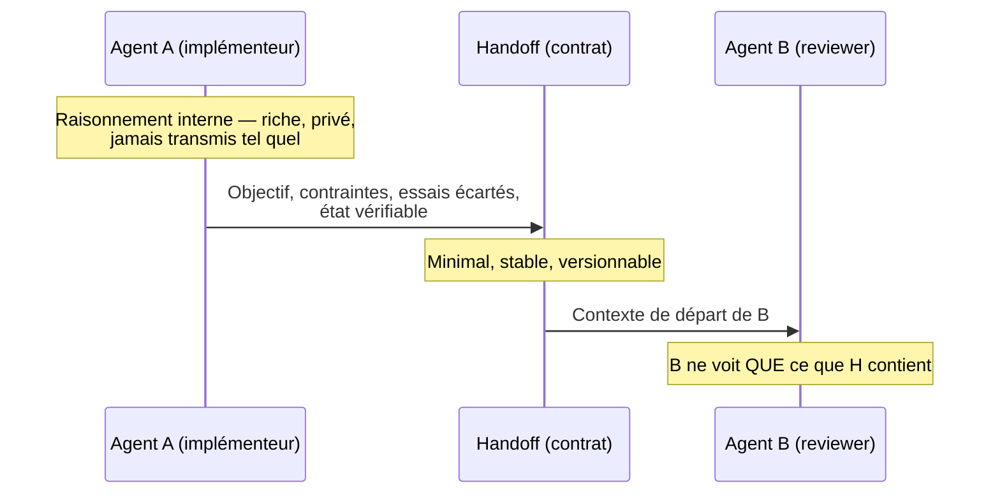

# Le handoff entre agents

Quand un agent passe le relais à un autre — dans un [pipeline ou un fan-in](./patterns-multi-agents) — la tentation naturelle est de traiter ça comme une continuation : le second agent « prend la suite ». Ce n'est pas ce qui se passe. Le second agent ne voit rien de la conversation qui a produit le résultat du premier ; il ne voit que ce qu'on lui a explicitement transmis. Tout ce qui n'a pas traversé cette frontière-là n'existe pas pour lui, même si ça a occupé cinquante tours de raisonnement chez le premier agent.

Le handoff n'est donc pas un partage de mémoire. C'est un **contrat** : une interface explicite, conçue, dont le contenu engage la suite.

## Le problème : ce que le second agent ne voit pas

Un agent qui vient de passer vingt minutes à explorer un bug a construit, dans son contexte, une compréhension riche : les pistes fausses qu'il a écartées, les fichiers qu'il a lus sans qu'ils soient pertinents, les hypothèses intermédiaires abandonnées. Si le handoff se limite à « voici le correctif », l'agent suivant hérite du résultat sans l'intuition qui l'a produit — ce qui est très bien, tant que le résultat est vérifiable par lui-même. Le problème apparaît quand le résultat n'est *pas* auto-suffisant : un correctif présenté sans les contraintes qu'il satisfait est indiscernable, pour le second agent, d'un correctif arbitraire. Il ne peut ni le challenger utilement, ni éviter de retomber dans les pistes déjà explorées et écartées.

## Le handoff est un contrat, pas un partage de mémoire

Le raisonnement interne d'un agent est l'équivalent d'un [**domain event**](../ddd/integration-events-vs-domain-events) : privé, riche, produit en continu, et libre de changer de forme d'un tour à l'autre sans conséquence pour personne d'autre. Le handoff, lui, est l'équivalent d'un **integration event** : c'est ce qui traverse la frontière, donc ça doit être stable, minimal, et pensé comme un contrat — pas comme un extrait brut du monologue interne.

Confondre les deux a exactement le même effet que côté bounded contexts : coller le raisonnement interne d'un agent dans le message transmis au suivant, c'est publier un détail d'implémentation comme s'il était un contrat. Le second agent devient couplé à des détails qui n'auraient jamais dû sortir du premier, et le premier ne peut plus changer sa façon de raisonner sans casser silencieusement ce que le second attend de lui. L'autonomie de chaque agent — comme celle d'un bounded context — dépend de cette séparation stricte entre ce qui se passe **dans** le contexte et ce qui **sort** vers l'extérieur.



## Ce qu'un bon handoff contient — et ce qu'il ne doit pas contenir

Un handoff bien conçu contient :

- **L'objectif** — ce que la suite doit accomplir, pas ce que l'agent précédent a accompli
- **Les contraintes** — ce qui doit rester vrai (API à ne pas casser, format de sortie attendu, budget de temps)
- **Ce qui a été essayé et écarté** — pour éviter que le suivant reparte explorer les mêmes impasses, sans lui imposer *pourquoi* dans le détail
- **L'état vérifiable** — un fichier, un diff, un résultat de test, quelque chose que l'agent suivant peut inspecter lui-même plutôt que devoir croire sur parole

Il ne doit **pas** contenir le monologue intérieur : les doutes en cours de route, les tours de raisonnement redondants, les considérations qui n'ont pas influencé le résultat final. Ce n'est pas une question de longueur mais de nature — un handoff n'est pas un résumé de la conversation, c'est l'interface minimale dont la suite a besoin pour agir correctement sans avoir à deviner.

## Exemple concret

Handoff raté — extrait brut du raisonnement, sans filtrage :

```text
[implémenteur → suite] J'ai d'abord pensé utiliser un cache Redis mais
  finalement non parce que ça complique le déploiement, donc j'ai regardé
  si on pouvait faire autrement, j'ai hésité entre trois approches, la
  troisième m'a semblé la plus simple même si je ne suis pas sûr à 100%
  que ce soit la meilleure, bref j'ai fait ça, voici le code, dis-moi ce
  que tu en penses.
```

L'agent suivant doit reconstruire lui-même l'objectif, les contraintes et l'état vérifiable à partir d'un flux de conscience. Rien n'est actionnable directement.

Handoff en contrat :

```yaml
objectif: "Réduire le temps de réponse de GET /catalogue sous 200ms p95"
contraintes:
  - "Pas de nouvelle dépendance d'infrastructure (pas de Redis)"
  - "Le format de réponse JSON ne change pas"
essais_écartés:
  - "Cache Redis — écarté : contrainte d'infra"
  - "Pagination côté client — écarté : ne réduit pas la latence p95, seulement le payload"
état_vérifiable:
  fichier_modifié: "src/Catalogue/CatalogueQueryHandler.cs"
  test: "dotnet test --filter CatalogueP95Benchmark"
  résultat_mesuré: "p95 = 180ms (avant : 340ms)"
```

Le second agent a tout ce qu'il lui faut pour juger, challenger ou continuer — sans avoir à relire une trace de raisonnement qu'il ne peut de toute façon pas vérifier.

## Ce que le handoff n'est pas : de la mémoire persistante

Ne confonds pas le handoff avec un mécanisme de [mémoire et de contexte](../agents/contexte-et-memoire) qu'un agent relirait pour lui-même d'une session à l'autre. La mémoire persistante sert le même agent, plus tard ; le handoff sert un agent différent, tout de suite. La mémoire peut se permettre d'être une projection large, relue et filtrée à la demande — le handoff, lui, est consommé une seule fois, par un destinataire qui n'a pas le luxe de trier après coup ce qui compte.

## Limites

Un handoff trop maigre force l'agent suivant à redécouvrir ce que le premier savait déjà — il refait le travail d'exploration, ou pire, il agit sans les contraintes et produit un résultat qui viole un invariant que le premier avait pourtant identifié. Un handoff trop gros — qui recolle tout le contexte du premier agent « pour être sûr » — ramène exactement le problème que la spécialisation cherchait à éviter : un contexte large, bruyant, où l'information utile est noyée. Le bon calibrage est un objectif observable : si l'agent suivant doit poser une question pour agir, le contrat était trop maigre ; s'il ignore une bonne partie de ce qu'on lui a transmis, il était trop gros.

## Pour aller plus loin

- Le contract-first design d'API — la même discipline appliquée à une frontière HTTP plutôt qu'à une frontière entre agents
- La distinction *tell, don't dump* en communication inter-équipes : donner une conclusion actionnable plutôt qu'un compte rendu exhaustif

## Pour un agent

> **Règle** — Un handoff contient l'objectif, les contraintes, ce qui a été écarté, et un état vérifiable — rien d'autre.
> **Règle** — Le raisonnement interne d'un agent ne traverse jamais tel quel vers l'agent suivant ; il se traduit en contrat.
> **Règle** — L'état transmis doit être vérifiable par l'agent suivant lui-même, pas seulement affirmé par celui qui le transmet.
> **Signal d'alerte** — Un handoff qui contient des hésitations ou des pistes non retenues sans dire pourquoi elles ont été écartées.
> **Signal d'alerte** — Un agent qui, à la réception d'un handoff, doit reposer une question sur l'objectif ou les contraintes.

---

*Notes liées : [Patterns d'orchestration multi-agents](./patterns-multi-agents) — les topologies où ce contrat de handoff circule. [Events de domaine vs Events d'intégration](../ddd/integration-events-vs-domain-events) — la distinction domain event / integration event qui inspire directement celle-ci. [Contexte et mémoire d'un agent](../agents/contexte-et-memoire) — pourquoi la mémoire persistante n'est pas un handoff.*
