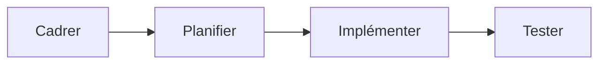
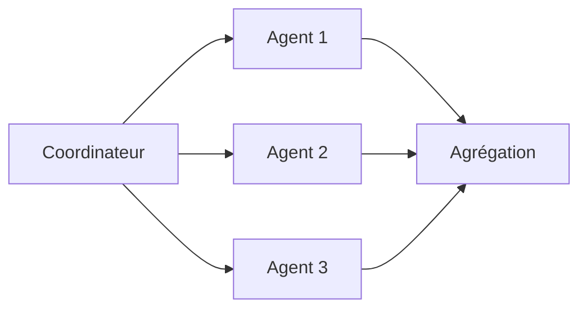

# Patterns d'orchestration multi-agents

Une fois que tu as [spécialisé tes agents par rôle](./roles-specialises), il reste une question à trancher : comment ces rôles se combinent-ils ? La même équipe de spécialistes, câblée différemment, produit des profils de latence, de coût et d'échec radicalement différents. La topologie compte autant que les rôles eux-mêmes.

## Pipeline séquentiel

Chaque agent consomme la sortie du précédent, dans un ordre fixe.

**Coût** — la latence totale est la somme de chaque étape ; aucun parallélisme possible.
**Apport** — chaque étape est vérifiable indépendamment, le raisonnement est traçable de bout en bout, simple à déboguer.
**Mode d'échec typique** — il n'y a pas de boucle de rétroaction : une erreur introduite tôt (un mauvais cadrage) se propage sans contrôle jusqu'au bout, et l'agent final hérite d'un problème qu'il n'a pas les moyens de détecter puisqu'il n'a jamais vu l'intention d'origine.

## Fan-out / fan-in

Un coordinateur distribue N sous-tâches indépendantes à N agents en parallèle, puis agrège les résultats.

**Coût** — N fois plus de jetons consommés en parallèle ; le temps total est celui de l'agent le plus lent, pas la somme.
**Apport** — des sous-tâches réellement indépendantes se résolvent en temps « max », pas en temps « somme » ; bon rendement quand le découpage est propre.
**Mode d'échec typique** — l'étape d'agrégation devient le nouveau goulot : elle doit réconcilier des résultats potentiellement incohérents entre eux, et un résultat partiel silencieusement écarté ne se remarque qu'en aval.

## Coordinateur / travailleurs

Un agent central garde la vue d'ensemble, décide dynamiquement qui fait quoi en fonction des résultats déjà obtenus — contrairement au pipeline, le graphe n'est pas figé à l'avance.

**Coût** — toute la complexité se concentre dans le prompt du coordinateur, qui devient lui-même sujet à la surcharge de contexte qu'on cherchait à éviter en spécialisant.
**Apport** — adaptatif : le coordinateur peut re-router le travail si un agent échoue ou si un résultat intermédiaire change la donne.
**Mode d'échec typique** — le coordinateur délègue sur la base de ce qu'il *croit* être l'état des travailleurs plutôt que sur un état vérifié ; il devient un goulot d'étranglement et un point de défaillance unique.

## Débat / contradiction

Deux agents reçoivent le même problème avec des cadrages opposés (ou des rôles antagonistes — attaque/défense, pour/contre), produisent chacun une position, et un troisième agent tranche.

**Coût** — au moins trois fois le budget d'un agent seul, et plus lent.
**Apport** — fait remonter des désaccords qu'un agent unique aurait lissés en une réponse médiane ; utile pour des décisions ambiguës et coûteuses à rater.
**Mode d'échec typique** — l'arbitre choisit la position la plus assurée dans sa formulation plutôt que la plus correcte dans son contenu : le débat dégénère en concours de rhétorique plutôt qu'en confrontation de preuves.

## Critères de choix

| Critère | Pipeline | Fan-out/fan-in | Coordinateur | Débat |
|---|---|---|---|---|
| Sous-tâches réellement indépendantes | Non requis | Requis | Non requis | Non requis |
| Vue d'ensemble adaptative nécessaire | Non | Non | Oui | Non |
| Budget jetons | Faible | Élevé (parallèle) | Moyen | Élevé (x3 min) |
| Latence tolérée | Additive, acceptable si séquence courte | Faible (parallèle) | Variable | Élevée |
| Enjeu de la décision | Faible à moyen | Faible à moyen | Moyen à élevé | Élevé, ambigu |

## Le même arbitrage qu'en lecture cross-contexte

Le choix entre fan-out et une forme de contexte partagé pré-construit n'est pas propre aux agents : c'est *exactement* l'arbitrage documenté dans [Composer un dashboard multi-contexte](../cqrs/composition-multi-contexte) pour un BFF qui agrège plusieurs bounded contexts. Appeler N sous-agents à la volée à chaque requête, c'est le fan-out à la volée : fraîcheur maximale, mais latence = service le plus lent et charge répétée à chaque appel. Maintenir un contexte partagé pré-calculé entre agents (un artefact de contexte relu par tous plutôt que reconstruit à chaque fois) revient à la projection pré-calculée : lecture rapide et découplée, au prix d'une fraîcheur dégradée — le contexte partagé peut être légèrement en retard sur l'état réel du travail en cours. Les mêmes critères de choix s'appliquent : fréquence d'appel, tolérance à la latence, nombre de sources à agréger.

## Limites

Le multi-agent n'est pas gratuit : chaque agent ajouté est un point de coordination, un mode d'échec de plus, un coût de jetons de plus, sans garantie que le résultat final soit meilleur. Un seul agent bien outillé — avec assez de contexte, les bons outils, et une tâche bien cadrée — bat très souvent une équipe mal coordonnée. L'orchestration se justifie par un besoin réel (parallélisme sur des sous-tâches indépendantes, séparation des points de vue, vue d'ensemble adaptative), jamais parce que « plusieurs agents » sonne plus sophistiqué qu'un seul.

## Pour aller plus loin

- Les patterns de composition de services distribués (orchestration vs chorégraphie) transposent presque tels quels au multi-agents
- La théorie de la décision en groupe (agrégation d'avis, biais de conformité) éclaire pourquoi le pattern débat échoue si l'arbitre n'a pas de critère externe

## Pour un agent

> **Règle** — Choisis la topologie en fonction de la dépendance entre sous-tâches, pas en fonction du nombre d'agents disponibles.
> **Règle** — Un pipeline sans point de contrôle intermédiaire propage les erreurs de la première étape jusqu'à la dernière sans les détecter.
> **Règle** — Dans un fan-out, l'étape d'agrégation doit expliciter ce qu'elle fait d'un résultat partiel manquant ou incohérent, jamais l'ignorer en silence.
> **Signal d'alerte** — Un coordinateur qui décide de la suite sans relire l'état réel produit par les travailleurs.
> **Signal d'alerte** — Un débat entre agents dont l'arbitre n'a aucun critère de tranchage autre que « la réponse la plus détaillée ».

---

*Notes liées : [Pourquoi spécialiser ses agents](./roles-specialises) — la brique de base que ces topologies combinent. [Composer un dashboard multi-contexte](../cqrs/composition-multi-contexte) — le même arbitrage fan-out vs projection, côté lecture cross-contexte. [Le handoff entre agents](./handoff-et-contexte-partage) — ce qui circule entre deux nœuds de la topologie. [Boucles et auto-correction](./boucle-et-auto-correction) — quand une des étapes de la topologie doit se répéter jusqu'à un critère.*
