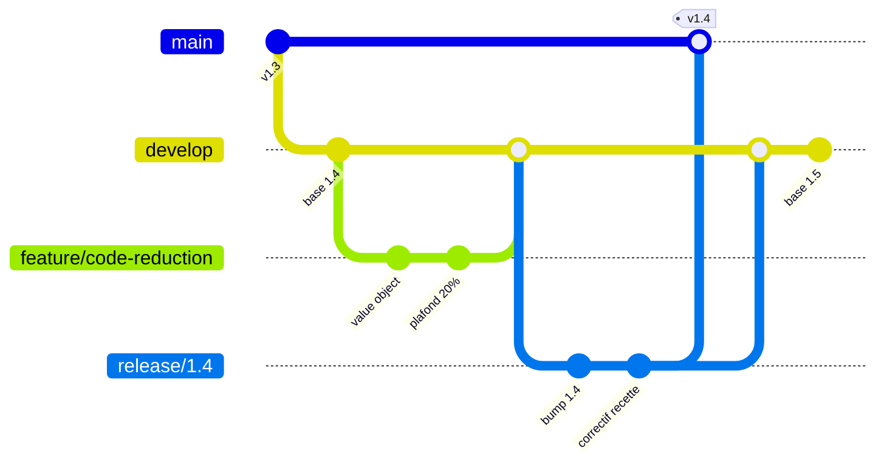

# GitFlow : les branches et le flux d'équipe

GitFlow, publié par Vincent Driessen en 2010, n'est pas une contrainte d'outil : Git ne connaît ni `develop`, ni `release`, ni `hotfix`. C'est une convention d'équipe, et elle répond à une question d'organisation avant d'être une question technique — comment plusieurs personnes travaillent sur le même code alors que tout n'avance pas au même rythme.

Car dans une équipe qui a des testeurs, trois rythmes cohabitent en permanence : ce qui est en train d'être écrit, ce qui est intégré mais pas encore validé, et ce qui tourne chez les utilisateurs. GitFlow donne à chaque rythme sa propre branche, et fixe les règles de passage de l'une à l'autre.

## Le problème que résout GitFlow

Avec une seule branche partagée, les trois rythmes se télescopent. Un testeur qui ouvre l'application ne sait jamais sur quoi il teste : la fonctionnalité qu'il valide peut avoir été modifiée par quelqu'un d'autre entre le moment où il a commencé son scénario et celui où il rédige son constat. Un bug remonté devient alors immédiatement ambigu — est-il dans la fonctionnalité, ou dans ce qui a été poussé pendant qu'on la testait ?

Symétriquement, un développeur qui doit corriger la production n'a aucun endroit stable d'où partir : la branche unique contient déjà du travail non terminé, qu'il embarquerait avec son correctif.

GitFlow supprime les deux problèmes en posant une frontière matérielle entre les rythmes. Le prix à payer est un nombre de branches plus élevé et des fusions à ne pas oublier ; ce qu'on achète est la capacité de dire, à tout instant, ce que contient exactement chaque version.

## Les cinq types de branches

| Branche | Part de | Fusionne vers | Durée de vie | Ce qu'elle garantit |
|---|---|---|---|---|
| `main` | — | — | permanente | Ne contient que ce qui est en production. Chaque commit y est taggé |
| `develop` | `main`, une seule fois | — | permanente | L'état intégré de la prochaine version |
| `feature/*` | `develop` | `develop` | une fonctionnalité | Isole un travail instable du reste de l'équipe |
| `release/*` | `develop` | `main` **et** `develop` | la recette | Fige le périmètre et ouvre la stabilisation |
| `hotfix/*` | `main` | `main` **et** `develop` | quelques heures | Corrige la production sans attendre le cycle |

Deux branches sont permanentes, trois sont éphémères — et ce découpage porte l'essentiel du modèle. `main` et `develop` ne meurent jamais et, après la scission initiale, ne repartent jamais l'une de l'autre : elles ne font que recevoir. Tout le reste naît, sert, fusionne et disparaît.



## Le flux, étape par étape

1. **Le développeur ouvre sa branche** depuis `develop`, jamais depuis `main` ni depuis la branche d'un collègue.
2. **Il code et intègre régulièrement** `develop` dans sa branche. Plus il attend, plus la fusion finale devient un arbitrage à la place d'une formalité.
3. **La branche est proposée en revue**, fusionnée dans `develop`, puis supprimée. Une branche de fonctionnalité fusionnée qui survit est un piège : quelqu'un finira par repartir de là.
4. **Le périmètre est atteint** : on ouvre `release/1.4` depuis `develop`. C'est la décision structurante du modèle — à cette seconde, le contenu de la version est figé.
5. **`develop` rouvre immédiatement** pour la version suivante. C'est précisément ce qui permet à l'équipe de continuer à produire pendant la recette, au lieu d'attendre les yeux dans le vide.
6. **La recette tourne sur `release/1.4`.** Seules des corrections y entrent, jamais une fonctionnalité.
7. **La recette est verte** : `release/1.4` fusionne dans `main`, on tag `v1.4`, on déploie — puis on fusionne la même branche dans `develop`. Ce second merge n'est pas une option.

## Qui fait quoi — développeur et testeur

| Moment | Le développeur | Le testeur |
|---|---|---|
| Fonctionnalité en cours | Code, tests unitaires, demande de revue | Rien officiellement — sauf si un environnement de preview existe |
| Fusion dans `develop` | Relit les demandes de revue de ses collègues | Vérifie l'intégration : ces fonctionnalités cohabitent-elles ? |
| Ouverture de `release/*` | Cesse d'ajouter au périmètre, bascule sur la version suivante | Lance la recette fonctionnelle complète sur périmètre figé |
| Pendant la recette | Ne corrige que ce qui est sur la branche de release | Rejoue les scénarios, tranche bloquant / non bloquant |
| Après le tag | Fusionne vers `develop`, surveille la production | Vérification de non-régression sur l'environnement réel |

Le point à retenir n'est pas la répartition des tâches, c'est la **séparation des branches** : le testeur ne valide jamais celle sur laquelle un développeur est en train d'écrire. Ce n'est pas une question de confiance, c'est ce qui rend un constat de test reproductible. C'est le même mécanisme que la [spécialisation des rôles entre agents](../orchestration/roles-specialises) : ce qui donne sa valeur au verdict, ce n'est pas la compétence de celui qui juge, c'est le fait qu'il ne juge pas son propre travail en cours.

## Les environnements, et ce que change un environnement par fonctionnalité

Dans le modèle canonique, chaque branche permanente ou longue alimente un environnement, et chaque environnement a un public :

| Environnement | Alimenté par | Pour qui |
|---|---|---|
| Intégration | `develop` | L'équipe — vérifier que le tout tient ensemble |
| Recette | `release/*` | Les testeurs, et souvent le métier |
| Production | `main` | Les utilisateurs |

Beaucoup d'équipes ajoutent aujourd'hui un environnement **éphémère par branche de fonctionnalité**, détruit à la fusion. Ce n'est pas un quatrième étage : c'est un déplacement de la frontière du test, et il change trois choses.

D'abord, un testeur peut valider une fonctionnalité **avant** qu'elle entre dans `develop` — ce qui déplace la nature de ce qu'il trouve, et pas seulement le moment où il le trouve ([Où corriger un bug avec GitFlow](./gitflow-ou-corriger-un-bug) détaille pourquoi un défaut trouvé là n'est pas un bug).

Ensuite, `develop` cesse d'être l'endroit où l'on découvre les défauts fonctionnels et redevient ce qu'il devrait être : une branche d'intégration, où la question posée est « ces fonctionnalités cohabitent-elles ? » et non « celle-ci marche-t-elle ? ».

Enfin, le coût est réel : de l'infrastructure à provisionner, un jeu de données par environnement, et surtout la tentation de tout valider en isolation. Une fonctionnalité verte sur son environnement dédié ne dit rien de son comportement à côté des autres. Ce que l'environnement de preview ne remplace pas, c'est la recette sur périmètre complet — la branche de release reste le seul endroit où l'on valide la version qu'on livre, et non la somme des fonctionnalités qu'on croit y avoir mises.

## Exemple concret

```bash
# Le développeur ouvre sa fonctionnalité
git switch develop && git pull
git switch -c feature/code-reduction
# ... commits, puis revue, puis fusion dans develop ...

# On fige le périmètre de la 1.4
git switch develop && git pull
git switch -c release/1.4
# la recette commence ; develop est déjà rouvert pour la 1.5

# La recette est verte
git switch main && git merge --no-ff release/1.4
git tag -a v1.4 -m "1.4"

# La moitié qu'on oublie
git switch develop && git merge --no-ff release/1.4
git branch -d release/1.4
```

Le `--no-ff` n'est pas cosmétique. Il force un commit de fusion qui matérialise « ici, telle branche a été intégrée ». Sans lui, Git aplatit l'historique quand il le peut, les frontières disparaissent, et le jour où quelqu'un demande ce qui est réellement parti en 1.4, plus personne ne sait répondre autrement qu'en relisant des tickets.

## Limites

Le cycle release-recette suppose que livrer une **version** ait un sens : une date, un périmètre, un numéro. Si tu livres plusieurs fois par jour un service dont une seule version existe, la cérémonie ne rembourse rien — c'est l'arbitrage complet de [GitFlow ou trunk-based](./gitflow-vs-trunk-based).

Plus insidieux : GitFlow n'empêche pas les branches longues, il les rend **confortables**. Une fonctionnalité peut vivre trois semaines isolée sans que rien ne proteste, et la douleur n'arrive qu'à la fusion, au pire moment. C'est le principal effet pervers du modèle, et aucune règle de branchement ne le corrige — seul un découpage plus fin du travail le fait.

Enfin, deux branches permanentes signifient que toute correction en aval doit redescendre, et qu'aucun outil ne signale l'oubli au moment où il se produit.

## Pour aller plus loin

- Vincent Driessen, *A successful Git branching model* (2010) — l'article fondateur, et l'avertissement que son auteur a ajouté en tête dix ans plus tard.
- La sémantique de version (SemVer), qui donne leur numéro aux branches de release et à leurs correctifs.

## Pour un agent

> **Règle** — Une branche `feature/*` part de `develop` et ne fusionne que dans `develop`.
> **Règle** — Une fois une branche `release/*` ouverte, aucune fonctionnalité nouvelle n'y entre : uniquement des corrections.
> **Règle** — Toute fusion dans `main` est suivie, dans la même unité de travail, d'une fusion de la même branche vers `develop`.
> **Règle** — Une fusion d'intégration se fait sans avance rapide, pour conserver la trace de la frontière.
> **Signal d'alerte** — Une branche `feature/*` qui part de `main` ou d'une autre branche `feature/*`.
> **Signal d'alerte** — Un commit posé directement sur `main` ou `develop` sans passer par une branche.
> **Signal d'alerte** — Une branche `release/*` encore ouverte alors que sa version est déjà taggée en production.

---

*Notes liées : [Où corriger un bug avec GitFlow](./gitflow-ou-corriger-un-bug) — la règle de branchement selon l'endroit où le défaut est visible. [GitFlow ou trunk-based](./gitflow-vs-trunk-based) — quand ce modèle cesse d'être le bon. [Pourquoi spécialiser ses agents](../orchestration/roles-specialises) — la même raison de ne jamais juger son propre travail en cours.*
