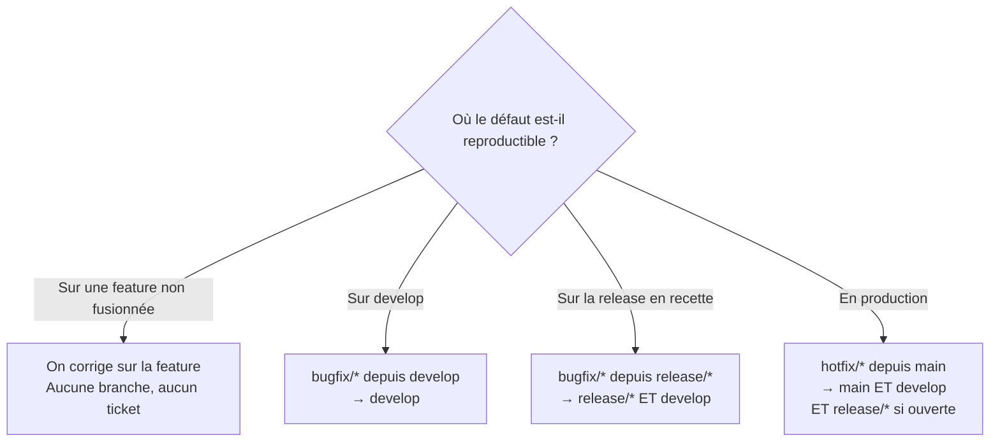

# Où corriger un bug avec GitFlow

Une équipe qui a adopté [les cinq branches de GitFlow](./gitflow-branches-et-flux) sait où écrire une fonctionnalité. Elle hésite bien plus souvent sur les corrections, parce que la question qui compte n'est pas « comment corriger » mais **« depuis quelle branche partir »** — et la réponse dépend d'une seule chose : l'endroit où le défaut est visible.

Se tromper ne casse rien sur le moment. C'est ce qui rend l'erreur coûteuse : elle produit un correctif qui disparaît silencieusement à la fusion suivante, ou une correction livrée dans une version qui ne devait pas la contenir. Dans les deux cas, aucun test n'échoue et aucun outil ne prévient. Le dégât se manifeste des semaines plus tard, sous la forme d'un « le bug est revenu » que personne ne sait expliquer.

## Le problème que résout une règle de branchement explicite

Sans règle, chacun corrige là où c'est le plus commode — c'est-à-dire, presque toujours, sur `develop`. Un développeur qui corrige sur `develop` un défaut trouvé en recette produit un correctif que la branche de release ne verra jamais : la version part en production avec le bug, alors que le ticket est fermé et le code écrit.

L'erreur symétrique est plus fréquente encore : corriger sur `release/1.4` et ne pas redescendre vers `develop`. La 1.4 est saine, et le bug réapparaît en 1.5 — une régression parfaitement évitable, sur du code que quelqu'un a déjà réparé une fois.

Une règle explicite ne rend pas ces situations impossibles. Elle les rend **nommables**, donc vérifiables.

## La règle unique

> **La branche de correction part de la branche la plus en amont où le défaut est reproductible, et le correctif redescend ensuite vers toutes les branches qui dérivent de celle-là.**

Deux moitiés. La première est intuitive, tout le monde l'applique. La seconde est celle qu'on oublie, et c'est elle qui produit tous les dégâts durables.

## Les quatre situations



| Où le défaut vit | Branche de correction | Part de | Fusionne vers | Ticket de bug |
|---|---|---|---|---|
| Fonctionnalité non fusionnée | aucune | — | — | Non |
| `develop` | `bugfix/*` | `develop` | `develop` | Oui |
| `release/*` en recette | `bugfix/*` | `release/*` | `release/*` + `develop` | Oui |
| Production | `hotfix/*` | `main` | `main` + `develop` (+ `release/*`) | Oui |

### 1. Le défaut vit dans une fonctionnalité non encore fusionnée

Pas de branche dédiée, pas de ticket. **Ce n'est pas un bug, c'est du travail non terminé.** Ouvrir un ticket ici ne documente rien : il naît et meurt dans le même sprint, sur du code que personne d'autre n'a jamais vu.

La seule chose qui compte est que le défaut ne franchisse pas la fusion — et ça, ce n'est pas une affaire de branche mais de [points de passage vérifiables](../aidd/gates-et-verification) : revue, tests, contrôles automatiques avant intégration.

Cette règle vaut aussi quand un testeur a validé la fonctionnalité sur un environnement de preview et y a trouvé un défaut. C'est un aller-retour de développement, pas un bug comptabilisé. Conséquence directe, souvent ignorée quand on compare des équipes : le nombre de bugs d'une équipe qui a des environnements de preview n'est pas comparable à celui d'une équipe qui n'en a pas. La première en attrape une partie avant qu'ils n'existent au sens du processus.

### 2. Le défaut vit dans `develop`

La fonctionnalité est fusionnée, le défaut apparaît à l'intégration. Branche `bugfix/*` depuis `develop`, fusion vers `develop`, terminé — une seule destination, c'est le cas simple.

Le ticket, lui, se justifie ici et pas avant. Ce qui fait un bug n'est pas sa gravité, c'est le fait qu'il ait **franchi une frontière** : quelqu'un d'autre que son auteur peut désormais le rencontrer, et le temps passé à le corriger n'est plus du temps de développement de la fonctionnalité.

### 3. Le défaut vit dans `release/*`

Trouvé en recette, sur un périmètre figé. La branche de correction part de `release/1.4`, fusionne dans `release/1.4`, **puis dans `develop`**. C'est le cas où l'oubli de la seconde fusion coûte le plus cher, parce qu'il est aussi le plus fréquent : la pression de fin de recette pousse à s'arrêter dès que la version est verte.

C'est aussi le seul endroit où se pose l'arbitrage **bloquant / non bloquant**, et il faut le trancher pour une raison structurelle : une branche de release doit pouvoir se fermer. Chaque correction non bloquante qu'on y accepte repousse la date et rouvre la recette sur ce qu'on vient de modifier. La règle par défaut est donc qu'un défaut non bloquant retourne dans `develop` par un ticket, et ne touche jamais la release. Sans cette discipline, `release/*` devient une seconde `develop` et le modèle s'effondre — la version ne sort plus.

Le critère de blocage mérite d'être écrit une fois pour toutes plutôt que rediscuté à chaque cycle : **est bloquant un défaut qui empêche un utilisateur d'accomplir le parcours pour lequel la version est livrée, ou qui corrompt de la donnée.** Le reste attend le cycle suivant, quelle que soit son irritation visuelle.

### 4. Le défaut vit en production

`hotfix/*` part de `main` — jamais de `develop`, qui contient déjà la version suivante. Fusion vers `main`, tag correctif, déploiement, puis fusion vers `develop`.

Et le piège du modèle : **si une branche de release est ouverte au même moment, le hotfix doit aussi y aller.** Sinon, la fusion de cette release dans `main` écrasera le correctif, et la 1.5 sortira sans un patch livré en 1.4.1 — une régression sur un bug déjà corrigé, en production, sans que personne ait rien fait de fautif.

## Le back-merge est le seul vrai piège

Toutes les erreurs durables de ce modèle sont des fusions descendantes oubliées. Le nombre de destinations d'une correction se calcule pourtant simplement : **une, plus le nombre de branches vivantes en aval**. Un correctif sur `develop` en a une. Un correctif de recette en a deux. Un hotfix pendant une release ouverte en a trois.

La difficulté n'est pas de comprendre la règle, c'est qu'elle ne se rappelle jamais à personne. Un back-merge oublié ne produit ni erreur, ni conflit, ni test rouge. Il ne faut donc pas compter sur la vigilance, mais poser un contrôle qui affirme l'invariant à chaque construction : tout commit de `main` doit déjà être un ancêtre de `develop`.

## Pont messaging — un back-merge est une double écriture

Le même changement doit atterrir à deux endroits, sans transaction commune entre les deux. C'est exactement le problème que résout l'[Outbox Pattern](../messaging/outbox-pattern) : écrire en base et publier un message ne sont pas atomiques, et si le second geste échoue après le premier, le système diverge en silence — chaque côté est cohérent, l'ensemble ne l'est plus.

Un back-merge oublié est la version manuelle du même dégât, et il appelle la même réponse : ne pas s'en remettre à la discipline de celui qui exécute, mais rendre la seconde écriture rejouable et vérifiable.

L'analogie a une limite qu'il faut poser, sinon elle promet trop. L'outbox **rattrape** : le message finit par partir, sans intervention. Le contrôle d'intégration continue, lui, ne rattrape rien — il constate et il crie. C'est un cran en dessous, parce que la fusion demande un arbitrage humain qu'aucun automate ne peut rendre à la place de l'auteur du correctif. Un contrôle qui crie reste néanmoins sans commune mesure avec l'absence de contrôle : il transforme une régression découverte dans six semaines en une alerte du jour même.

## Exemple concret

```bash
# Défaut bloquant trouvé en recette sur la 1.4
git switch release/1.4 && git pull
git switch -c bugfix/arrondi-total-panier
# ... correction + test de non-régression ...
git switch release/1.4 && git merge --no-ff bugfix/arrondi-total-panier

# La moitié qu'on oublie
git switch develop && git merge --no-ff bugfix/arrondi-total-panier
```

Et le contrôle qui rend l'oubli impossible à ignorer, à placer dans l'intégration continue :

```bash
# Échoue si un commit de main n'est pas déjà présent dans develop
git merge-base --is-ancestor origin/main origin/develop \
  || { echo "back-merge manquant : main n'est pas ancêtre de develop"; exit 1; }
```

Trois lignes qui remplacent une consigne que personne n'applique sous pression.

## Limites

La règle suppose que les branches en aval sont **connues et peu nombreuses**. Une équipe qui maintient trois versions en parallèle chez ses clients multiplie les destinations de chaque correctif, et GitFlow tel quel ne suffit plus : il faut une branche de maintenance par version supportée, avec un coût qui croît beaucoup plus vite que le nombre de versions. C'est un des arbitrages tranchés dans [GitFlow ou trunk-based](./gitflow-vs-trunk-based).

Elle suppose aussi qu'un correctif s'applique proprement en aval. Si `develop` a réorganisé la zone touchée, le back-merge n'est plus une formalité mais un conflit à arbitrer — et c'est l'auteur du correctif qui doit trancher, pas celui qui a déclenché la fusion. Un contrôle automatique détecte l'oubli ; il ne dit pas quoi faire du conflit.

Enfin, rien ici ne s'applique tant qu'on ignore **dans quelle version le défaut est apparu**. Identifier la branche d'origine précède le choix de la branche de correction, il ne le remplace pas.

## Pour aller plus loin

- `git bisect`, pour retrouver le commit d'origine d'une régression avant de décider d'où partir.
- Le versionnement des correctifs (le segment *patch* de SemVer), qui donne son numéro à un hotfix.

## Pour un agent

> **Règle** — Une correction part de la branche la plus en amont où le défaut est reproductible, jamais de `develop` par défaut.
> **Règle** — Tout correctif appliqué sur `release/*` ou `main` est fusionné vers `develop` dans la même unité de travail.
> **Règle** — Un hotfix produit pendant qu'une branche `release/*` est ouverte est fusionné vers `main`, `develop` **et** cette branche de release.
> **Règle** — Un défaut trouvé avant la fusion d'une branche `feature/*` se corrige sur cette branche, sans ticket ni branche dédiée.
> **Règle** — Seul un défaut bloquant entre sur une branche `release/*` ouverte ; tout le reste repart vers `develop`.
> **Signal d'alerte** — Un commit présent dans `main` et absent de `develop`.
> **Signal d'alerte** — Une branche `bugfix/*` partie de `develop` alors que le défaut a été trouvé en recette.

---

*Notes liées : [GitFlow : les branches et le flux d'équipe](./gitflow-branches-et-flux) — le modèle dont cette règle est le mode d'emploi en correction. [GitFlow ou trunk-based](./gitflow-vs-trunk-based) — ce que devient la question des back-merges quand il n'y a plus qu'une branche. [Gates et vérification](../aidd/gates-et-verification) — les points de passage qui empêchent un défaut de franchir une fusion. [Outbox Pattern](../messaging/outbox-pattern) — le même problème de double écriture, résolu automatiquement plutôt que constaté.*
